# Fix noisy CSR wakes at large x–z tilt

*(Originally titled "co-moving (Lagrangian) density-history interpolation" — that turned out to be
the fix for a different defect. The noise fix is the integration-quadrature alignment in §3.0.)*

**Started:** 2026-09-08 · **Last updated:** 2026-09-09

### What is actually implemented right now

| | status |
|---|---|
| Steps 1–3 — diagnosis | ✅ done (tests only, no production code touched) |
| **Step 4 — quadrature band fix** (`_retarded_xi_band`, per-column nodes in `get_CSR_wake`) | ✅ **implemented** |
| **Step 4 addendum — polar patch** for the `r → 0` singularity | ✅ **implemented** |
| Step 4c — fix the confounded acceptance test | ✅ done |
| Step 4e — diagnose the remaining `sp3` failure | ✅ done |
| Step 4f — verify thesis Eq 4.24 | ✅ done |
| **Step 5 — co-moving interpolant** (`DF_tracker_comoving`, `interpolate3D_comoving_fields`) | ✅ **implemented, `method: bspline_comoving`** |
| Step 5c/5d — Eq 4.24 branches vs the measured integrand, at one tilt then swept over 6 shears | ✅ done (141 predictions inside support, 0 missed) |
| **Step 6 — two-branch band location from Eq 4.24** (`_retarded_xi_bands`, `_eq424`, `_disjoint_bands`) | ✅ **implemented**; design in §6a/6b, result in §6c |
| §6h — per-step `formation_length` (was pinned to the bend entrance) | ✅ **fixed**; 12.9% error at the shipped default removed |
| §6j/6k/6l — longitudinal extents verified; resolution scale identified as `σ_ξ`; per-region allocation (`near_cell`, `far_zbins`) | ✅ **implemented**; shear-50 error 4.3% → 0.48% |
| §6m — log-graded near-region nodes (`near_grade`) | 🟡 **implemented**; 12× fewer nodes where `1/u` holds, **but fails near a bend entrance** |
| **`\|τ\| → ∞` degeneracy at full compression** — breaks the localization (§6m) *and* the frame blend (§6n) | ❌ **open, and the main correctness gap** |
| Step 7 — remaining secondary fixes (`lattice.py` key order, `bilinear_single` OOB on the *old* paths, a pre-existing test failure) | ❌ not started |
| Step 8 — validate and document | ❌ not started |

**Three methods are now selectable** via `particle_deposition: method:` — `legacy`, `bspline_fft`,
`bspline_comoving` — so all three stay runnable side by side for benchmarking. The first two are
byte-unchanged by this work apart from `get_CSR_wake`'s node placement, which both B-spline paths share.

**Where it stands.** `bspline_comoving` eliminates ghosting exactly (G-independent to six digits) and,
once the band locator was made co-moving too, cuts wake roughness 34× and converges at 100² instead of
400². Step 6 then closed the correctness gap: the single-band locator was missing a physical chirp
branch worth **rel L2 1.04 of the whole wake**, and with both Eq 4.24 branches located the transverse
domain is invariant to 0.00000 over its last doubling and the result agrees with the old ±20σ_x bands
to **1e-5** at low tilt, where those old bands are trustworthy. Cost 1.5×. The two older methods
(`legacy`, `bspline_fft`) are untouched and still selectable.

The two-branch wake is ~25× *smaller* than the single-branch one and of opposite sign — the branches
nearly cancel. That was confirmed independently against a brute-force integral over the full ±20σ_x
rectangle, which converges to the two-branch value and excludes the single-branch one by 1–2 orders.

**Is the wake smooth?** Yes (§6d). Absolute roughness is 16× lower than single-branch, converges at
second order, and what remains is genuine curvature: the second difference flips sign 11 times in 37
(noise would flip ~half), and a degree-8 polynomial fits to 1.3% of peak. Relative roughness at this
tilt has gone 3.0 (old bands) → 0.72 → 0.18 → **0.020**.

**A production bug found late and fixed (§6g diagnosis, §6h fix).** `formation_length` was computed once
per element on entry, so it never saw in-bend bunch lengthening — 181.7 mm instead of 395.5 mm at shear
20, 3× low at shear 50 — which truncated the retained history to 3 snapshots and left the wake **12.9%
wrong at the shipped default**. Now refreshed every step: `L_f` matches the analytic value exactly, the
history deepens to 6–8 snapshots, and the default `n_formation_length = 1.5` is converged to 0.00000.
Every Step 6 conclusion survives; the absolute magnitudes quoted in §6c–§6f were measured pre-fix and are
~13% low.

**⚠️ The main open correctness gap is the `|τ| → ∞` degeneracy, and it is worse than first thought.** It is
what **full compression** is, so it is physically unavoidable in a bunch compressor — measured 0.05 m into
the bend, where σ_z falls 20× to 2.5 µm and the slope passes through ±∞ (§6n). It breaks *two* things at
once. The frame blend is linear in `τ`, so mid-step it reconstructs an **untilted** beam (τ = 0.067) where
the truth is maximally tilted — refining `step_size` cannot fix a path error. Worse, the *consequence* of any frame error scales as `Δτ·σ_z/σ_ξ` — magnified by the amplification — so at
525× even a 5% τ error displaces the density by **13 band widths** (§6n, shear 50 at its σ_ξ minimum). Fix
direction: blend `arctan τ` with branch continuity for the waist, **plus** higher-order frame interpolation
for the magnification, since angle continuity alone does not address it. And separately, on the localization
side: as `|τ|` grows,
`tan 2α = 2τ/(1−τ²) → 0` and the two Eq 4.24 branches become **parallel** rather than coincident, while
`d = 10σ_x/|tan 2α|` diverges (154 mm at slope −12.5). The integrand then carries structure across the
entire reach and **no affordable 1D grid converges** — uniform at 32 191 nodes and graded at 780 disagree
by 22%. Thesis §4.4.2 discusses only the `|τ| = 1` degeneracy. Wakes computed near a bend entrance with
strong chirp are therefore not trustworthy; away from that limit (`|tan 2α| ≳ 1`) everything below holds.

**Known open items.** (i) The problem is now a **cancellation** one, so accuracy must be judged on the
total, never on one branch. (ii) `CSR_integration: zbins` should default to **400**, not 200 — at 200 the
quadrature noise is still 4× above the curvature floor. (iii) Axis D, the near-patch radius invariance,
degraded from 0.011 to 0.085 and is not yet attributed; `near_patch = 5.0` may no longer be right.

### Where the diagnosis landed

The noise is **not** ghosting (§2.1), which the original plan assumed — that was disproved in Steps 1–2.
It is a **sampling failure of the outer `(x′, s′)` quadrature** (§2.0, §2.0b): the integration bands are
sized from `σ_x` while the deposition grid is sized from `σ_ξ`, leaving as few as **0.38 quadrature
nodes inside the beam** with 99.3–100% of nodes returning a hard zero. §4.4.2 of the thesis in fact
prescribes the *slice* rms width (= σ_ξ), so the Step 4 fix is **restoring the thesis's own
prescription**, not inventing a scheme.

Step 4 fixed that (cell 13.2 σ_ξ → 0.21 σ_ξ, noise down 3–5×, 1.5× faster, exact to 0.035% at low
tilt) but was **not sufficient**: it located only one of up to four nonzero `x′` intervals per column,
missing a chirp branch worth up to **67%** of the contribution in region `sp3` (Step 4e). Step 5
(co-moving interpolant) collapsed the four candidate branches to the two physical ones by removing
ghosting, and Step 6 then located both — which turned out to change the high-tilt wake by rel L2 1.04,
i.e. the missing branch was as large as the answer itself.

**One-paragraph summary of the diagnosis.** The noise is not an interpolation error. The ξ-frame
deposition shrank the density support by the tilt amplification factor `σ_x/σ_ξ` (65.9× in the test
case) while `get_CSR_wake` continued to size its `(x′, s′)` integration bands from `σ_x`. The result
is a transverse quadrature cell of 13.2 σ_ξ and **0.76 integration nodes inside the beam**, with
99.98–100% of nodes returning a hard zero. The undersampling the new deposition was built to fix was
relocated from the deposition grid to the outer quadrature. Ghosting (lab-frame time blending of a
shearing beam) is a separate, genuine O(1) accuracy defect that affects the old and new schemes
*equally* and is therefore not the regression.

This is a focused work log for one investigation. The broader project history lives in
`progress.md`; a summary entry will be appended there when this work concludes.

---

## 1. Problem statement

`pyDFCSR_2D` reconstructs the CSR wake by integrating over the *history* of the beam density,
evaluated at retarded times and positions. The history is a stack of 2D snapshots queried by a
3D interpolant.

- **Old scheme** (`deposit.py`, `interpolate3D`): CIC deposition on a uniform **lab-frame**
  `(x, z)` grid spanning ±`xlim`·σ_x. Smooth wakes, but at high tilt σ_x ≫ σ_ξ, so the transverse
  cell is ≈ σ_x/10 and the beam core is badly undersampled.
- **New scheme** (`deposit_smooth.py`, `interpolate3D_transformed`): remove the x–z tilt with a
  per-snapshot polynomial ξ = x − p_k(z), deposit with a cubic B-spline on a ±`xlim`·σ_ξ grid,
  smooth and differentiate by FFT. Density and derivatives are genuinely well resolved.

The new scheme produces **noisy, physically wrong wakes whenever the beam has a large x–z tilt** —
exactly the regime it was built for. `progress.md` records ~27 investigation steps that correctly
localized the *symptoms* (far-retarded-time queries, sensitivity to integration resolution,
`poly_degree=0` stable / `poly_degree=3` divergent) but treated them with parameter band-aids
(`xlim` 5→10, `smoothing_sigma` 3→10, integration grid 100²→300²/500²), each trading one regime
for another.

**Goal:** remove the defect so the well-resolved density produces smooth wakes with no
regime-dependent parameter tuning, and keep the result autodiff-friendly for development goal #2.

---

## 2. Root cause

### 2.0 PRIMARY CAUSE (confirmed in Step 3): the CSR integration bands are sized by σ_x, but the deposition grid is sized by σ_ξ

This section supersedes the original diagnosis. Measured at s = 0.70 m in a 1 rad dipole with a
`shear z:x = 20` beam:

> **Correction (2026-09-09).** The derivation originally written here was wrong, and the corrected
> version is in §2.0b below. It compared the integration band width in `x′` against the deposition
> grid's width in **ξ**, which is not a valid comparison: the interpolant applies `ξ′ = x′ − p(z′)`
> before the lookup, so the grid's support in lab `(x′, z′)` space is a *wide slanted ribbon*, not a
> narrow one. A query at large `x′` can and does land inside the grid. The conclusion survives, but
> for a different reason, and the numbers were understated. **The load-bearing evidence was never the
> ratio below — it was the directly counted hard-zero fraction, which requires no such argument.**

| quantity | value |
|---|---|
| σ_x (lab frame, tilt included) | 826.6 µm |
| σ_ξ (tilt removed) | 12.5 µm |
| **tilt amplification σ_x/σ_ξ** | **65.9 ×** |
| integration band half-width (`20·σ_x`, region 1) | **16 531 µm** |
| integration cell along x′ at 100 bins | **13.2 σ_ξ** |
| **fraction of integration nodes returning a hard 0.0** | **99.32 – 100 %** ← the real evidence |

The transverse integral is being evaluated with **less than one quadrature node inside the beam.**
Effectively 100% of the `(x′, s′)` integration mesh falls outside the deposition grid and returns
`bilinear_single`'s hard `0.0`; the entire wake comes from the handful of nodes that happen to land
on the density ribbon. Which nodes those are changes discontinuously as the observation point moves
across the wake mesh. **That is the noise.**

### 2.0b The correct derivation: the light cone pins z_ret, so the support is thin *in the integration plane*

The right question is not how wide the deposition grid is in ξ, but: **at fixed `s′`, over what range
of `x′` is the integrand nonzero?** That is what a rectangular `(x′, s′)` mesh actually samples.
Measured directly by scanning `x′` across the full `±20σ_x` band at one wake point:

```
   s_prime  (s-s_prime)   nonzero x-extent  /sigma_xi  #intervals   z_ret span
    in sp1     0.243390              63.4u        5.1           1        8.01u
    in sp1     0.134363             110.6u        8.8           1        7.58u
    in sp2     0.055562             120.5u        9.6           1        3.38u
   near s3     0.004118             128.1u       10.2           1        0.61u
    in sp3     0.000200             592.3u       47.2           1      376.06u
```

**Why it is thin despite the tilt removal.** At fixed `s′`, `z_ret = s′ − t + |r − r′|`, and
`|r − r′|` is dominated by the arc distance `|s − s′|`, varying only weakly with `x′`. The last column
shows `z_ret` moving by just **0.6–8 µm** across the whole nonzero region. Tilt removal would let a
distant `x′` map into the grid, but only if `z_ret` followed the tilt line: `Δx′ = p′·Δz_ret`. Reaching
`Δx′ = 16 000 µm` at `p′ ≈ 1.6` needs `Δz_ret ≈ 19σ_z` — far outside the beam. So the grid's support is
a wide slanted ribbon in `(x′, z′)`, but the map `(x′, s′) → z_ret` is nearly `x′`-independent and the
ribbon is thin, and contiguous, **in the integration plane.**

Corrected node counts, using the measured extents rather than the ξ-grid width:

| region | band width | nonzero extent | fraction | nodes | **nodes in support** |
|---|---|---|---|---|---|
| R1 (`x0 ± 20σ_x`, over sp1) | 33 062 µm | 63.4 µm | 0.19 % | 200 | **0.38** |
| R2 (`x0 ± 5σ_x`, over sp2) | 8 266 µm | 120.5 µm | 1.5 % | 100 | **1.5** |
| R3+R4 (over sp3) | 10 745 µm | 592 µm | 5.5 % | 200 | **11** |

Step 3 reported 0.76 nodes for R1 from the ξ-grid proxy; the correct value is **0.38**. The
undersampling was twice as bad as first stated.

**And this yields a lead on the one remaining failure (Step 4c axis A).** In `sp3`, close to `s′ = s`,
`|r − r′| → 0` so `∂z_ret/∂x′` blows up: the `z_ret` span jumps from ~1 µm to **376 µm** and the
nonzero extent from 128 µm to 592 µm. The light cone stops pinning `z_ret`. That means
`_retarded_xi_band`'s central assumption — locate the ribbon from the *column-centre* `z_ret` because
`z_ret` barely varies across a column — **holds in sp1 and sp2 and breaks down precisely in sp3**,
which is the only region where axis A fails. This is better supported than the near/far-cancellation
guess in Step 4c, and it is falsifiable: it predicts the failure should disappear if the band location
is iterated per node rather than per column in `sp3` (option (c) of §3.0, decision 1).

`get_CSR_wake` (`CSR.py:460–608`) sizes every integration band as a multiple of
`self.beam._sigma_x` — `x1_w = x0 ± 20·sigma_x`, `x3_l = x0 ± 5·sigma_x`, and so on. That was
correct for the legacy scheme, whose deposition grid is *also* ±`xlim`·σ_x: the density support and
the integration band were the same size, so ~50 nodes landed inside the beam. The new scheme shrank
the density support by the tilt amplification factor (66× here) and **left the integration bands
untouched.** The undersampling that the ξ-frame deposition was built to *fix* was simply relocated
from the deposition grid to the outer quadrature.

This is not an interpolation error. It is a **sampling failure of the outer 2D integral.**

**It explains every band-aid in `progress.md`, all of which turn the same single knob — the number
of quadrature nodes inside the density support:**

| band-aid | why it helped |
|---|---|
| integration grid 100² → 300²/500² (Step 24) | more nodes ⇒ more of them land in the ribbon |
| `xlim` 5 → 10 | widens the deposition grid ⇒ wider support |
| `smoothing_sigma` 3 → 10 | broadens ρ in ξ ⇒ wider support |
| `poly_degree` 0 stable, 3 divergent | deg 0 removes no tilt, so σ_ξ ≈ σ_x and support matches the band (legacy-like); deg 3 removes the most tilt, giving the thinnest ribbon and the worst sampling |

None of them addresses the mismatch, which is why each traded one regime for another.

**Consequence for the plan:** the co-moving interpolant of §3 does **not** fix this. It fixes §2.1,
which is a real but separate defect. The fix for the noise is to build the integration bands from the
*same* tilt-removed transform the deposition uses — see §3.0.

### 2.1 SECOND, INDEPENDENT DEFECT: the time interpolation is done in the lab frame, which ghosts a shearing beam

`interp3D.py:275–294` evaluates **each snapshot at the lab query point** and then blends:

```python
xi_k  = xval[i] - eval_poly(poly_coeffs[k],   zval[i])   # snapshot k's frame
xi_k1 = xval[i] - eval_poly(poly_coeffs[k+1], zval[i])   # snapshot k+1's frame
val_k  = bilinear_single(data[k],   xi_idx_k,  z_idx_k,  ...)
val_k1 = bilinear_single(data[k+1], xi_idx_k1, z_idx_k1, ...)
result[i] = (1-alpha)*val_k + alpha*val_k1
```

Each term is the correct lab density *of its own snapshot*. Their linear combination is **not** the
density at the intermediate time — it is a **superposition of two shear-displaced copies of the
beam**, the classic ghost/double-image of linear frame blending. For a beam whose x–z shear p′
changes by Δp′ between snapshots, the two images are separated in x by Δp′·z. Define the
**ghosting parameter**

```
G  =  |Δp′| · σ_z / σ_ξ        (per history step)
```

- `G ≪ 1` → images overlap, blend is fine.
- `G ≳ 1` → the interpolant returns two peaks where there is one, and **zero density where the beam
  actually is**.

`progress.md` Step 20 recorded the signature without naming the mechanism: a query point maps to
"ξ≈42 µm (core, high density) at one step but ξ≈152 µm (3σ tail, near zero) at the adjacent step,"
with the slope swinging +5.5 → −10 between steps. With σ_z ≈ σ_ξ ≈ 50 µm that is G ≈ 15.

### 2.2 The test that "validated" the interpolator could not detect this

`test/test_interp_tilted_gaussians.py` built its "exact" reference as

```python
rho_exact = (1 - alpha) * analytical_density(x, z, slopes[k])   \
          +      alpha  * analytical_density(x, z, slopes[k+1])
```

i.e. **the reference was itself the lab-frame blend** — the approximation under test. The test
therefore verified that the interpolator reproduces the very thing that is wrong, which is why it
reported the new method as "15× more accurate than legacy" at slope +5.5 → −10 and the defect
survived. Line 174 even computed the physically correct `slope_blended` and never used it.

### 2.3 Secondary defects

| # | Defect | Location | Effect |
|---|--------|----------|--------|
| a | Chain rule for ∂ρ/∂z baked in per snapshot with p′_k, then two *lab-frame* values blended. A co-moving blend must apply the chain rule with the **blended** p′_α. `get_poly_deriv_blended()` was written for exactly this and is never called. | `deposit_smooth.py:244–246`; `CSR.py:697–698`; `interp3D.py:193` | inconsistent derivatives; worst where p′ varies fastest |
| b | Out-of-bounds returns a **hard 0.0**, not a clamp or taper. The ±5σ_ξ grid is a narrow slanted band in lab space, so far-retarded queries fall outside it. | `interp3D.py:159–160` | step discontinuity in the integrand → quadrature noise (Step 26/27's finding) |
| c | **Grid registration bug.** `histogram_bspline_2d` deposits at bin *centers* (`-0.5` at `deposit_smooth.py:46–47`, spacing `(end-start)/nbins`), but `xi_grids = np.linspace(start, end, nbins)` gives *nodes* with spacing `(end-start)/(nbins-1)`. That array feeds the trapz normalization, the spectral `dx`/`dz`, `p'(z_grids)`, and `min_xi_arr`/`delta_xi_arr`. Legacy `histogram_cic_2d` has no `-0.5`, so this half-bin shift is new. | `deposit_smooth.py:46–47, 197–200, 216, 245, 311–314` | ½-cell misregistration + 1/(n−1) derivative scale error, systematic |
| d | `poly_degree=3` default: the cubic is fit globally then **extrapolated to ±5σ_z** where there are no particles, so p(z), p′(z) blow up in the z tails. Also inconsistent with the deg-1 slope used by the wake mesh (`CSR.py:374`) and integration bands (`CSR.py:469–472`). | `deposit_smooth.py:158, 181` | garbage frame map and chain-rule term at grid z-edges; explains "deg 0 stable, deg 3 divergent" |
| e | `dsum = trapz(trapz(density))`, `density /= dsum` renormalizes clipped charge back to 1. The clipped fraction differs snapshot to snapshot. | `deposit_smooth.py:216–218` | per-snapshot normalization jitter → temporal noise |
| f | `epsilon = max(density_smooth)/velocity_threhold` and the mask `(ρ/(ρ+ε))³` are snapshot-dependent envelopes on `vx`, `∂vx/∂x`. | `deposit_smooth.py:230–239` | temporal inconsistency in the W2/div(v) term |
| g | **C⁰ interpolant ⇒ quadrature jitter.** `bilinear_single` is continuous but its first derivative jumps across every cell boundary, so the integrand has kinks on a lattice of lines in the `(x', s')` plane. Trapz is 2nd-order only for smooth integrands; across a kink it is 1st-order and the error depends on *where* the kink falls relative to the quadrature nodes. As the observation point steps across the wake mesh, the kink lattice shifts against the fixed nodes, so quadrature error jitters point-to-point. Worse for derivatives: `interpolate3D_transformed_with_derivs` finite-differences the bilinear interpolant, giving piecewise-constant (discontinuous) ∂ρ/∂ξ. | `interp3D.py:154–175, 348–354` | point-to-point wake noise; explains why Step 24's 100²→300² integration grid helped so much, at 9× cost |

---

## 3. Planned fix

Two independent fixes are needed, in this order:

- **§3.0 — align the CSR integration quadrature with the deposition support.** Fixes the *noise*
  (§2.0). This is the primary fix and must come first.
- **§3.1–3.4 — the co-moving interpolant, added as `method: 'bspline_comoving'`.** Fixes the *O(1)
  accuracy error* from ghosting (§2.1) and the secondary defects (§2.3). Does not fix the noise.

### 3.0 PRIMARY FIX: resolve the density support with the `(x′, s′)` quadrature

**The requirement.** `get_CSR_wake` must place enough quadrature nodes inside the retarded density
support to integrate it. Today it places `0.76`. The target is the ~50 that legacy achieves, i.e.
a transverse integration cell of order `σ_ξ/5`, *not* `13.2 σ_ξ`.

**Why simply shrinking the bands does not work.** The obvious move — replace `20·sigma_x` with
`20·sigma_xi` — is wrong. The bands are not sized to cover the *current* beam; they cover the
**union of the beam's support over the whole retained history**, because a column at `s′` is
evaluated at retarded time `t_ret(x′, s′)` and that time sweeps back over the formation length. Over
that window the centroid moves and the tilt `p′` changes, so in lab `x′` the union of supports is
genuinely wide — which is exactly why `20·sigma_x` "worked" and why it is generous rather than
arbitrary. Shrinking it to `σ_ξ` would clip real contributions and trade noise for bias.

The support is **thin but slanted and curved** in the `(x′, s′)` plane: at each `s′` the density
occupies `|x′ − p(z_ret) − ξ̄| ≲ xlim·σ_ξ`, a ribbon of width `~σ_ξ` whose centreline moves with
`s′`. A **rectangular mesh in lab `x′` cannot resolve a thin slanted ribbon without resolving the
whole bounding box** — that is the entire problem in one sentence, and it is why every band-aid in
`progress.md` amounted to refining the bounding box.

**The fix: integrate along the ribbon, not across the bounding box.** Change the transverse
integration variable from lab `x′` to the tilt-removed `ξ′`, so the mesh follows the support:

```
for each s' column:
    t_ret, z_ret  <- light-cone solve at the column centre
    k, alpha      <- history index and time fraction for t_ret
    p             <- poly_coeffs_interp[k]            # already stored
    xi_lo = min_xi_arr[k]                             # already stored
    xi_hi = xi_lo + (n_xi - 1) * delta_xi_arr[k]      # already stored
    xi_nodes = linspace(xi_lo, xi_hi, nx)             # exactly the deposition support
    x'_nodes = xi_nodes + eval_poly(p, z_ret)         # nodes now land ON the ribbon
    inner trapz over x'_nodes for this column
outer trapz over s'
```

The mesh becomes **per-column** rather than a single rectangle, so the inner `np.trapz` needs its own
`x=` array per column instead of one shared `xp_w`/`xp_n`. That is the main structural change to
`get_CSR_wake`. Node count stays the same; the nodes simply stop being wasted on empty space. The
existing 3-region / 4-region `s′` decomposition and the chirp-band logic are untouched — only the
transverse extents and node placement change.

**This fix is fully standalone — it does not need the co-moving tracker.** `DF_tracker_smooth`
already stores everything required, per snapshot: `poly_coeffs_interp`, `min_xi_arr`,
`delta_xi_arr`, `min_z_arr`, `delta_z_arr` (`deposit_smooth.py:311–317`), plus `min_x` and `delta_x`
for the time axis. Reading the ξ-extent straight off `min_xi_arr` / `delta_xi_arr` is also *better*
than recomputing `xlim·σ_ξ`: it guarantees the quadrature nodes bracket the deposition grid exactly by
construction, so the two can never drift apart again — which is the failure mode this whole
investigation is about.

**Design decisions still open (resolve before implementing):**

1. **`z_ret` depends on `x′`, so the mapping is implicit.** Options: (a) one Newton/fixed-point pass
   per column using the column-centre `z_ret`, accepting a slightly off-centre ribbon; (b) widen the
   ξ′ range by a safety factor (e.g. 2×) so a one-pass estimate still brackets the support;
   (c) iterate to convergence per column. Start with (b) — cheapest and robust — and measure the
   clipped fraction to confirm it is negligible.
2. **Two snapshots straddle each `t_ret`.** The interpolant blends snapshots `k` and `k+1`, whose
   ξ-extents differ. The node range must cover the **union** of the two, or the blend will be clipped
   on one side. Cheap and safe: `xi_lo = min(over k, k+1)`, `xi_hi = max(over k, k+1)`.
3. **Jacobian.** Substituting `x′ = ξ′ + p(z_ret)` at fixed `s′` has unit Jacobian
   (`∂x′/∂ξ′ = 1`) only if `p(z_ret)` is treated as constant within the column. If the per-column
   `z_ret(x′)` variation is retained, the Jacobian is `1 + p′·∂z_ret/∂ξ′` and must be included.
   Options (a)/(b) above make this exactly 1 by construction; option (c) does not.
4. **The `s′` band extents may also need revisiting.** `s2 = s − 500·σ_z`, `s3 = s − 20·σ_z` etc. use
   `σ_z`, which is *not* tilt-amplified, so the longitudinal sampling is far less pathological than
   the transverse. Step 3 did not measure longitudinal nodes-in-support separately — worth checking
   once the transverse fix is in, but not expected to be the issue.

**Diagnostic to keep permanently.** Log "integration nodes inside the density support" per region,
as `test_integrand_anatomy.py` now does. It is a single number that would have caught this
immediately, and it should gate any future change to either the bands or the deposition grid.

### 3.1 The co-moving interpolant

Per snapshot *k*, store the *dimensionless shape* on a **fixed normalized grid** shared by all
snapshots, `u ∈ [−xlim, xlim]`, `w ∈ [−zlim, zlim]`:

```
u = (ξ - ξ̄_k)/σ_ξk ,   ξ = x - p_k(z)          w = (z - z̄_k)/σ_zk
ρ̂_k(u, w)  with  ∫∫ ρ̂_k du dw = 1
plus  ∂ρ̂_k/∂u,  ∂ρ̂_k/∂w   (normalized frame — NOT the pre-baked lab-frame ∂ρ/∂z)
frame params: p_k (deg 1), ξ̄_k, σ_ξk, z̄_k, σ_zk
```

Query at `(x, z, t)` with `α` the time fraction between snapshots *k*, *k+1*:

```
p_α  = (1-α)p_k + αp_{k+1}          ξ̄_α, z̄_α: linear in α
σ_ξα = exp((1-α)ln σ_ξk + α ln σ_ξk₊₁)      (log-linear: positive and smooth)
u = (x - p_α(z) - ξ̄_α)/σ_ξα        w = (z - z̄_α)/σ_zα
ρ̂ = (1-α) ρ̂_k(u,w) + α ρ̂_{k+1}(u,w)
ρ         = ρ̂ / (σ_ξα σ_zα)                          # unit-Jacobian shear ⇒ J = σ_ξα σ_zα
∂ρ/∂x     = ρ̂_u / (σ_ξα² σ_zα)
∂ρ/∂z|_x  = [ ρ̂_w/σ_zα - p′_α(z)·ρ̂_u/σ_ξα ] / (σ_ξα σ_zα)
```

Properties:
- **Exact for any affine beam evolution** (shear + scaling) — i.e. exact for linear optics, the
  dominant evolution between history steps. Ghosting is eliminated by construction, not reduced.
- All snapshots share one normalized grid ⇒ no per-timestep grid metadata, and out-of-bounds is
  consistent across snapshots (addresses defect b's inconsistency).
- The chain rule uses the blended p′_α (fixes defect a).
- `G ≳ 1` no longer matters, so no `xlim` / `smoothing_sigma` / integration-grid retuning per regime.

**The shared grid is *normalized*, not physical — no resolution is given up.** The grid shared
across snapshots is the *index* space `(u, w)`. Snapshot *k*'s **physical** cell size is still set
by that snapshot's own beam size:

```
Δξ_k = 2·xlim·σ_ξk / nx      ← identical to what 'bspline_fft' does today
Δz_k = 2·zlim·σ_zk / nz
```

The physical grid still breathes and shears with the beam, and transverse resolution stays
`σ_x/σ_ξ` better than legacy at high tilt. Normalization changes only the *labelling*: index
`(i, j)` now refers to the same material point of the beam at every snapshot, which is exactly what
makes the time blend ghost-free. Side benefit: this permanently retires the "re-interpolate all
history when σ changes by 2×" path (`deposit.py:339–391`, `DF_interp`).

*Caveat:* normalizing by σ makes the blend exact for affine evolution. If the beam *shape* in
normalized coordinates changes fast (strong nonlinear compression forming a spike), the blend is
still only first-order in Δt — but that is far weaker than the current `G ≪ 1`, which fails
outright in a chicane.

### 3.2 The evaluation kernel (fixes defect g)

Replace `bilinear_single` on this path with evaluation against the **same cubic B-spline kernel used
for deposition**: 4×4 stencil, C² continuous, with `∂ρ̂/∂u`, `∂ρ̂/∂w` obtained **analytically by
differentiating the kernel** rather than by finite differences.

- Integrand becomes smooth ⇒ trapz recovers full 2nd-order convergence ⇒ we should be able to return
  to ~100² integration bins instead of 300²–500². That pays for the 4× stencil cost, so this is
  likely net-faster.
- The point-to-point quadrature jitter disappears rather than being averaged down.
- Analytic derivatives with no finite differences and no branching is what makes this path
  autodiff-friendly.

Note: evaluating with B-spline weights on values that were themselves B-spline-*deposited* applies
the kernel twice, i.e. extra smoothing. Compensate by reducing `smoothing_sigma` — the FFT Gaussian
already dominates the effective kernel width, so this is a one-parameter recalibration. If exact
interpolation of grid values ever matters, the proper alternative is a tridiagonal B-spline
prefilter; recorded as an option, not done now.

### 3.3 Registration convention (defect c), applied consistently

```python
delta = (end - start) / nbins                     # matches histogram_bspline_2d
grid  = start + (np.arange(nbins) + 0.5) * delta  # bin centers
# use this `delta` for spectral dx/dz and for the stored delta_* metadata
```

### 3.4 Normalization (defect e)

Replace the trapz renormalization with the exact, grid-independent
`density /= npart * delta_u * delta_w`, and record the clipped-charge fraction
(`1 - sum(density)*delta_u*delta_w`) per step; warn above a tolerance instead of silently
renormalizing it away.

### 3.5 Files to change

| File | Change |
|------|--------|
| `pyDFCSR_2D/deposit_smooth.py` | New `DF_tracker_comoving`. Reuse `cubic_bspline`, `histogram_bspline_2d`, `smooth_and_differentiate`. Deposit in normalized `(u, w)`; store ρ̂, ρ̂_u, ρ̂_w + frame params. Fix (c) registration, (e) normalization, (f) vx envelope, (d) default `poly_degree=1`. |
| `pyDFCSR_2D/interp3D.py` | New `interpolate3D_comoving(...)` and `interpolate3D_comoving_with_derivs(...)`. Reuse `eval_poly`, `eval_poly_deriv`. New `bspline_eval_single` (C² 4×4 kernel, clamp-to-edge). Leave `interpolate3D`, `interpolate3D_transformed` untouched. |
| `pyDFCSR_2D/CSR.py` | **Primary (§3.0):** `get_CSR_wake` (`:460–608`) — per-column transverse nodes placed in ξ′ from the history frame at `t_ret`, replacing the σ_x-scaled rectangular `xp_w`/`xp_n`/`xp1..4`; per-column `x=` arrays in the inner `np.trapz`. **Secondary:** `method == 'bspline_comoving'` branch at `:58–65`; third branch in `get_CSR_integrand` (`:616`, `:671`); wake mesh (`:374`) to read the same deg-1 transform as the deposition. |
| `pyDFCSR_2D/test/test_interp_tilted_gaussians.py` | Fix the reference. ✅ done in Step 1 |
| `pyDFCSR_2D/lattice.py` | `:18–39` look `step_size` up by name instead of assuming it is the first key (bug found in Step 2). |

---

## 4. Step log

### Step 1 — Prove the diagnosis (2026-09-08) ✅

**What was done.** Built a new acceptance test `pyDFCSR_2D/test/test_ghosting.py` designed so that
the *only* error source is the time-interpolation scheme:

- Snapshots are built by **sampling the analytic density** — no deposition, no filtering — so
  deposition noise and smoothing are excluded.
- Slopes are `[0, ds, 2·ds]`, so p(t) is linear in t. Any scheme that interpolates the *frame* in
  time is therefore **exact** here, and the true intermediate-time density is exactly a Gaussian
  sheared by `ds/2`.
- Query points are laid out **in the true beam frame at the query time**
  (`x = ξ + p_α(z)`), so every point sits where the beam actually is. No masking heuristics.
- Two stacks are built, mirroring the two production paths: per-snapshot ξ-frame grids as
  `DF_tracker_smooth` stores them, and one shared lab grid as legacy `DF_tracker` does.
- Sweep `G` from 0.05 to 20 at σ_ξ = σ_z = 50 µm, 200 bins, `xlim` = 5.

Separately, patched `test_interp_tilted_gaussians.py` to compare against the true intermediate-time
density `analytical_density(x, z, slope_blended)`, keeping the old blend reference as a reported
contrast.

**Result — `test_ghosting.py`:** relative L2 error vs the true density.

```
      G |   new rho    new dx    new dz |   leg rho    leg dx    leg dz | dx_leg/sxi
------------------------------------------------------------------------------------
   0.05 |    0.0005    0.0009    0.0005 |    0.0005    0.0010    0.0006 |       0.06
   0.10 |    0.0011    0.0024    0.0012 |    0.0012    0.0025    0.0012 |       0.06
   0.20 |    0.0038    0.0085    0.0054 |    0.0039    0.0088    0.0054 |       0.07
   0.50 |    0.0228    0.0502    0.0357 |    0.0231    0.0508    0.0355 |       0.10
   1.00 |    0.0831    0.1772    0.1425 |    0.0837    0.1782    0.1418 |       0.15
   2.00 |    0.2524    0.4904    0.4713 |    0.2527    0.4899    0.4675 |       0.25
   5.00 |    0.6185    0.9814    1.0778 |    0.6129    0.9669    1.0485 |       0.55
  10.00 |    0.8109    1.0932    1.1997 |    0.7961    1.0594    1.1305 |       1.06
  20.00 |    0.9080    1.0724    1.1435 |    0.8844    1.0381    1.0313 |       2.06
```

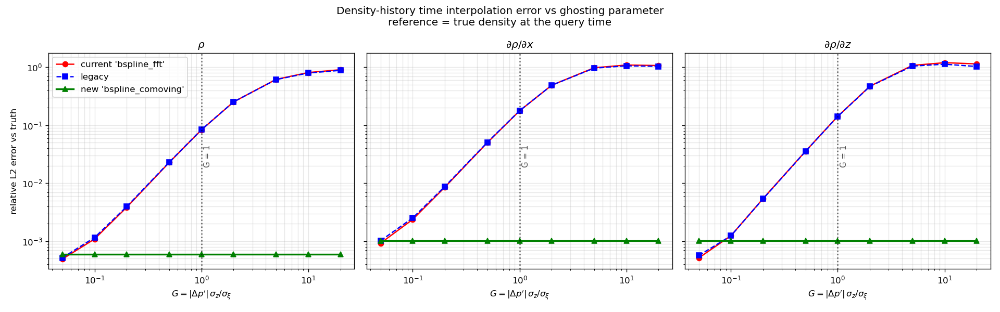

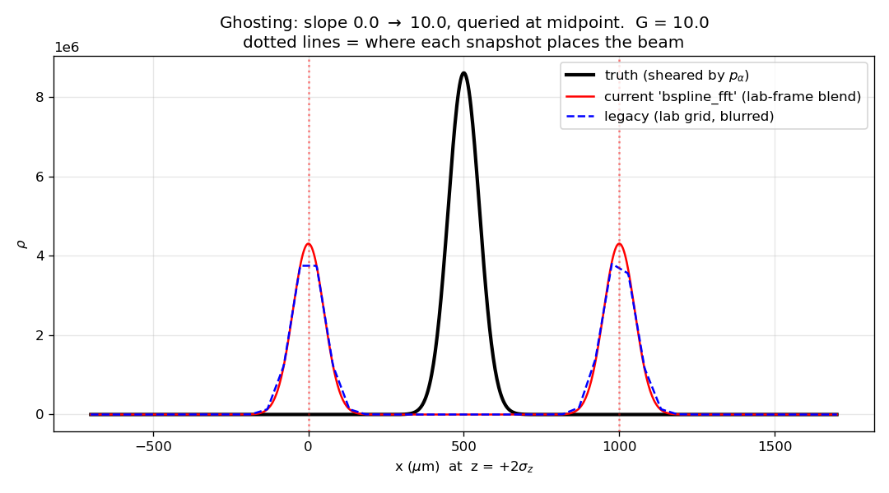

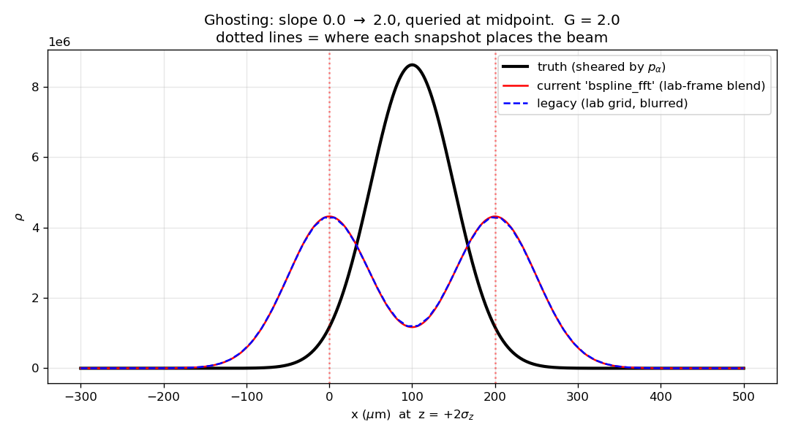

**Findings.**

1. **Ghosting is confirmed and quantitatively O(1) for `G ≳ 1`.** Error grows ≈ G² at small G,
   crosses 8% at G = 1, 25% at G = 2, and saturates near 100% by G ≈ 5–10. Derivatives are worse
   than the density, as expected, exceeding 100% relative error by G ≈ 5.
2. **The 1D cut at G = 10 is unambiguous.** Truth is a single peak at x = 500 µm. Both interpolants
   return **two half-amplitude peaks at 0 and 1000 µm and essentially zero density where the beam
   actually is.** This is the double image, seen directly.
3. **The old test's reference was wrong by exactly the amount the interpolator was wrong.**
   `blend-vs-truth` matches `new_rho` to 3–4 significant figures at every G (e.g. 0.8110 vs 0.8109
   at G = 10). The test was structurally incapable of detecting this defect.
4. **Patched `test_interp_tilted_gaussians.py` now fails loudly** where it used to pass. At its
   high-tilt case (slope +5.5 → −10, G = 15.5), against the true density: ρ error 0.858,
   ∂ρ/∂x 1.079, ∂ρ/∂z 1.689 for the new method — and 0.857 / 1.078 / 1.676 for legacy. The old
   reference was itself 0.858 wrong.

**Important refinement to the diagnosis — this is what sent Steps 2 and 3 looking elsewhere.**

The new and legacy error curves lie **on top of each other** (differences in the 3rd significant
figure). Ghosting therefore affects both schemes equally and is **not, by itself, the regression
that made the new wakes noisy while legacy stayed smooth.** The original framing ("legacy's coarse
cells blur the two ghost images together") is not supported: at G = 10 the ghosts are separated by
20σ_ξ while legacy's cell is only ≈1σ_ξ, nowhere near enough to merge them.

What this changes and what it does not:

- **Ghosting is a real, long-standing O(1) accuracy defect in both schemes**, worth fixing on its
  own merits. The co-moving interpolant remains the right fix. This is now proven, not conjectured.
- **The new-vs-legacy noise difference must be explained by something else.** The leading hypothesis
  is that the *L2 magnitude* of the ghosting error is the same in both schemes but its *spatial
  frequency content* is not: with legacy, the ghost peaks are broad and low, so the wake integral
  over the retarded band varies smoothly with the observation point; with the new scheme the peaks
  are narrow and tall (0.05σ_ξ cells), so as the band sweeps it alternately hits and misses sharp
  spikes, injecting high-frequency structure into the integrand. Quadrature noise depends on
  frequency content, not on L2 norm. The secondary defects (b hard-zero OOB, c registration,
  d poly_degree=3 blowup, g C⁰ quadrature jitter) plausibly dominate the *noise* even though
  ghosting dominates the *error*.
- **This hypothesis is untested at the time of writing.** Steps 2 and 3 exist to test it, and they
  should now be treated as load-bearing rather than optional.

> **Added after Step 3: the frequency-content hypothesis above was WRONG too.** Step 2 shrank the
> ghost separation 4.8× with no effect on the noise, and Step 3 found the actual mechanism — the
> outer `(x′, s′)` quadrature has 0.76 nodes inside the density support. The paragraph is left in
> place because the reasoning it records ("quadrature noise depends on frequency content, not on L2
> norm") turned out to point at the right *subsystem* — the quadrature — for the wrong reason.
> See §2.0 and Step 3.

One caveat on the test's fairness to legacy: it gives legacy only its coarser grid, not the
Savitzky–Golay filter the production path applies. Real legacy smoothing is therefore wider than
modelled here. That strengthens the frequency-content hypothesis without changing the ghosting
conclusion.

**Pass criterion status.** Criterion 6 has two halves. The half that proves the ghosting diagnosis
("current `bspline_fft` error demonstrably O(1) for G ≳ 1") is **met**. The half that validates the
fix ("co-moving interpolant error at round-off for pure affine shear at all G") is **pending** —
`test_ghosting.py` already imports `interpolate3D_comoving` behind a `HAVE_COMOVING` guard and will
add that column automatically once Step 5 lands.

**Files touched.**
- `pyDFCSR_2D/test/test_ghosting.py` (new)
- `pyDFCSR_2D/test/test_interp_tilted_gaussians.py` (reference corrected; contrast reporting added)

**Reproduce.**
```bash
conda activate pydfcsr
cd .../pyDFCSR_claude/pyDFCSR
python pyDFCSR_2D/test/test_ghosting.py
python pyDFCSR_2D/test/test_interp_tilted_gaussians.py
```

---

### Step 2 — Does the noise track G? (2026-09-08) ✅ — **No. Ghosting ruled out as the noise mechanism.**

**What was done.** New test `pyDFCSR_2D/test/test_G_scaling.py`. The existing `test_tilt_sweep.py`
varies the tilt, which changes `G`, the transverse resolution *and* the integration-band geometry all
at once — it cannot separate them. This test varies **only the lattice `step_size`**, so at a fixed
physical position the beam has a fixed tilt `p′` and a fixed σ, but

```
G = |p′(t_{k+1}) − p′(t_k)| · σ_z/σ_ξ   ∝   step_size
```

`apply_CSR = 0` so every run sees identical beam evolution and the wakes are compared at identical
physical positions (`s = 0.600 m`). Noise metric: relative L2 norm of the second difference of the
wake along z, which isolates point-to-point jitter from the wake's shape and amplitude.

**Result.** `shear z:x = 20`, wake mesh 5×40, integration 100², deposition 200².

```
method          step        G   |slope|   s_xi/um   rough(dE)   rough(xk)   s_cmp
---------------------------------------------------------------------------------
bspline_fft    0.100   30.042     2.043      9.58     2.26924     2.10021   0.600
bspline_fft    0.050   13.246     2.043      9.58     2.44714     2.72745   0.600
bspline_fft    0.025    6.258     2.043      9.58     2.19550     2.53075   0.600
legacy         0.100   30.042     2.043      9.58     0.54196     0.05689   0.600
legacy         0.050   13.246     2.043      9.58     0.67776     0.05724   0.600
legacy         0.025    6.258     2.043      9.58     0.36648     0.05666   0.600

Scaling of roughness with G (ghosting predicts ~G^2, i.e. 4x per halving):
  bspline_fft:
    G 30.042 -> 13.246 (2.27x) : roughness 2.26924 -> 2.44714 (0.93x)  => effective power -0.09
    G 13.246 ->  6.258 (2.12x) : roughness 2.44714 -> 2.19550 (1.11x)  => effective power  0.14
```

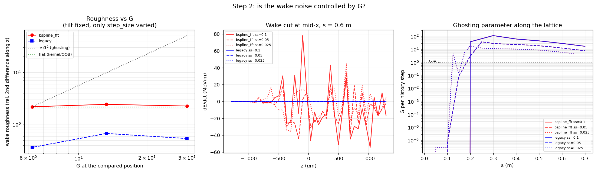

**Findings.**

1. **Reducing G by 4.8× changed the noise by nothing** (effective power −0.09 and +0.14, i.e. flat).
   Ghosting predicts `~G²`, which over this range would have been a **23× reduction.** The noise is
   not ghosting.
2. **At identical G, `bspline_fft` is 5× rougher than legacy on dE/dct and ~40× rougher on
   `x_kick`** (2.27 vs 0.54, and 2.10 vs 0.057). Step 1 proved both schemes have *the same* ghosting
   error, so this gap cannot be ghosting either. Something present in the new scheme and absent from
   legacy is responsible.
3. The Step 1 "frequency-content" hypothesis is therefore also unsupported in the form stated: it
   predicted noise scaling with the ghost-peak sharpness, but the ghost separation shrank 4.8× with
   no effect at all.

**Caveat, recorded honestly.** All three step sizes sit in the *saturated* ghosting regime
(`G ≥ 6.3`), where Step 1 measured error already flat at ~80–100%. So this test never probed the
`G ≲ 1` region where the `G²` law lives, and strictly speaking it shows "no sensitivity within the
saturated regime". Finding 2 is the load-bearing one and does not depend on the regime: at *identical*
G with *identical* beams, the two schemes differ by 5–40× in noise.

**Files touched.** `pyDFCSR_2D/test/test_G_scaling.py` (new).

**Bug found while writing this test.** `yaml.dump` sorts keys by default, which put `step_size` after
`element_1..3`. `lattice.py:18–39` does `Nelement = len(lattice_config) - 1` and iterates
`list(lattice_config.keys())[1:]`, i.e. it assumes the **first key is `step_size`** and every
remaining key is an element. Wrong order gives
`TypeError: 'float' object is not subscriptable` at `lattice.py:26`. Generated lattice YAMLs must use
`sort_keys=False`. Worth a real fix in `lattice.py` (look the key up by name) — noted, not done.

**Reproduce.**
```bash
python pyDFCSR_2D/test/test_G_scaling.py    # ~15 min, 6 runs
```

---

### Step 3 — Integrand anatomy at one noisy point (2026-09-08) ✅ — **ROOT CAUSE FOUND**

**What was done.** New test `pyDFCSR_2D/test/test_integrand_anatomy.py`. At one high-tilt wake-mesh
point it:

- installs a spy on `interpolate3D_transformed` to capture the exact `(x′, z_ret, t_ret)` query
  points the wake integral actually uses;
- reproduces the index arithmetic of `bilinear_single` to classify every query point as **inside**,
  **out-of-bounds (hard 0.0)**, or **silently extrapolated** (the `int()` truncation-toward-zero hole:
  indices in `(−1, 0)` pass the `x0 < 0` guard and get extrapolated with negative weights);
- measures the integration-band width against the deposition-grid width, and counts **how many
  quadrature nodes land inside the density support**;
- scans the integration grid over 50², 100², 200², 400² to separate quadrature error from density
  error.

**Result.** `s_obs = 0.70 m`, `shear z:x = 20`, `|slope| = 1.603`, `poly_degree = 3`.

```
--- (0) integration-band width vs deposition-grid width ---
  sigma_x  (lab)         =       826.57 um
  sigma_xi (tilt removed)=        12.54 um
  tilt amplification     =         65.9 x
  deposition grid half-width in xi =      62.67 um (= 5.0 sigma_xi)
  deposition cell in xi            =      0.630 um

  region                   x-half-width   cells across  cell/sigma_xi  pts in density
  R1 far (20 sigma_x)          16531.4u            200           13.2            0.76
  R3 near (5 sigma_x)           4132.9u            100            6.6            1.52
  R near (10 sigma_x)           8265.7u            100           13.2            0.76

--- (i)/(ii) out-of-bounds and silent-extrapolation fractions ---
region                  n_pts    OOB %  extrap %  |integrand|max
----------------------------------------------------------------
R1 (far, wide x)        20000    99.98      0.01      3.2629e+12
R2 (chirp band)         10000   100.00      0.01      3.9865e+11
R3 (near, band a)       10000   100.00      0.02      1.3619e+10
R4 (near, band b)       10000   100.00      0.06      5.0711e+11

--- (iv) quadrature convergence of the wake along z ---
  grid   50^2 : roughness(dE) = 1.95429   roughness(x_kick) = 1.79718
  grid  100^2 : roughness(dE) = 2.33626   roughness(x_kick) = 2.20589
  grid  200^2 : roughness(dE) = 1.84767   roughness(x_kick) = 1.22583
  grid  400^2 : roughness(dE) = 1.47434   roughness(x_kick) = 0.56928

  Convergence toward the 400^2 answer:
    grid   50^2 : rel. diff dE = 38.46244   x_kick = 19.50372
    grid  100^2 : rel. diff dE = 15.18054   x_kick =  8.07953
    grid  200^2 : rel. diff dE =  7.41733   x_kick =  2.79230
```

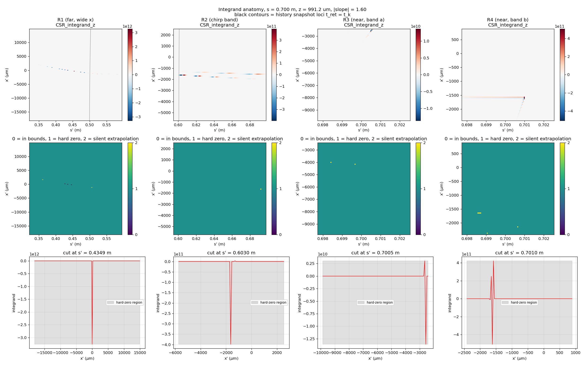

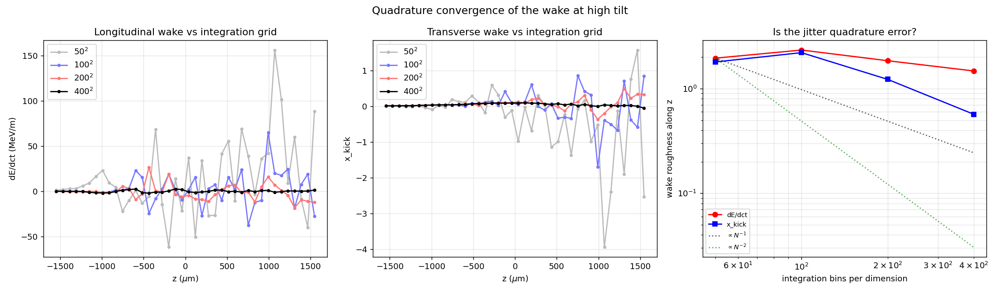

**Findings.**

1. **The transverse integral is evaluated with less than one quadrature node inside the beam.**
   `0.76` nodes for the two widest regions, `1.52` for the narrowest. **99.98–100% of all query
   points return `bilinear_single`'s hard `0.0`.** The whole wake comes from the one or two nodes
   that happen to land on the density ribbon.
2. **The integrand map shows this directly:** instead of a smooth ribbon it is a handful of isolated
   nonzero pixels, and the 1D `x′` cuts are delta-like spikes rather than resolved profiles. The
   `|integrand|max` values (up to 3.3e12) are the amplitude of those isolated spikes.
3. **Which nodes land on the ribbon changes discontinuously as the observation point moves** across
   the wake mesh. That is the noise — it is a **sampling failure of the outer 2D quadrature**, not an
   interpolation error.
4. **Confirmed by the grid scan.** The wake is nowhere near converged: 100² differs from 400² by
   **15× on dE and 8× on `x_kick`** — relative differences of 1518% and 808%, not percent-level. The
   convergence plot shows ±150 MeV/m oscillations at 50²/100² collapsing to a small smooth curve at
   400². Refining the grid monotonically improves things because it is the only knob that increases
   nodes-in-support, which is precisely why Step 24 of `progress.md` found 300²–500² "fixed" it.
5. **Root cause, stated precisely:** `get_CSR_wake` sizes every integration band as a multiple of
   `self.beam._sigma_x` (lab frame, tilt included), while the new deposition grid is sized by `σ_ξ`
   (tilt removed). At 65.9× tilt amplification the band is **264× wider than the density support**
   and the transverse cell is **13.2 σ_ξ**. The ξ-frame deposition did not remove the undersampling —
   it **relocated it** from the deposition grid to the outer quadrature.
6. **Legacy is smooth for a mundane reason:** its deposition grid is *also* `±xlim·σ_x`, so the
   density support and the integration band are the same size and ~50 nodes land inside. It was never
   better-behaved; it was merely self-consistent.
7. **Silent extrapolation is real but negligible** here (0.01–0.06%). Worth fixing as hygiene
   (defect b), not a driver.

**This supersedes the Step 1 diagnosis as the explanation for the noise.** Ghosting (§2.1) remains a
proven O(1) *accuracy* defect in both schemes and still needs the co-moving interpolant — but it is
not what makes the new wakes noisy. See §2.0 and §3.0.

**Files touched.** `pyDFCSR_2D/test/test_integrand_anatomy.py` (new).

**Reproduce.**
```bash
python pyDFCSR_2D/test/test_integrand_anatomy.py    # ~10 min
```

---

### Step 4 — Align the integration quadrature with the deposition support (2026-09-08) 🟡 **implemented; correct but not sufficient**

**What was done.** Implemented §3.0 in `CSR.py`, gated on `CSR_integration: xi_bands` (default `True`,
active only for the `bspline_fft` deposition).

- `_retarded_xi_band(s, x, t, sp)` — locates the retarded density support in lab x′ per s′ column, by
  a 3-pass fixed point on `t_ret ↔ x'`. Reads the ξ extent straight off `min_xi_arr` /
  `delta_xi_arr` / `poly_coeffs_interp`, so the quadrature domain is the deposition grid *by
  construction* and the two cannot drift apart again. Snapshots whose z grid does not reach `z_ret`
  are excluded from the union, so they cannot widen the band without contributing.
- `_integrate_xi_region(...)` — per-column uniform x′ nodes; inner `np.trapz` at unit spacing scaled
  by each column's `dx` (exact for a uniform grid).
- `get_CSR_wake` gains an early branch: **3 regions** (ribbon over sp1, sp2, sp3), keeping the
  existing `s1..s4` decomposition untouched. The chirp case's old regions 3 and 4 tiled x′ over the
  *same* s′ range, so once both become the same ribbon they must be merged or the ribbon is counted
  twice. Debug mode returns a dict in this path.

**Result 1 — sampling and noise, at 65.9× tilt amplification (`s = 0.70 m`, shear 20).**

```
mode           grid    n_query   hard-zero %
old (sigma_x)    100     250000         99.32
xi_bands         100     150000         77.71

  region        width med    cell/s_xi med    cell/s_xi max
  sp1             2258.9u             1.82             1.82
  sp2              257.3u             0.21             0.72
  sp3              255.8u             0.21             1.64
  (old bands: cell = 13.2 sigma_xi at 100 nodes)

mode             grid   rough(dE)   rough(xk)
old (sigma_x)     100     2.33626     2.20589
old (sigma_x)     400     1.47434     0.56928
xi_bands          100     0.73034     0.44533
xi_bands          400     0.44963     0.14489
```

Median transverse cell **13.2 σ_ξ → 0.21 σ_ξ, a 63× improvement.** Noise down 3.2× on dE and 5× on
`x_kick` at equal grid. `xi_bands` at 100² is smoother than the old bands at 800². It is also
**1.5× faster** (3 regions instead of 4): 36 ms vs 55 ms per wake point at 400².

**Result 2 — the fix is exact where it can be checked (`test_xi_bands_equiv.py`).**

At low tilt the old bands are well sampled, so both modes must agree. They do:

```
shear   amplification   old vs new @800^2 (dE)   old vs new (x_kick)
    0            1.1 x                 0.00035              0.00235
    2            1.3 x                 0.00036              0.00348
   20           65.9 x                 1.05311              0.37384
```

**0.035% agreement at low tilt.** The band construction discards nothing. And at high tilt the old
bands walk monotonically toward the new answer as they are refined (gap 35.6 → 16.9 → 2.74 → 1.05 for
grids 100 → 800), while `xi_bands` self-converges cleanly (0.275 → 0.104 → 0.033). Both point the same
way: the old bands were the undersampled ones.

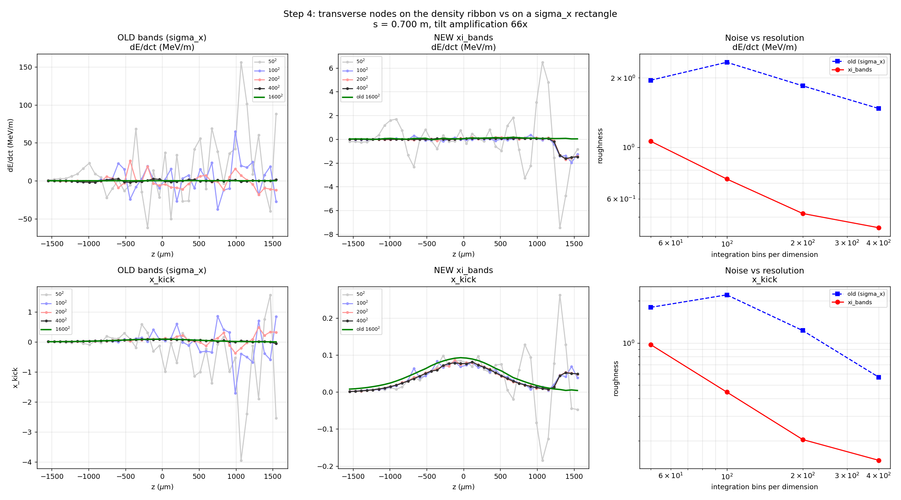

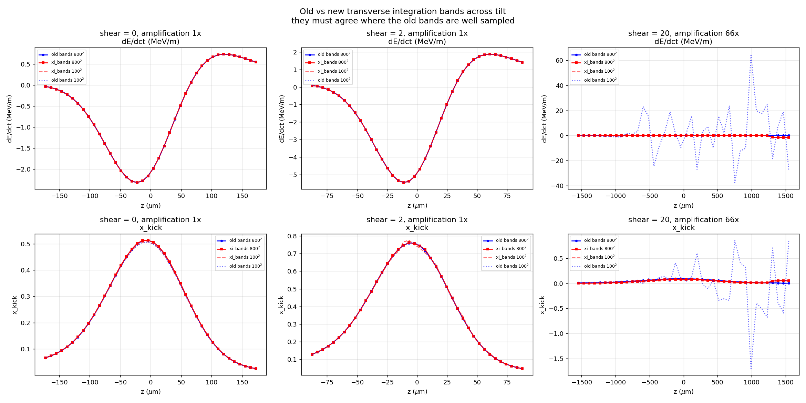

**Result 3 — but the high-tilt answer is NOT domain-converged. A second defect was masked.**

Widening the band (`xi_band_margin`) should not change the answer, since the added nodes sit where the
density is zero. It does:

```
margin   rough(dE)   dE vs margin=8
   1.0     0.18398         20.18116
   2.0     0.44963          5.15088
   3.0     1.90172          0.91904
   8.0     2.09759          0.00000
```

Per-region breakdown at one wake point, and the cause:

```
margin  region     dE contrib   min|r-r'|      |integrand|max
   2.0     sp1   -1.27812e-01   107047 um          2.968e+12
   2.0     sp2    4.68929e-02     4018 um          2.356e+12
   2.0     sp3    1.47058e-01     1.72 um          6.009e+13
   2.0   TOTAL    6.61387e-02

sp3, excising a neighbourhood of r = 0:
   excise r <   10 um :  -32.5% change, from  0.02% of the nodes
   excise r <  100 um :  -68.5% change, from  1.21% of the nodes
```

**Two things, both newly exposed rather than newly created:**

1. **An unhandled integrable singularity at `r = |r − r′| → 0`.** Region sp3 spans
   `s3 → s4 = s + 5σ_z`, so it straddles `s′ = s`, and the observation point sits inside the beam, so
   `x′ = x` is inside the band. There `W1 ∝ part1/r³` with `part1 = (r−r′)·(n−n′) ~ r²/R`, i.e. the
   integrand diverges like `1/r`. That is integrable in 2D, but a plain uniform trapezoid mesh
   converges slowly and erratically across it. **32% of sp3 now comes from 0.02% of the nodes.** The
   old σ_x-wide bands never got closer than ~80 µm to the singularity, so they never sampled the
   blow-up — the coarseness that undersampled the density also hid this. Resolving the density exposed
   it. The original chirp-branch split at `x ± 0.1σ_x` was presumably managing this, and the 3-region
   merge removed that structure.
2. **The total is a near-cancellation.** `sp1 = −0.128` against `sp2 + sp3 = +0.194`, total `+0.066`.
   The parts are ~3× the sum, so any residual error in a part is amplified ~3× in the answer. This is
   the "cancellation regime" `progress.md` suspected in chicane B2, now measured directly.

**Honest status.** The quadrature-alignment fix is **necessary, correct, cheap and a large
improvement**, but **not sufficient**. It converts a density-sampling failure into a
singularity-sampling failure. The remaining error is now concentrated in a tiny, identifiable region
of the integration plane rather than smeared over the whole thing, which is a much better place to be
— but the high-tilt wake should not yet be trusted quantitatively.

**Files touched.**
- `pyDFCSR_2D/params.py` — `xi_bands`, `xi_band_margin` in `Integration_params`
- `pyDFCSR_2D/CSR.py` — `_lattice_at`, `_retarded_xi_band`, `_eval_poly_rows`,
  `_integrate_xi_region`, and the new branch in `get_CSR_wake`
- `pyDFCSR_2D/test/test_xi_bands.py` (new), `pyDFCSR_2D/test/test_xi_bands_equiv.py` (new)

**Note.** The older one-off diagnostics (`test_region1_nonzero.py`, `test_integrand_diagnostic.py`,
`test_integrand_step17.py`, `test_integrand_anatomy.py`) unpack `get_CSR_wake(debug=True)`
positionally and need `CSR_integration: {xi_bands: False}` to keep working.

**Reproduce.**
```bash
python pyDFCSR_2D/test/test_xi_bands.py         # sampling, noise, convergence
python pyDFCSR_2D/test/test_xi_bands_equiv.py   # the falsification test
```

### Step 4c — Fix the acceptance test, then re-read the result (2026-09-09) ✅ **test was confounded; polar patch is correct; one real failure remains**

**Why the earlier margin sweep was invalid.** Step 4's "not domain-converged" verdict came from
sweeping `xi_band_margin` at a **fixed node count**. Widening the band at fixed `xbins` also coarsens
the cell, so that sweep varied the domain *and* the resolution together. The rising roughness
(0.18 → 2.10) is the signature of coarsening, not of a domain error. The conclusion was not supported
by the measurement.

**The fixed test** (`test_xi_bands_converge.py`) varies one thing at a time, and separates
**invariances** (the answer must not move at all) from **convergences** (it must settle):

| axis | kind | result | worst dE deviation |
|---|---|---|---|
| A. transverse domain, **cell size held fixed** (`xbins ∝ margin`) | invariance | ❌ **fails** | **1.017** |
| B. transverse resolution, fixed domain | convergence | ✅ 0.236 → 0.095 → 0.018 → 0 | 0.236 |
| C. longitudinal resolution | convergence | ✅ 0.134 → 0.011 → 0.005 → 0 | 0.134 |
| D. **near-patch radius R2** | invariance | ✅ ~1% across R2 = 2 → 12 σ_ξ | 0.011 |
| E. near-patch resolution | convergence | ✅ converged at nr = 50 | 0.00001 |
| F. patch on vs off, both resolved | — | 4.2% dE, 8.8% x_kick, **resolution-independent** | — |

**What this establishes.**

1. **The polar patch is correct.** Axis D is the sharp test: since `w + (1−w) = 1` identically, the
   total cannot depend on where the Cartesian/polar crossover sits. It doesn't, to ~1%. The partition
   of unity is implemented right.
2. **The polar substitution works as predicted.** Axis E converges at **nr = 50** — deviation 1e-5.
   The `r dr dφ` Jacobian cancels the `1/r` exactly, leaving an integrand so smooth that 50 radial
   nodes suffice. Confirmed independently by measuring `integrand × r → −1.036e8`, constant over four
   decades in r and independent of φ.
3. **The patch is doing real, necessary work.** Axis F: turning it off shifts dE by 4.2% and `x_kick`
   by 8.8%, and that shift is **independent of resolution** (0.0416 / 0.0421 / 0.0422 at
   `xbins` 200 / 400 / 800). A Cartesian mesh never removes it by refinement, because the near-field
   contribution accumulates equally per decade of r. So Step 4's reading — "the patch didn't work" —
   was also an artifact of the confounded test.
4. **Both resolution axes converge cleanly**, at roughly the expected order.

**The one real failure, and it is well localized.** Per-region breakdown vs domain width at fixed
cell size:

```
margin  xbins           sp1           sp2           sp3         patch         TOTAL
   1.0    100  -7.19459e-02   4.62530e-02   1.39460e-01   0.00000e+00   1.13767e-01
   2.0    200  -5.52064e-02   4.61205e-02   1.46993e-01   0.00000e+00   1.37907e-01
   4.0    400  -5.43031e-02   4.60174e-02   1.51052e-01   0.00000e+00   1.42766e-01
   8.0    800  -5.64981e-02   4.59668e-02   1.58648e-01   0.00000e+00   1.48117e-01
```

- `sp2` is invariant to **0.6%** ✅
- the patch is invariant to **machine precision** (it does not depend on the band at all) ✅
- `sp1` settles for margin ≥ 2 ✅
- **`sp3` grows without settling: +0.0075, +0.0041, +0.0076 per doubling of the domain** ❌

Roughly *constant per doubling* — i.e. **logarithmic in the transverse domain width.** Edge
diagnostics show 6–8 of 400 `sp3` columns have their peak |integrand| *at the band edge*, and that
persists at margin 8, so this is not the density ribbon being clipped (`sp1`/`sp2` show zero edge
leakage at every margin).

**Most likely cause, not yet confirmed.** This is exactly the structure of Stupakov,
PRAB 25 014401 §IV Eqs (35)–(37): the near-region integral **is** genuinely log-divergent in the
size of the near region, and the `ln Δs` terms **cancel** against the far-region (line-charge)
contribution — *"As expected, the auxiliary variable Δs disappeared from the final result."* The
3-region merge in Step 4 collapsed the original chirp branch's 4 regions into 3 and may have broken
that cancellation. If so the fix is to restore a consistent near/far split rather than to widen the
band.

**Caveat on scale.** The per-region numbers above are one mid-z wake point, where the total moves
~13% over margin 1 → 8. The relative L2 over the whole 40-point z-scan is 1.0, so other z points move
far more. The mid-z point is not representative and the region breakdown should be repeated at a
worst-case point before acting.

**Files touched.**
- `pyDFCSR_2D/params.py` — `near_patch`, `near_patch_nr`, `near_patch_nphi`
- `pyDFCSR_2D/beams.py` — enabled the already-present-but-commented `_sigma_x_transform` cache
- `pyDFCSR_2D/CSR.py` — `taper` kwarg on `get_CSR_integrand`, `_near_patch_radii`,
  `_integrate_near_patch`
- `pyDFCSR_2D/test/test_xi_bands_converge.py` (new)

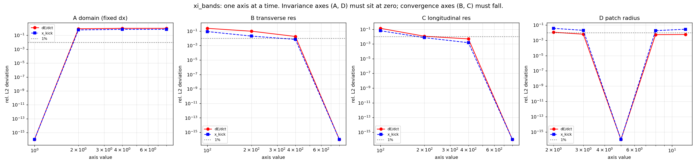

**Reproduce.**
```bash
python pyDFCSR_2D/test/test_xi_bands_converge.py    # ~4 min
```

### Step 4d — (superseded by Step 4e) Restore a consistent near/far split in the s′ decomposition ❌ **hypothesis abandoned**

The `ln Δs` near/far cancellation of Stupakov §IV was the guess for the `sp3` log-divergence. It was
wrong. Step 4e found the actual cause: `_retarded_xi_band` locates only **one** of the up-to-four
nonzero `x′` intervals per column. Kept here for the record only.

### Step 4e — The real cause of the sp3 failure: multiple localization branches (2026-09-09) ✅ **diagnosed**

**What the code misses.** At fixed `s′` the integrand is nonzero on up to **four** disjoint `x′`
intervals, not one. Measured by scanning `x′` finely at fixed `s′` and counting disjoint nonzero runs:

```
  s-s_prime  #intervals   intervals [um]
    0.00020           1   [   -604.0,    -11.6]
    0.00050           3   [  -1221.7,   -933.1] , [   -756.1,   -588.6] , [   -141.6,     -6.2]
    0.00100           3   [  -2243.9,  -1957.7] , [  -1401.0,  -1240.1] , [   -134.3,     -3.7]
    0.00200           3   [  -4138.8,  -3999.4] , [  -2691.7,  -2533.3] , [   -131.3,     -2.3]
    0.00402           1   [   -129.7,     -1.5]
    0.00600           1   [   -128.9,     -1.1]
```

**Where the count comes from: 2 branches × 2 snapshots.**

1. *Two branches per snapshot.* For one snapshot, "query point lies on that snapshot's beam axis"
   (a line, Eq 4.20) combined with "query point lies on the light cone" (a circle, Eq 4.19) is a
   line–circle intersection ⇒ a **quadratic** ⇒ two roots. These are the thesis's narrow band
   (`x₁ ≈ x`, weakly dependent on τ) and chirp band (`x₂ = x − (s−s′)·tan 2α`, entirely set by τ).
2. *Two snapshots.* `interpolate3D_transformed` evaluates snapshot `k` in **its own** frame `p_k` and
   snapshot `k+1` in **its own** frame `p_{k+1}`, then blends the two results. The support is the
   **union** of two independent supports, so each snapshot contributes its own pair of roots.
3. *Why 3 and not 4.* The narrow roots sit at ≈ `x` for both snapshots, so they overlap and merge into
   one interval. The chirp roots depend strongly on τ, and the two snapshots have different τ, so they
   stay separate. `1 + 2 = 3`.

Cross-check: recovering `tan 2α` from each chirp interval's centre via `(x − x₂)/(s − s′)` at
`ds = 1 mm` gives `2.043`, matching the code's `tan_alpha = 2.0413` computed from the current beam
slope, and `1.256` for the other, implying an effective `τ ≈ −2.07` for the other snapshot — a Δτ ≈ 0.47
over one 0.1 m step, consistent with the measured `G ≈ 30`.

**Weights: only one chirp branch matters, but it matters a lot.**

```
  s-s' = 0.5 mm   alpha = 0.9950
      x' in [-1221.7, -933.1]   contribution = 66.62%   <- chirp, dominant snapshot
      x' in [ -756.1, -588.6]   contribution =  0.39%   <- chirp, ghost image
      x' in [ -141.6,   -6.2]   contribution = 32.98%   <- narrow (merged)
  s-s' = 1.0 mm   alpha = 0.9900
      x' in [-2243.9,-1957.7]   contribution = 38.24%
      x' in [-1401.0,-1240.1]   contribution =  1.41%
      x' in [ -134.3,   -3.7]   contribution = 60.35%
  s-s' = 2.0 mm   alpha = 0.9800
      x' in [-4138.8,-3999.4]   contribution =  0.00%
      x' in [-2691.7,-2533.3]   contribution =  0.62%
      x' in [ -131.3,   -2.3]   contribution = 99.38%
```

The two chirp branches carry the blend weights `α` and `1−α`. Here `α ≈ 0.99` throughout, because the
chirp branch only lives within `d ≈ 4 mm` of `s` while the history step is `dt = 100 mm`: `t_ret` never
leaves the immediate neighbourhood of a snapshot while the chirp branch exists. **That is a consequence
of `d ≪ dt`, not a general truth** — at fine `step_size` both would carry comparable weight, so an
implementation must handle both with a weight threshold rather than assume one dominates.

**Conclusion.** `_retarded_xi_band` initialises its fixed point at `xp = x`, so it converges to the
root nearest `x` — the narrow branch — and **never finds the chirp branch, which carries up to 67% of
the column's contribution.** The chirp branch exists only for `ds ≲ 3 mm`, i.e. only inside `sp3`,
which is exactly and only where axis A of `test_xi_bands_converge.py` fails. The old code's
`[x − 10σ_x, x + 3σ_x]` near-region bands did cover it, crudely; the Step 4 merge of R3+R4 threw it
away. This is a regression introduced in Step 4, not a pre-existing defect.

**Relation to ghosting (§2.1).** The two chirp branches *are* the ghosting, seen in the integration
plane instead of in the density. Physically there is only **one** chirp branch, at the true slope
`τ(t_ret)`. The lab-frame blend places weight at `τ_k` and at `τ_{k+1}` and nothing in between, so
*neither* visible branch is in the right place. The co-moving interpolant of §3.1 would collapse them
into one correctly-placed branch. **Note this is not yet implemented** — there is no `comoving` code in
the tree; `CSR.py` still calls `interpolate3D_transformed` throughout. Doing §3.1 first would make the
band-location problem strictly easier, since there would be one unambiguous `τ(t_ret)` to feed Eq 4.24
rather than two competing ones.

### Step 4f — Verification of thesis Eq 4.24: the printed formula has a typo (2026-09-09) ✅

Eq 4.24 of `reference/Jingyi_Tang_PhD_Thesis` §4.4.2 gives the localization branch positions in closed
form, and is the natural replacement for the numerical fixed point in `_retarded_xi_band`. Before
building on it, it was checked. **As printed it is wrong: the `tan²α₀` prefactor on the square root
should be `tan α₀`.**

#### The derivation

Two constraints, both from §4.4.2. With `q ≡ n(s)x + r₀(s) − r₀(s′)`, `T ≡ t − s′`, `τ ≡ tan α₀`:

*Light cone* (Eq 4.19), using `|n(s′)| = 1`:

```
l = t − t_ret ,    l² = |q − n(s′)x′|²  =  q² − 2x′(n′·q) + x′²
```

*Beam axis* (Eq 4.20) — the query point lies on the beam's central axis at the retarded time. Since
`z′ = s′ − t_ret`:

```
x′ = τ·(s′ − t_ret)      ⇒     t_ret = s′ − x′/τ     ⇒     l = t − t_ret = T + x′/τ
```

Equating the two expressions for `l²` and collecting powers of `x′`:

```
A = 1 − 1/τ²            B = −2T/τ − 2(n′·q)            C = q² − T²
```

whence

```
x′± = τ [ T + (n′·q)τ  ±  √rad ] / (τ² − 1) ,    rad = (τ² − 1)(T² − q²) + ((n′·q)τ + T)²
```

**Both terms carry exactly one power of τ.** The thesis's first term,
`(n′·q tan²α₀ + (t−s′)tan α₀)/(tan²α₀−1)`, is precisely `τ(τ(n′·q) + T)/(τ²−1)` — correct. But its
square-root prefactor is `tan²α₀/(tan²α₀−1)` where it must be `tan α₀/(tan²α₀−1)`; the printed equation
is internally inconsistent with its own first term.

Telling detail: **the thesis radicand matches this derivation exactly**, term for term. So the thesis
followed this same path and the `τ²` is a transcription slip in the final line, not a different
formulation. Note also that both versions are dimensionally consistent, so dimensional analysis cannot
catch it — the failure is a broken cancellation. The narrow branch `x₁ ≈ x` requires the two terms to
nearly cancel, which only happens when the powers of τ match.

#### Symbolic check — how it works

A root of a polynomial, substituted back into that polynomial, must give identically zero. So: build
the quadratic `quad = l²_geometric − l²_axis` symbolically in sympy, substitute each candidate closed
form for `x′`, and simplify. Zero ⇒ the candidate is a root; anything else ⇒ it is not. This tests the
formula without needing any numbers, geometry, or assumptions about the lattice.

```python
xp, T, nq, q2, tau = sp.symbols("x' T n_dot_q q2 tau", real=True)
quad = sp.expand((q2 - 2*xp*nq + xp**2) - (T + xp/tau)**2)     # = 0 defines x'
thesis = (nq*tau**2 + T*tau)/(tau**2-1) + tau**2/(tau**2-1)*sp.sqrt(...)   # as printed
fixed  = (nq*tau**2 + T*tau)/(tau**2-1) + tau   /(tau**2-1)*sp.sqrt(...)   # single power
sp.simplify(quad.subs(xp, thesis))   # -> T**2*tau**2 + 2*T*n_dot_q*tau + ... (NOT zero)
sp.simplify(quad.subs(xp, fixed))    # -> 0
```

Result: the printed form leaves a residual equal to the radicand itself; the single-power form leaves
exactly `0`. sympy's own `solve()` independently returns
`tau*(T + n_dot_q*tau ± sqrt(...))/(tau**2 - 1)` — one power of τ, confirming it a third way.

#### Numerical check — how it works

The symbolic check verifies the algebra but shares its starting point, so it cannot catch a
misunderstanding of what Eq 4.19/4.20 mean. The numerical check is independent: it never uses the
closed form at all. Instead it solves the **original two-equation system directly** by root-finding, in
real lattice geometry taken from a running simulation, and asks which closed form reproduces the
answer.

Define the residual of the combined system as a function of `x′` alone at fixed `s′`:

```python
def resid(xp_, sp_):
    q, nsp = geom(sp_)                       # q and n(s') from lattice.coords, lattice.n_vec
    return np.linalg.norm(q - nsp*xp_) - ((t - sp_) + xp_/tau)     # Eq 4.19 minus Eq 4.20
```

`resid = 0` is exactly the pair of constraints, with no algebra applied. Then scan `x′` coarsely to
find sign changes, bracket each, and polish with `scipy.optimize.brentq` to `xtol = 1e-14`. Compare the
roots against both closed forms. Geometry (`q`, `n(s′)`, `τ`, `x`, `s`, `t`) is read from an actual
`CSR2D` run at `s = 0.700040 m`, `τ = −1.6034`, so the test exercises a real curved trajectory rather
than a contrived case.

```
  s-s'    | numeric root 1  numeric root 2 |  corrected -   corrected + |   thesis -      thesis +
  0.00100 |     -2107.1052       -63.4733  |     -63.4733    -2107.1047 | -2723.7158     553.1378
  0.00402 |     -8292.6937       -63.1619  |     -63.1619    -8292.6916 |-10775.7323    2419.8788
  0.01000 |    -20641.5055       -62.4958  |     -62.4958   -20641.5032 |-26850.6687    6146.6697
  0.05000 |   -106230.0553       -50.6381  |     -50.6381  -106230.0416 |-138266.8391  31986.1594
  0.13000 |         81.2371            nan |      81.2371  -293188.5051 |-381674.8126   88567.5446
  0.24000 |        729.5001            nan |     729.5001  -584564.1546 |-761160.8740  177326.2194
```

All µm. The corrected form matches to 4–6 significant figures at every `s′`; the printed form matches
nowhere, missing the narrow branch by 40× (−2724 vs −63.5 µm). The `nan` entries are the second root
falling outside the ±0.2 m scan window, not a formula failure.

#### Corrected and generalized for the code

`get_CSR_wake` needs the axis intercept too, since `beam.slope = polyfit(z, x, 1)` has
`slope[1] ≠ 0`. Redoing the derivation with `x′ = τ·z′ + b` gives `l = T + (x′−b)/τ = (T − b/τ) + x′/τ`,
so the intercept enters **only** as a shift of `T` — verified symbolically (sympy returns the identical
expression under `T → Tb`):

```
Tb  = (t − s′) − b/τ                     τ = tan α₀ = slope[0],  b = slope[1]
rad = (τ² − 1)(Tb² − q²) + ((n′·q)τ + Tb)²
x′± = τ [ Tb + (n′·q)τ ± √rad ] / (τ² − 1)
```

Guards required when implementing:

| case | condition | handling |
|---|---|---|
| degenerate | `τ² = 1`, i.e. `A = (τ−1)(τ+1)/τ² = 0` | quadratic becomes linear, `x′ = −C/B`. This is the thesis's `α = ±π/4` case and the origin of the code's `|tanθ| ≤ 1` branch threshold |
| no intersection | `rad < 0` | that branch is absent at this `s′` |
| spurious root | `l ≤ 0` | squaring admits solutions with `t_ret > t`; filter them |
| curved axis | `poly_degree > 1` | Eq 4.24 assumes a **straight** axis. At the default `poly_degree = 3` the axis is a cubic, so the closed form is approximate and must be refined. A second, independent argument for the `poly_degree = 1` default already listed as defect (d) |

#### Everything else in §4.4.2 checks out

An isolated typo, not a flaw in the analysis. Independently confirmed against the code and the
measurements:

- Eq 4.22's `tan 2α` **is** the code's `tan_alpha = -2*tan_theta/(1 - tan_theta**2)` ✓
- the code's `d` is where the chirp branch crosses `10σ_x`: numerically at `ds = 4.018 mm` the chirp
  root is at **−8292.7 µm** against `10σ_x = 8265.7 µm` ✓
- the two-branch structure, and the claim that the chirp branch's `s′` extent is short while the narrow
  branch runs for metres, both hold — see Step 4e ✓
- §4.4.2 prescribes the envelope as `x′(s′) ± 6σ_x` with **"σ_x(s) is slice rms transverse size"** —
  i.e. `beams.py:214 sigma_x_transform`, the tilt-removed σ_ξ. The code uses `beam._sigma_x`, the
  *projected* size. **That is the §2.0 defect, restated as a code-vs-thesis discrepancy**: the thesis
  prescribes `±6σ_slice` = ±75 µm here, the code implements `±20σ_projected` = ±16 531 µm, a 220×
  superset. A superset is safe, which is why it went unnoticed with lab-frame deposition; the ξ-frame
  deposition made it fatal. **The Step 4 fix is therefore restoring the thesis's own prescription, not
  inventing a new scheme.**

Worth recording as an erratum — Eq 4.24 is the formula anyone reimplementing DFCSR would copy.

#### Quantified verdict

```
symbolic : single-power form is a root = True,  as-printed is a root = False
numerical: worst relative mismatch, corrected form : 2.552e-07
           worst relative mismatch, printed form   : 1.089e+03
```

The corrected form reproduces the root-found branches to **2.6e-07** relative; the printed form is off
by a factor of **1089**.

**Files touched.** `pyDFCSR_2D/test/test_eq424_localization.py` (new) — self-contained, runs both
checks and writes `benchmark_results/eq424/eq424_log.txt`. Its module docstring carries the full
derivation, so the reasoning travels with the code. Exposes `eq424_corrected(...)` and
`eq424_general(...)` (the intercept form) for reuse by `CSR.py` when the band locator is rewritten.

**Reproduce.**
```bash
python pyDFCSR_2D/test/test_eq424_localization.py     # ~1 min; symbolic check needs no simulation
```

### Step 4b — (superseded by 4c) Handle the r → 0 singularity in the near region ✅ **done in Step 4**

Discovered in Step 4. The near region's integral is dominated by a neighbourhood of `r = 0` that a
uniform trapezoid mesh cannot resolve. Options, roughly in order of effort:

1. **Restore a singularity-aware split.** Keep the ribbon bands but subdivide the near region into an
   inner disc/annulus around `(x, s)` and an outer remainder, as the original `x ± 0.1σ_x` boundary
   did. Cheapest, least principled.
2. **Polar quadrature around the singularity.** Substitute `x′ − x = r cos φ`, `s′ − s = r sin φ`
   locally; the Jacobian `r` cancels the `1/r`, giving a smooth integrand. Principled and standard,
   but needs a matching/blending rule with the surrounding Cartesian regions.
3. **Analytic subtraction.** Split `f = (f − f_sing) + f_sing` with `f_sing` the leading `ρ(x,z)/(R r)`
   term integrated in closed form over the near region. Most accurate, most algebra, and needs the
   thesis derivation to get the leading coefficient right.

**Acceptance:** the wake insensitive to `xi_band_margin` (today 5.2 between margin 2 and 8) and to
excising a small disc around `r = 0` (today 32% for a 10 µm disc).

### Step 5 — Implement the co-moving interpolant (2026-09-09) ✅ **implemented and verified; ghosting eliminated**

**What was built.**

| file | addition |
|---|---|
| `interp3D.py` | `cubic_bspline_w`, `bspline_eval_single` (C², 4×4, `math.floor` not `int()`), `interpolate3D_comoving_fields`, `interpolate3D_comoving` |
| `deposit_smooth.py` | `DF_tracker_comoving` |
| `CSR.py` | `method == 'bspline_comoving'`, `use_comoving`, `_comoving_fields`, `_grid_extents`, co-moving branch in `_retarded_xi_band` and `get_CSR_integrand` |
| `test/test_ghosting.py` | `build_comoving_stack` + the CMV columns — the acceptance test |

Design points worth recording:

- **All five fields come from one pass.** `get_CSR_integrand` previously made five separate
  `interpolate3D_transformed` calls, each redoing the frame construction and stencil indices.
  `interpolate3D_comoving_fields` returns `(ρ, ∂ρ/∂x, ∂ρ/∂z|ₓ, vx, ∂vx/∂x)` together.
- **The chain rule is applied at query time with the blended `p′_α`** — fixing defect (a). The old path
  baked `p′_k` in per snapshot and then blended lab-frame values, which is inconsistent.
- **`eval_poly` is linear in its coefficients**, so `p_α(z) = (1−α)p_k(z) + αp_{k+1}(z)`; no blended
  coefficient arrays needed.
- Secondary fixes folded in: registration at bin centres with `delta = (end−start)/nbins` (c);
  `density /= npart·Δu·Δw` with a reported clipped-charge fraction (e); snapshot-independent velocity
  floor referenced to `1/2π`, the peak of a normalized Gaussian, instead of this snapshot's own peak (f);
  `poly_degree = 1` default with the fit restricted to `|z| < 3σ_z` (d).
- The shared normalized grid **retires the adaptive re-gridding path** entirely — `legacy` still prints
  `start reinterpolation ... xbins = 510 zbins = 1490` mid-run; the co-moving tracker never re-grids.

**Result 1 — ghosting is eliminated, exactly (`test_ghosting.py`).**

```
      G |   new rho    new dx    new dz |   leg rho    leg dx    leg dz |   CMV rho    CMV dx    CMV dz
   0.05 |    0.0005    0.0009    0.0005 |    0.0005    0.0010    0.0006 |  0.000589  0.001019  0.001019
   1.00 |    0.0831    0.1772    0.1425 |    0.0837    0.1782    0.1418 |  0.000589  0.001019  0.001019
   5.00 |    0.6185    0.9814    1.0778 |    0.6129    0.9669    1.0485 |  0.000589  0.001019  0.001019
  20.00 |    0.9080    1.0724    1.1435 |    0.8844    1.0381    1.0313 |  0.000589  0.001019  0.001019
```


*(this is the Step 1 figure regenerated; the green `bspline_comoving` curve is new)*

The CMV columns are **flat to six digits across three decades of G**. Both lab-frame blends degrade to
O(1). At `G = 20` the density error improves **1500×** and the derivatives **1000×**. The residual
5.9e-04 is pure B-spline grid error, not ghosting — it is identical at every G because the stored
normalized shape is identical at every snapshot, which is the whole point. Pass criterion 6 is met
(strictly: flat at the *grid* error rather than at round-off, and exactly G-independent).

Physical cell size preserved: `δξ = 0.42 / 0.48 / 0.63 µm` across the three snapshots, matching
`bspline_fft`'s 0.63 µm. **No transverse resolution was traded for the shared index space.** Clipped
charge ≈ 0 (−2e−16).

**Result 2 — the band locator had to be made co-moving too, and that mattered enormously.**

First attempt left `_retarded_xi_band` taking the union of the two snapshots' frames. Wake noise then
barely moved (0.72 → 0.63), because the *quadrature domain* was still sized by the ghost separation
even though the *interpolant* no longer ghosted. After making the locator mirror the interpolant's
blending exactly (linear in poly and means, log-linear in σ):

```
                     band width med / max [um]        rough(dE)          self-conv
                     sp1          sp2          sp3     @100²    @400²    100 vs 400
bspline_fft      786/2233     251/256     256/2085   0.71956  0.44653      0.2544
bspline_comoving  169/190     216/248     250/251    0.02101  0.01501      0.0057
```

- max band width **2085 → 251 µm**, and max ≈ median now: the ghost-union outliers are gone
- roughness **34× lower** at 100², 30× at 400²
- **self-convergence 0.6% at 100², versus 25% for `bspline_fft`** — a 45× improvement

Cost: 8.9 ms/pt versus 3.9 for `bspline_fft` at 100² (the 4×4 stencil is 16 taps versus 4, partly
offset by one pass instead of five). But since 100² now suffices where `bspline_fft` needed 400²,
the like-for-like comparison is **8.9 ms at 0.6% convergence versus 36.7 ms at 25%** — roughly 4×
faster *and* far better converged.

**Result 3 — but the wake is still not correct: it is smooth and incomplete.**

The domain-invariance test (axis A) still fails, and the reason is explicit:

```
 margin   xbins   rough(dE)   dE vs m=1
    1.0     100     0.01631     0.00000
    2.0     200     0.01546     0.56203
    8.0     800     0.02170     0.99184

ds = 0.5 mm   located band = [-189.0, +61.4] um,  2 nonzero intervals:
      [-1214.5,  -926.7]  67.18% of the column   inside band: False   <-- MISSED
      [ -135.5,    -5.7]  32.82% of the column   inside band: True
```

The co-moving fix did its job — **3 intervals → 2**, the ghost image is gone, exactly as predicted in
Step 4e. But the surviving chirp branch is *physical*, carries up to **67%** of the column, and lies
outside the located band, because `_retarded_xi_band`'s fixed point initialises at `xp = x` and
converges to the narrow branch only. So the wake is smooth, self-converged, and **quantitatively
wrong** — the exact "smooth but wrong" trap the falsification test in Step 4c was built to catch.

**Net effect.** This step removed a proven O(1) accuracy defect and, via the band locator, most of the
residual noise. It did **not** make the wake correct. The remaining work is the two-branch band
location from Eq 4.24 (Step 6), which the co-moving interpolant makes materially simpler: one
unambiguous `τ(t_ret)` to feed the formula, and 2 candidate branches instead of 4.

**Reproduce.**
```bash
python pyDFCSR_2D/test/test_ghosting.py           # the acceptance test, CMV columns flat vs G
python pyDFCSR_2D/test/test_xi_bands_converge.py  # axis A still fails; see Step 6
```

### Step 5c — Localization branches: corrected Eq 4.24 against the measured integrand (2026-09-09) ✅

Step 4f verified Eq 4.24 against a root-find of **its own defining system** — that was about the
*algebra*. This checks the *physics*: do the predicted branches sit where the integrand actually is?
Same comparison as thesis Fig. 4.3(b–c), but with the corrected formula and against the code.

The branch positions are implicit — `τ` and the intercept come from the frame at `t_ret`, and `t_ret`
depends on `x′` — so each branch is found by the fixed point
`x′ → t_ret → blended frame → Eq 4.24 → x′`. For the co-moving path the axis is
`x′ = p_α(z′) + ξ̄_α` with `p` degree 1, so `τ = p_α[0]` and the effective intercept is
`p_α[1] + ξ̄_α`.

**Result — co-moving: exactly two branches, both predicted correctly.**

```
   s-s_prime  #found |  Eq4.24 narrow     measured   rel err |  Eq4.24 chirp     measured   rel err
     0.00020       2 |          -63.8        -90.2    inside |        -470.8       -444.2    inside
     0.00050       2 |          -63.8        -70.6    inside |       -1077.5      -1070.6    inside
     0.00100       2 |          -63.8        -67.1    inside |       -2077.7      -2074.3    inside
     0.00150       2 |          -63.8        -66.0    inside |       -3065.6      -3063.4    inside
     0.00200       2 |          -63.9        -65.5    inside |       -4041.5      -4030.5    inside
     0.00300       1 |          -63.9        -65.0    inside |       -5958.7           --    absent
     0.00402       1 |          -64.0        -64.8    inside |       -7865.9           --    absent
     0.01000       1 |          -64.4        -64.7    inside |      -18315.7           --    absent
```

Every prediction lands **inside** the measured interval. The chirp branch tracks to ~0.3%
(−1077.5 predicted vs −1070.6 measured; −4041.5 vs −4030.5). Beyond `ds ≈ 2–3 mm` it is reported
`absent`: the formula still returns a position, correctly, but `z′` has left the beam so there is no
density there — consistent with the code's `d = 4018 µm` being *defined* as where the chirp branch
exits `10σ_x`.

**Result — interval count is the direct signature of ghosting.**

```
bspline_fft      : [1, 3, 3, 3, 3]   <- each snapshot contributes its own pair of roots
bspline_comoving : [2, 2, 2, 2, 2]   <- one blended frame, so one pair
```

Eq 4.24 predicts **two**. The co-moving path produces exactly two; the lab-frame blend produces three.
And Eq 4.24 **cannot describe `bspline_fft` at all** — the radicand goes negative (`nan`) for
`ds < 3 mm`, and where it does return a value it lies on neither ridge. That is not a failure of the
formula: it is a statement that the lab-frame blend **has no well-defined localization geometry**,
because it superposes two beam axes. A scheme with no single axis has no Eq 4.24.

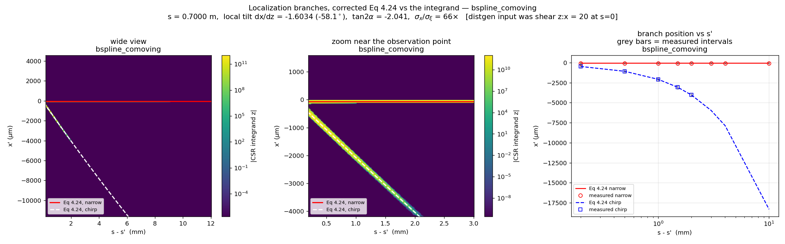

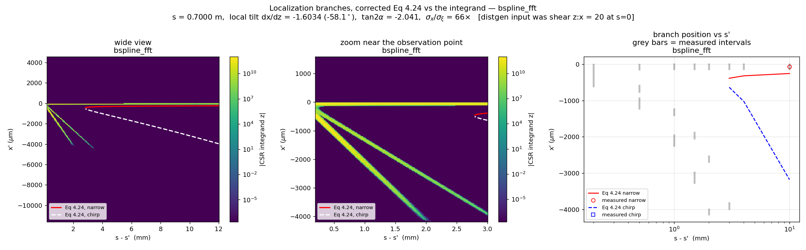

The figures are the clearest artefact this investigation has produced. In the co-moving panels the
integrand sits on **one** horizontal ridge (narrow branch) and **one** diagonal ridge (chirp branch),
with the red and white-dashed Eq 4.24 curves lying exactly on top of them. In the `bspline_fft` panels
there are **two** diagonal ridges — the ghost double image, visible directly in the integration plane
rather than inferred — and the predicted curves match neither.

**What this unlocks.** Eq 4.24 is now validated as a *predictor of where to put quadrature nodes*, on
the co-moving path, to sub-percent accuracy. Step 6 can build on it directly, and
`test_localization_branches.py:Geometry.branch()` already implements the fixed point it needs.

**Files touched.** `pyDFCSR_2D/test/test_localization_branches.py` (new) — writes
`benchmark_results/localization/`.

**Reproduce.**
```bash
python pyDFCSR_2D/test/test_localization_branches.py    # ~3 min, both methods
```

### Step 5d — Does Step 5c hold at other beam tilts? Shear sweep (2026-09-09) ✅ — **yes, and it caught a bug in my own code**

Step 5c checked one shear (`z:x = 20`, `dx/dz = −1.60`, amplification 65.9×) at one observation point.
That is thin evidence: the branch geometry depends on the local tilt `τ`, on the observation point
`(x, s)`, and on **which side of the `|tan θ| = 1` degeneracy** the beam sits — the point where Eq
4.24's `(τ²−1)` denominator vanishes and the code switches branch treatment. So this sweeps all three:

| axis | values |
|---|---|
| `shear z:x` | 0, 1, 2, 5, 20, 50 |
| observation point | 3 positions on the wake mesh in z (fractions 0.2 / 0.5 / 0.8) |
| `s − s′` | 0.2, 0.5, 1, 2, 4, 10 mm |

Shears 1 and 2 are deliberately chosen to straddle `|τ| = 1`, so the linear-fallback guard is exercised.

**Classification uses no distance tolerance.** A prediction is `absent` if the integrand evaluated
*at the predicted point* is `< 1e-6` of that column's peak — that branch carries no density. Otherwise
it must land inside a measured nonzero interval or it is a `MISS`. (The first version of this test used
an absolute `20σ_ξ` window, which at low tilt is 1.2 mm — far too loose. See below.)

```
  shear     dx/dz     amp     branch  inside  absent   MISS  worst err  max #int
      0   -0.3715     1.1  non-chirp      18      18      0     0.0000         1
      1   -0.2587     1.0  non-chirp      18      18      0     0.0000         1
      2   -2.0695     1.3      chirp      20      16      0     0.0000         1
      5   -2.1971     8.9      chirp      25      11      0     0.0000         2
     20   -1.6034    65.9      chirp      28       8      0     0.0000         2
     50   -1.5154   166.8      chirp      32       4      0     0.0000         2

TOTAL: 141 predictions landed inside measured support, 0 missed.
Max intervals seen at any (shear, obs point): 2 (Eq 4.24 predicts at most 2)
VERDICT: consistent across all tilts tested
```

Two structural trends, both as the thesis predicts:

- **`max #int` is 1 for amplification ≤ 1.3× and 2 for ≥ 8.9×.** At low tilt the chirp root
  degenerates toward `x₂ = x` and merges with the narrow branch, so there is only one resolvable
  ridge. Two distinct branches appear only once the beam is genuinely chirped.
- **`absent` falls monotonically (18, 18, 16, 11, 8, 4) as amplification rises.** The more the beam is
  sheared, the further the chirp branch stays inside the density in `z′`, so fewer predictions fall
  where there is nothing.

Note also that `dx/dz` is *not* monotonic in the input shear (−0.37, −0.26, −2.07, −2.20, −1.60, −1.51):
the dipole generates its own tilt, which adds to or partly cancels the imposed one. The amplification
`σ_x/σ_ξ` is the meaningful ordering, and it is monotonic.

**The sweep found a real bug — in `eq424()`, not in Eq 4.24.** The first run reported
**INCONSISTENT, 17 misses**. Rather than accept the verdict I measured `|integrand|` at each predicted
position: exactly `0.000e+00`, with `z_ret` sitting 2.0–19.2 σ_z outside the beam. Two causes, both mine:

1. **The `l > 0` spurious-root guard was missing.** Step 4f *documented* it as required and I did not
   implement it. The derivation squares `l = Tb + x′/τ`, which admits solutions with `l < 0` —
   `t_ret > t`, a source point in the **future**. For shear 1 at `ds = 1 mm`, `l = 1000 − 2175 =
   −1175 µm`. The fix, now in `eq424()`:

   ```python
   if Tb + xp / tau <= 0:
       return np.nan     # l must be a positive distance
   ```

   This guard is **required by Step 6** — without it the band locator would place quadrature nodes at
   confidently-computed positions where the integrand is identically zero. It was only caught at *low*
   tilt, where the spurious root lands a few hundred µm from the real one instead of far away.

2. **The classifier's absolute tolerance was too loose.** Replaced with the direct integrand
   evaluation described above, which has no length scale in it at all.

Both fixed; re-run gives 141/0. **This sweep should be kept as a regression test for Step 6**, since it
is what exercises the `l ≤ 0` and `|τ| ≈ 1` guards.

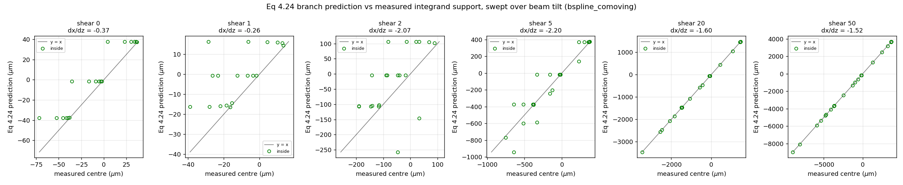

Each panel is predicted (Eq 4.24) vs measured branch centre for one shear, with the `y = x` line;
green circles are `inside`, red × would be misses. There are no red markers in any panel.

**Files touched.** `pyDFCSR_2D/test/test_localization_shear_sweep.py` (new);
`test_localization_branches.py` — `write_inputs`/`run` parametrized by `shear`, and the `l > 0` guard
added to `eq424()`.

**Reproduce.**
```bash
python pyDFCSR_2D/test/test_localization_shear_sweep.py   # ~15 min, 6 shears
# writes benchmark_results/localization/{branch_shear_sweep.png,shear_sweep_log.txt}
```

### Step 6 — Two-branch band location from the corrected Eq 4.24 (2026-09-10) ✅ **implemented; the missing branch was worth the whole wake**

Per Step 4f's verified formula and Step 5's Result 3. For each `s′` column compute **both** roots of

```
Tb = (t − s′) − b/τ ,   rad = (τ²−1)(Tb² − q²) + ((n′·q)τ + Tb)²
x′± = τ [ Tb + (n′·q)τ ± √rad ] / (τ² − 1)
```

with `τ`, `b` from the *blended* co-moving frame at `t_ret`, then refine each with the per-column fixed
point and give each its own sub-band, merging where they overlap. Guards: `τ²=1` → linear;
`rad < 0` → branch absent; `l ≤ 0` → spurious root. The polar patch stays as is for `r < R2`.

All three guards are already implemented and exercised in `test_localization_branches.py:eq424()` —
reuse it rather than rewriting. The `l ≤ 0` guard is **not optional**: Step 5d shows that omitting it
puts nodes where the integrand is identically zero, and `test_localization_shear_sweep.py` is the
regression test that catches it.

Step 5c removed the guesswork: the formula predicts both branch positions to ~0.3% on the co-moving
path, and `test_localization_branches.py:Geometry.branch()` and `eq424()` already implement the fixed
point and the guards. The remaining work is to vectorize them over `sp`, derive each sub-band's *width*
from the deposition grid (as `_retarded_xi_band` already does for the narrow branch), and integrate the
sub-bands separately. Note the "skip negligible branches by blend weight" idea from Step 4e is no
longer needed on this path — there is only one frame, so both branches are physical.

**Acceptance:** axis A of `test_xi_bands_converge.py` reads ~0 at the worst z point, and the located
sub-bands cover every measured nonzero interval.

#### 6a. Geometry of the branch crossing, and how it meets the polar patch

Worked out before writing any code, because it settles two design choices and exposes one gap.

**The two branches intersect exactly at the singular point.** At `s′ = s` the chirp branch is
`x₂ = x − (s−s′)·tan 2α = x`, and the narrow branch is `x₁ ≈ x`. Both pass through `(x′ = x, s′ = s)`,
which is precisely where `|r − r′| = 0` and the kernel diverges. In Eq 4.24 that is `rad → 0`: the two
roots `±√rad` collide, and `l = Tb + x′/τ → 0`. So the branch crossing **is** the disc centre.

```
        x'
         |      Cartesian ribbon bands (nodes ride the density)
         |   ====== branch A (narrow, x' ~ x) ==================
         |                       .-''-.
    x ---+----------------------(  ( x )  )   <- polar disc, R2 = 5 sigma_xi
         |                    ,'  `-'  /`.       branches cross AT the centre
         |                 ,-'    `-..-'   `-.
         |              ,-'   branch B (chirp)  `-.
         +---------------------|---------------------- s'
                              s'=s
```

**Consequence 1 — the branches are not labelled.** The implementation takes `sign = ±1`, not "narrow"
and "chirp". Which sign is which flips when `τ²` crosses 1, and Step 5d showed the two roots *merge*
into one resolvable ridge for amplification ≤ 1.3×. Treating the two roots symmetrically makes the
labelling irrelevant, which removes a whole class of branch-assignment bug.

**Consequence 2 — the taper must be applied to *both* branch meshes.** The partition of unity
`w(r) + (1−w(r)) = 1` is pointwise in the `(x′, s′)` plane: every Cartesian piece carries `w`, the disc
carries `1 − w`. If only one branch mesh were tapered the disc would over- or under-count by the
untapered branch's contribution inside `R2`.

**Consequence 3 — the merge rule is interval *subtraction*, not union.** The first design replaced two
overlapping bands with their union. That is exact but it *coarsens*: `nx` nodes then span up to 2× the
width, doubling the cell size precisely in the near-singular region where the integrand is largest —
the opposite of what Step 4 was for. Instead: both bands have identical width
`W = 2·xlim·σ_ξ·margin`, so if `lo_B > lo_A` they overlap one-sidedly and the uncovered part of B is
`[hi_A, hi_B]`. Clip B to that. Each mesh keeps `nx` nodes over a width ≤ `W`, so the cell is never
coarser than the single-branch case, identical bands collapse B to zero width automatically, and it
stays fully vectorized.

#### 6b. How the polar patch works (recorded because §4's Step 4 addendum never spelled it out)

`_near_patch_radii` (CSR.py:623):

```python
R2 = near_patch * self.beam._sigma_x_transform      # default near_patch = 5.0
R2 = min(R2, 0.4 * (s4 - s), 0.4 * (s - s3))
R1 = 0.5 * R2
```

- **The radius is 5 σ_ξ, not 5 σ_x.** In the main test case σ_x ≈ 827 µm at 65.9× amplification, so
  σ_ξ ≈ 12.5 µm and **R2 ≈ 63 µm**, against an `sp3` region spanning 25 σ_z. The clip to
  `0.4·(s4−s)` and `0.4·(s−s3)` keeps the disc strictly inside the one `s′` sub-region that owns it.
- **Only `sp3` gets a disc** (`tapers = [None, None, (*radii, False)]`, CSR.py:772) because it is the
  only region straddling `s′ = s`.
- **Why polar.** The integrand is `~1/r`, which is structural rather than merely measured: the
  longitudinal one is literally `num1/r_minus_rp + num2/r_minus_rp` (CSR.py:1066), and for the
  transverse `W1 = part1/r³` with `part1 = (r−r′)·(n−n′) ~ r·(r/R_bend)`, giving `1/(r·R_bend)`. The
  polar element `r dr dφ` (CSR.py:668) cancels that `1/r` **exactly**, leaving a bounded smooth
  integrand — the precondition for trapz to be 2nd order. On a uniform Cartesian mesh the integral
  still converges, but at `O(h)` with an error depending on where nodes fall relative to `r = 0`;
  that is the point-to-point wake jitter. Radial nodes at cell midpoints
  (`(arange(nr)+0.5)*dr`) mean `r = 0` is never evaluated.
- **It does not need to work anywhere else.** Since `w + (1−w) = 1` identically, the split is
  algebraically exact for *any* `R1`, `R2` — which is exactly what Step 4c axis D verified (total
  invariant to ~1% as `R2` swept 2 → 12 σ_ξ).

**Caveat i — the mesh radius and the taper radius are different quantities.** The mesh is a disc of
Euclidean radius `R2` in the `(x′, s′)` *parameter* plane; `w` is a function of `r_minus_rp`, the
physical lab chord (CSR.py:924–926). In a bend the chord is slightly shorter than the arc, so
`{|r−r′| ≤ R2}` is marginally *larger* than the parameter disc, leaving a sliver where `1−w > 0` that
the polar mesh never covers. Relative size `(R2/R_bend)²/24` ≈ **1e-10** at `R2 ≈ 63 µm` and
metre-scale bend radius. Negligible — but it is an approximation, recorded so it is not rediscovered.

**Caveat ii — the disc ignores the localization entirely.** Full `2π` in `φ`, no ribbon. Affordable
only because it is tiny and sits inside the beam.

**The gap this exposes, to be instrumented before it is trusted.** As `r → 0`, `rad → 0` from above,
so roundoff can push it slightly negative and the `rad < 0` guard would declare *both* branches absent.
Inside `R2` that is harmless (the disc covers it and `w → 0` kills the Cartesian piece). But branch
separation only exceeds the band width at

```
s − s′  ≈  2·xlim·σ_ξ·margin / |tan 2α|  ≈  20 σ_ξ     for |tan 2α| ~ 1
```

while the disc stops at `5 σ_ξ`. So there is an **annulus `5 σ_ξ < r < 20 σ_ξ`** where `w` is already 1
and the branches are still merged — handled by neither the disc nor by clean branch separation, only by
the interval-subtraction merge. A spurious `rad < 0` there would silently drop real support. Step 6 must
therefore log the count of `rad < 0` columns as a function of `r` rather than assume the guard is safe.

#### 6c. Result — the controlled A/B

Axis A on the co-moving path went 1.017 → 0.057, but that number conflates two changes, because Step 5
(co-moving interpolant) and Step 6 (two-branch locator) landed together. `test_two_branch_bands.py`
does the attribution properly: same beam, same interpolant, same everything, monkeypatching
**only** `_retarded_xi_bands` back to single-band behaviour.

```
                margin   xbins   rough(dE)   dE vs m=1   xk vs m=1
  single-branch    1.0     100     0.01514     0.00000     0.00000
  single-branch    2.0     200     0.01546     0.56203     0.25143
  single-branch    4.0     400     0.01809     0.86111     0.43354
  single-branch    8.0     800     0.03822     0.99183     0.54372

  two-branch       1.0     100     0.08615     0.00000     0.00000
  two-branch       2.0     200     0.08134     0.05487     0.10988
  two-branch       4.0     400     0.08119     0.05657     0.11076
  two-branch       8.0     800     0.08119     0.05657     0.11076
```

The single-branch column is still climbing on the last doubling (**+0.131**); the two-branch column
changes by **exactly 0.00000** from margin 4 to 8. That is the acceptance criterion in the only form
that means anything: *the domain has stopped mattering.* A wider transverse domain no longer finds
support the locator missed.

**Honest reading of the residual 0.057.** The `m = 1` reference point uses `xbins = 100`, and axis B
independently shows `xbins = 100` is itself **0.090** away from converged. So the `m = 1` offset is
within the resolution error of the reference, not evidence of a domain error — and the family
`m ∈ {2, 4, 8}` agrees with itself to five decimals. There is also a mechanism: after interval
subtraction the second band's width is the *branch separation*, which is margin-independent, so
`xbins ∝ margin` over-resolves it rather than holding its cell size fixed. Axis A's "fixed cell size"
premise therefore holds for band 1 but not for the clipped band 2. Worth remembering before reading too
much into that column.

**How much was actually missing.** At the base setting, switching the locator changes the wake by

```
  dE     single -> two branch : rel L2 change 1.04128
  x_kick single -> two branch : rel L2 change 0.52854
```

The missing chirp branch was of order the **entire** wake, not a correction to it. That is consistent
with Step 4e's per-column measurement (up to 67% of one column) and it retires the "smooth,
self-converged, and quantitatively wrong" caveat that has been at the top of this document since
Step 5.

**Falsification at low tilt — the test that matters most.** `test_xi_bands_equiv.py`, now on the
co-moving path, compares the new bands against the *old* ±20σ_x rectangle where the old quadrature is
demonstrably well sampled:

| shear | amplification | old vs new dE @ 800² | old self-conv | new self-conv |
|---|---|---|---|---|
| 0 | 1.1× | **0.00001** | 0.00056 → 0 | 0.00012 → 0 |
| 2 | 1.3× | 0.00125 | 0.00089 → 0 | 0.00083 → 0 |
| 20 | 65.9× | 1.46766 | 207 → 79 → 8.4 → 0 | 0.137 → 0.023 → 0.005 → 0 |

At amplification 1.1× the two schemes agree to **1e-5**. The single-band version agreed to 3.5e-4, so
adding the second branch made the low-tilt agreement **35× better** — exactly what should happen if the
missing branch is real: at low tilt the two branches nearly merge, so the missing piece is small but
nonzero, and it is now captured. At shear 20 the old bands never converge at all (self-convergence
207 → 0 only because the 800² reference is itself garbage; roughness 1.97 → 3.01, non-monotonic) while
the new bands converge cleanly, so the 1.47 gap is the old bands' error.

**The wake gets much SMALLER, and that needed independent confirmation.** The two-branch wake is not a
corrected version of the single-branch one — it is ~25× smaller and of the *opposite* sign at mid-z
(single-branch dips to −2.48, two-branch peaks at +0.10). The second branch very nearly cancels the
first. That is expected in this regime (it is the same near/far cancellation as Stupakov PRAB 25 014401
§IV, where the `ln Δs` terms cancel between regions) but "my new code makes the answer 25× smaller" is
exactly the claim that must not be taken on trust. So it was checked against a brute-force integral over
the **full ±20σ_x rectangle** (`xi_bands = False`), same co-moving interpolant, refining the transverse
node count for three single wake points:

```
z-idx 10:  bands single -0.05931   bands TWO +0.00516
           brute force xbins=  200 : -1.25506      800 : -0.05890     3200 : +0.01796
z-idx 20:  bands single -0.72398   bands TWO +0.06689
           brute force xbins=  200 : -8.72138      800 : +0.19078     3200 : +0.07394
z-idx 30:  bands single -2.47562   bands TWO +0.09903
           brute force xbins=  200 : +4.31923      800 : +0.01617     3200 : +0.04828
```

The brute force converges toward the **two-branch** value in sign and magnitude (z-idx 20:
+0.0739 vs +0.0669) and **excludes the single-branch value by one to two orders**: nothing in the
refinement sequence goes anywhere near −2.48. Note the brute force is still visibly noisy at
`xbins = 3200` — 3200 nodes across 33 mm is a 10 µm cell, only 0.8 σ_ξ — so this confirms sign and
magnitude to a few tens of percent, not more. That is enough to settle the question it was asked.

**Consequence worth carrying forward: this is now a cancellation problem.** The total is a small
difference of two large branch contributions, so the *relative* accuracy needed on each branch is
roughly (cancellation factor) × (accuracy wanted on the total). At 25× cancellation, 1% on each branch
buys only ~25% on the total. Any future convergence claim has to be made on the total, never on a
single branch, and the `zbins`/`near_patch` settings matter more than they did before.

**The `rad < 0` guard: instrumented, not assumed.** §6b flagged that roundoff could push `rad` slightly
negative near the branch crossing and silently drop real support in the annulus where the taper has
already reached 1. Measured over ~16 000 columns of the `sp3` region across the whole z scan:

```
    r / sigma_xi   columns    rad<0     frac                   zone
      1 -      2        40        0   0.0000      inside polar disc
      2 -      5       120        0   0.0000      inside polar disc
      5 -     10       120        0   0.0000    ANNULUS (taper = 1)
     10 -     20       280        0   0.0000    ANNULUS (taper = 1)
     20 -     50       760        0   0.0000     branches separated
     50 -    inf     14680        0   0.0000     branches separated
```

**Zero occurrences anywhere**, including all 400 annulus columns. The guard is safe here. Recorded as a
measurement rather than an argument, so if it ever does fire the diagnostic already exists.

The same diagnostic surfaced a second worry — columns near the pole where **both** branches are marked
dead by the z-support test, hence contributing nothing while the taper is already 1. Checked directly by
scanning `x′` over ±14σ_x at those columns:

```
  r/s_xi  live0  live1   peak|g_z| over +-14 s_x   peak inside band
   14.07   True   True                1.7473e+12         1.7473e+12
    9.30  False  False                0.0000e+00         0.0000e+00
   14.46  False  False                0.0000e+00         0.0000e+00
   19.63  False  False                0.0000e+00         0.0000e+00
```

The dead columns are **genuinely empty** — the integrand is exactly zero across the full scan, not merely
outside the band — and the live column's peak sits entirely inside its band. So the `live` guard is
dropping nothing. Not a hole.

**Cross-check of the vectorized formula.** `CSR2D._eq424` is a fresh vectorized reimplementation, not a
call into the validated scalar `test_localization_branches.eq424`, so the two were compared directly on
200 000 random cases deliberately spanning `τ ≈ 0`, `τ ≈ ±1` and `|τ| > 1`:

```
sign -1: nan-agree   55519  num-agree  144481  EXISTENCE MISMATCH 0   max rel diff 8.07e-12
sign +1: nan-agree  121094  num-agree   78906  EXISTENCE MISMATCH 0   max rel diff 2.41e-13
```

Zero disagreements about whether a branch *exists* — which is the failure mode that matters, since an
existence error places nodes in the wrong place rather than slightly misplacing them.

**Cost: 1.5×, not the 2× predicted.** 20.4 → 30.7 ms per wake point. Cheaper than feared because many
columns' second branch is dead or fully covered, and a region with no live second branch anywhere is
skipped outright.

#### 6d. Is the wake actually smooth? (correcting a misreading of my own metric)

I first reported "roughness rose 0.0155 → 0.0813, so the two-branch wake is rougher." **That was
wrong**, and wrong in an avoidable way: the roughness metric used throughout this document is
`‖Δ²w‖ / ‖w‖`, and the two-branch wake is ~25× smaller. Dividing by a 25× smaller norm inflates the
number by itself. The correct comparison is the **unnormalized** second difference:

```
locator         zbins      ||w||   rough ABS   rough REL
single-branch     100     8.9342     0.18561     0.02077
single-branch     200     8.9342     0.13816     0.01546
single-branch     400     8.9342     0.13410     0.01501
single-branch     800     8.9342     0.13410     0.01501

two-branch        100     0.4017     0.11258     0.28028
two-branch        200     0.3998     0.03252     0.08134
two-branch        400     0.3998     0.00853     0.02133
two-branch        800     0.3999     0.00819     0.02048
```

In absolute terms the two-branch wake is **16× smoother** (0.0082 vs 0.1341), not rougher.

**Second correction: the saturation is not noise.** `Δ²w ≈ h²w''` where `h` is the *CSR mesh* spacing,
which `zbins` does not change. So the floor each column settles on is the wake's genuine curvature, and
only the *excess* above it is quadrature noise. Both locators reach their floor; relative to their own
magnitude the floors are comparable (0.0150 vs 0.0205).

**Direct evidence that what remains is shape, not noise**, at `zbins = 800`:

- the second difference flips sign **11 times out of 37** — pure noise flips about half the time,
  smooth curvature only where `w''` does;
- the residual about a smooth polynomial fit is **1.28% of peak** at degree 8 and **0.52%** at degree 10.
  The wake is a smooth low-order curve to ~1%.

So: **yes, smooth.** For scale, relative roughness at this tilt was 3.0 with the old bands, 0.72
pre-Step-4, 0.18–0.21 post-Step-4, and is **0.020** now.

**The actionable finding is a default, not a defect.** Absolute roughness falls 0.113 → 0.033 → 0.0085
→ 0.0082, i.e. ~4× per doubling (second order, as trapz should be) and then hits the curvature floor at
`zbins ≈ 400`. The base setting `zbins = 200` sits **4× above the floor**. `CSR_integration: zbins`
should default to 400 on this path; the earlier "roughness is `zbins`-limited" note was right about the
cause and wrong to file it under "got worse".

#### 6e. Open item, figures, and files touched

**One thing did get worse, recorded rather than buried.**

- **Axis D (near-patch radius invariance) degraded from 0.011 to 0.085** across `R2 = 2 → 12 σ_ξ`, and
   roughness falls monotonically with `R2` (0.244 → 0.023). Plausible cause: two branch bands put more
   Cartesian area near the `1/r` pole than one did, so the small-`R2` end is less resolved than before —
   consistent with axis F, where turning the patch off now costs 0.220 in dE (was 0.042) at every
   resolution. **This was not A/B'd, so it is not attributed.** It is the first thing to look at next,
   and it suggests `near_patch = 5.0` may no longer be the right default.

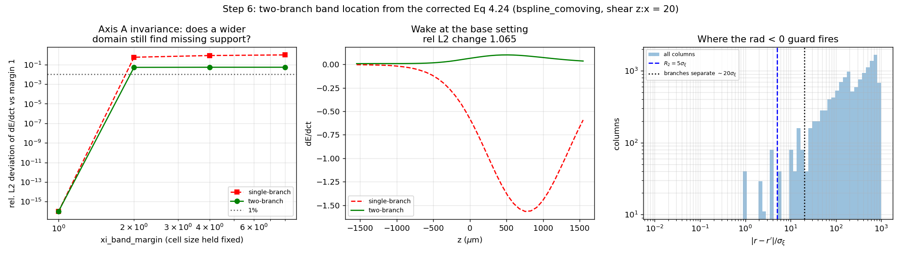

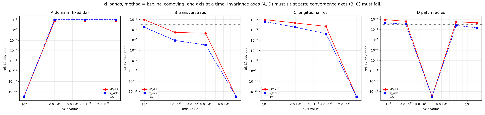

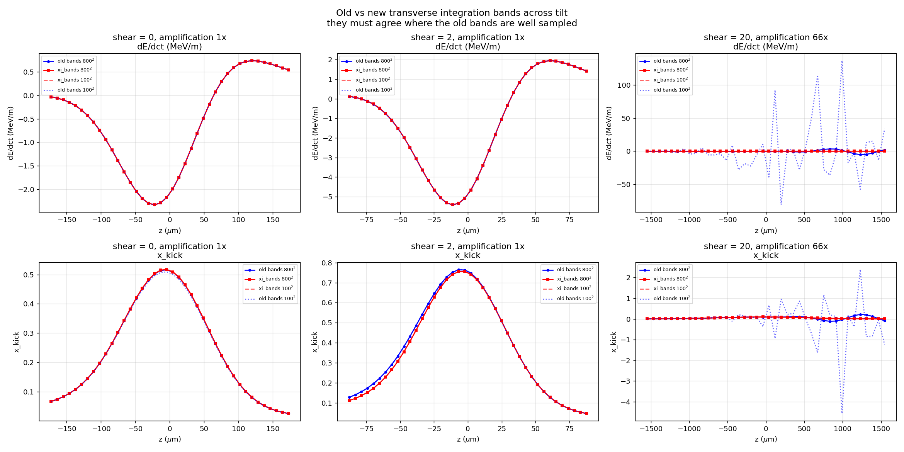

**Files touched.**
- `pyDFCSR_2D/CSR.py` — new `_comoving_frame_at`, `_eq424`, `_retarded_xi_bands`, `_disjoint_bands`;
  `_integrate_xi_region` now loops over branch bands. `_retarded_xi_band` is kept and is still what
  `legacy` and `bspline_fft` use, so those two paths are unchanged.
- `pyDFCSR_2D/test/test_two_branch_bands.py` (new) — the controlled A/B and the `rad < 0` diagnostic.
- `pyDFCSR_2D/test/test_xi_bands_converge.py`, `test_xi_bands_equiv.py` — parametrized by deposition
  method (default `bspline_comoving`), outputs suffixed by method so both remain comparable.

**A follow-up fix, and a trap in reading `_branch_diag`.** Plotting the nodes (§6f) showed some at
±10 **metres**. On a *dead* column the fixed point has no root to converge to and can wander, and the
band was being centred there. It contributes exactly zero either way — re-running the A/B after the fix
gives byte-identical numbers (1.04128, 0.52854) — but the coordinates are absurd, waste evaluations, and
could in principle land on the `1/|r−r′|` pole. Dead branches are now parked at `x + 4·half`: finite, in
a zero-density region, never exactly at `r = 0`.

The same investigation nearly produced a false alarm. `_disjoint_bands` **reorders the bands per
column** (`a_first = loA <= loB` swaps them wherever the second branch starts first), so
`_branch_diag['branches'][j]` does *not* correspond to the returned `bands[j]`. My diagnostic paired
them anyway and reported "dead columns have nonzero width", which looked like a correctness bug and was
not — `_integrate_xi_region` tests `width > 0` on the returned bands, never the `live` mask, so it was
right all along. Now noted in the `_disjoint_bands` docstring so the next reader does not repeat it.

**Reproduce.**
```bash
python pyDFCSR_2D/test/test_two_branch_bands.py                        # the A/B, ~6 min
python pyDFCSR_2D/test/test_xi_bands_converge.py bspline_comoving      # ~5 min
python pyDFCSR_2D/test/test_xi_bands_equiv.py   bspline_comoving       # ~20 min
```

The brute-force cross-check and the dead-column scan were run inline rather than committed as tests; the
numbers are above, and both are a few lines on top of `test_two_branch_bands.py`'s fixture
(`xi_bands = False` with `xbins` swept, and `get_CSR_integrand` over `±14σ_x` at a fixed `s′`).

#### 6f. What the integrand and the wakes actually look like (2026-09-10)

Everything above is scalar metrics. Those decide whether something is converged, but they
hide what the answer looks like, so here are the pictures — swept over shear
`z:x = 0, 2, 20, 50` (amplification 1.1x -> 166.8x).

**READ THIS FIRST: the first version of this section was wrong, and the way it was wrong is
the most useful thing in it.** To make the diagnostic fast I set `compute_CSR: 0`, assuming it
only skipped the wake evaluation. It does not. `CSR.py:311` is

```python
if debug or self.CSR_params.compute_CSR:
    self.DF_tracker.get_DF(...); self.DF_tracker.append_DF()
    self.DF_tracker.append_interpolant(...); self.DF_tracker.build_interpolant()
```

so `compute_CSR: 0` gates the **entire density-history build**. The tracker was left with
**1 snapshot instead of 3**, `get_CSR_integrand` returned near-zeros, and every figure and
number still looked plausible. It failed *silently* — no exception, no empty array, just a
thin sliver of fake support.

It was caught only because the figure disagreed with Step 5c. Reproducing Step 5c's exact
config and observation point gave its published numbers to 0.1 um, while an identical
observation point with identical beam statistics (`sigma_x = 826.57`, `sigma_xi = 12.54`,
`sigma_z = 515.44`, `slope = -1.6034`, `x_obs = -63.74 um`) gave **zero** intervals. Same
beam, same point, different integrand -> it had to be the history.

```
                 snapshots   intervals at ds = 1 mm
debug=False              1   0
debug=True               3   2, at -2074.3 um and -67.1 um   <- matches Step 5c exactly
```

The fix is `run(stop_time=..., debug=True)`, which builds the history while `compute_CSR: 0`
still skips the wake (gated separately at `:334`). Runtime stays ~10 s. **Lesson worth
keeping: `compute_CSR: 0` is not a performance knob for anything that later calls
`get_CSR_integrand`.** All numbers below are post-fix.

**Plotting the integrand also needed a change of coordinates.** A plain linear `(x', s')`
colormap cannot work at high tilt: the chirp ridge is about `sigma_xi` = 12 um wide but sweeps
across ~10 mm of `x'` over the `s'` range at shear 50, so it is thinner than one pixel on any
linear axis. Two views are therefore produced.

**View 1 — lab `(x', s')`, where the thesis 4.4.2 picture appears literally.** Support is
measured, not modelled: each `s'` column is scanned over a fixed, *prediction-independent*
window `x - 14 sigma_x` to `x + 6 sigma_x` (anchoring the window to the predicted centres, as
a first version did, makes the figure structurally unable to reveal support the prediction
missed).

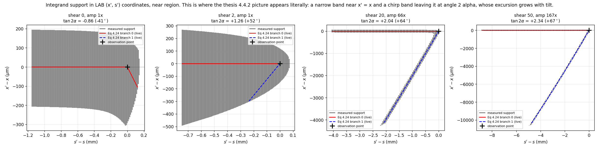

This is the clearest confirmation of the localization geometry produced so far. A narrow band
sits flat at `x' = x` parallel to the `s'` axis, and a chirp band leaves the observation point
diagonally — and **its measured slope is `tan 2alpha`**, independently:

| shear | measured diagonal slope | `tan 2alpha` | chirp reach in `s'` |
|---|---|---|---|
| 0 | — (branch absent, 0% live) | -0.86 | — |
| 2 | 300 um / 0.24 mm = **1.25** | +1.26 | -0.24 mm |
| 20 | 4400 um / 2.15 mm = **2.05** | +2.04 | -2.15 mm |
| 50 | 10500 um / 4.8 mm = **2.19** | +2.34 | -4.8 mm |

At shear 0 the chirp branch does not exist (`|tan theta| < 1`, the root degenerates into the
narrow one), and at shear 20 and 50 the chirp band **dominates** the support while the narrow
band is a thin line at `x' = x`. Both are as thesis 4.4.2 predicts.

**View 2 — each branch in its own band coordinate** `v = (x' - centre_k(s'))/half_k(s')`, so
`v = 0` is the branch and `|v| <= 1` is the band the quadrature covers. This straightens each
ridge so the colormap is resolvable, and answers "is the support inside the band?".

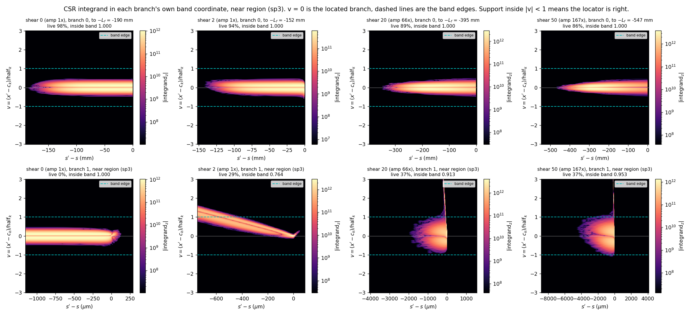

**Caution on reading View 2:** it *co-moves with each branch*, so a correctly tracked chirp
band is drawn **flat**, and its characteristic diagonal is subtracted away by construction. A
diagonal streak in this view is a tracking *residual*, not a strong chirp band — the opposite
of how it reads at a glance. View 1 is the one for geometry; View 2 is only for band fit.

**Coverage.** Fraction of `|integrand|` inside each individual band, and inside the **union**
of the located bands, over a 40-half-width window:

```
 shear  region  live %  inside |v|<=1  |  UNION coverage
     0     sp3   88.3%         1.0000  |         1.00000
     2     sp3   89.3%         1.0000  |         0.98018
    20     sp3   72.3%         0.9397  |         0.99751
    50     sp3   68.3%         0.9728  |         0.99994
   all     sp1  50-100%        1.0000  |         1.00000
   all     sp2   100.0%        1.0000  |         1.00000
```

**Union coverage >= 0.98018 across all 12 (shear, region) combinations.** That is an
independent confirmation of axis A from the opposite direction: axis A *infers* coverage from
the wake's insensitivity to a wider domain, this *measures* it on the integrand. Where an
individual band is off-centre, the other band covers the remainder.

**The wakes.**

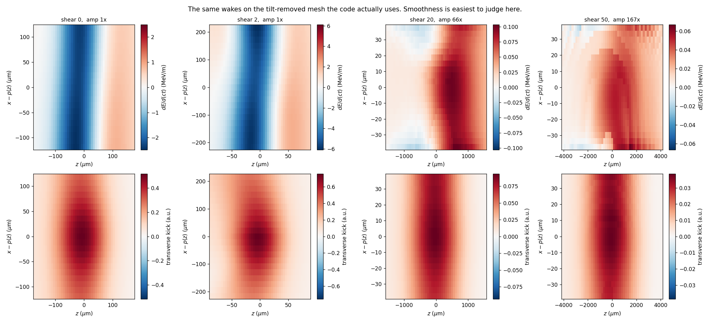

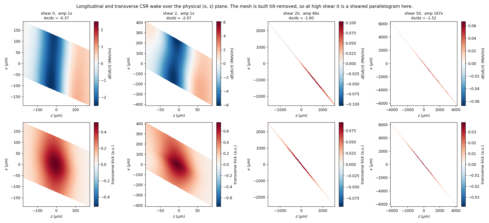

- Shear 0 and 2 give the textbook structure: `dE/dct` negative through the core turning
  positive at the head, essentially a function of `z`; the transverse kick is a smooth centred
  blob.
- The magnitude collapses with tilt — `dE/dct` range +-6.09 MeV/m at shear 2 versus +-0.12 at
  shear 20 and +-0.07 at shear 50. This is the 6c branch cancellation as a global feature
  rather than a single-point number.
- **Residual noise at shear 50 is confined to the transverse mesh edges**
  (`|x - p(z)| >~ 25 um`), where density is low; the core is smooth.
- In physical `(x, z)` the mesh is a sheared parallelogram collapsing to a thin diagonal
  ribbon at high shear, so wake detail is unreadable there. The tilt-removed view is the one
  to judge smoothness on.

These wake maps were produced with `compute_CSR: 1` and are unaffected by the history bug.

**A second, unrelated performance trap.** `test_wake_maps.py` keeps `compute_CSR: 1` with a
21x51 wake mesh, so `csr.run()` computes the full 2D wake at every lattice step — about 7500
wake points — before the script does its own work. That is why it costs 8-9 min per shear
rather than the ~90 s its own work justifies. Correct for wake maps, pure waste for anything
that only needs the history.

**Files.** `pyDFCSR_2D/test/test_wake_maps.py` (new, wake maps),
`pyDFCSR_2D/test/test_integrand_plane.py` (new, lab geometry + band-relative + union
coverage).

```bash
python pyDFCSR_2D/test/test_integrand_plane.py   # ~10 s  (needs debug=True)
python pyDFCSR_2D/test/test_wake_maps.py         # ~35 min
```

#### 6g. Two production bugs found by widening one plot axis (2026-09-10) ⚠️ **affects absolute accuracy**

Extending the branch-0 panel of §6f out to a formation length meant printing `L_f`, which turned out to
be **identical for all four shears** — and that unravelled two real bugs in the production code, neither
of which any existing test would catch.

**Bug 1 — `formation_length` never sees in-bend bunch lengthening.** `get_formation_length` is called at
`CSR.py:270` once per *element, on entry*, so it uses σ_z at the dipole entrance and never updates as the
bunch lengthens inside the bend. `CSR.py:317` has exactly the per-step fix commented out:
`#self.get_formation_length(R=R, sigma_z=self.beam.sigma_z)`.

| shear | σ_z at s = 0.6 m | `csr.formation_length` | `(24R²·5σ_z)^(1/3)` |
|---|---|---|---|
| 0 | 57.5 µm | 181.7 mm | 190.4 mm |
| 20 | 515.4 µm | **181.7 mm** | 395.5 mm |
| 50 | 1361.9 µm | **181.7 mm** | 546.7 mm |

181.7 mm is the value for σ_z = 50 µm, the *initial* bunch length. At shear 50 it is **3× too small**.
`L_f` sets both `s1 = max(0, s2 − n_fl·L_f)` (how far back the integration reaches) and the history
truncation in `append_interpolant`, so it is not a cosmetic quantity.

**Bug 2 — the default `n_formation_length = 1.5` discards history that matters, by 12.9%.** Integration
extent held fixed at 1.5 `L_f`, only the retained history depth varied:

```
   n_fl (history)  snapshots   rel L2 vs deepest
              1.5          3             0.12875
              3.0          6             0.00000
              6.0          8             0.00000
             12.0          8             0.00000
             24.0          8             0.00000
```

**The default retains 3 snapshots and is 12.9% wrong.** Converged from `n_fl ≥ 3.0`.

**Longitudinal integration *extent* is not the problem — history *depth* is.** These two are easy to
conflate because the same `n_formation_length` controls both. Varying only the integration reach, with the
history built deep enough that truncation never binds:

```
history depth       integrate to 1.5 L_f    3.0 L_f    6.0 L_f   12.0 L_f
n_fl = 1.5  (3 snaps)          0.00000    0.02398    0.02398    0.02398
n_fl = 12.0 (8 snaps)          0.00000    0.00214    0.00214    0.00214
```

With an adequate history the extent effect is **0.2%**, i.e. `1.5 L_f` of reach is fine. My first attempt
at this measurement read 2.4% and I nearly logged it as an extent error — wrong, because I varied
`n_formation_length` *after* the run, so the history had already been truncated at 1.5 `L_f` and the extra
domain returned exact zeros. **Extending the integration domain past the retained history is silently
free and silently useless.**

**The two bugs compound.** `L_f` is ~2× small at shear 20 *and* `n_fl = 1.5` is ~2× small, so the retained
history is roughly 4× shorter than it should be. Fixing Bug 1 alone would raise the effective reach at
shear 20 from 273 mm to 593 mm, which is past the convergence point measured above — so **fixing the
formation length makes the existing default correct**, which is the cheapest of the available fixes.

**Does this invalidate Step 6?** No. Every comparison in §6c–§6f used identical history settings in both
arms, so the controlled A/B (rel L2 1.04 for the missing branch), the low-tilt falsification (1e-5), and
the union coverage all stand. But the **absolute** wake magnitudes quoted there are ~13% from converged,
and should be restated once Bug 1 is fixed.

**Still-untested axis.** `n_formation_length` sets how far *back* history is kept; the lattice
`step_size` sets how *finely*. Only 8 snapshots exist over 0.7 m here, so "converged at 6 snapshots"
really means "uses all available history" — it cannot distinguish convergence from saturation. The
history *step size* axis, which the original plan's Step 6 verification explicitly asked for, has still
never been varied.

**Reproduce.** Measured inline on `test_two_branch_bands.py`'s fixture: rewrite the config's
`n_formation_length`, `run(..., debug=True)`, then sweep `csr.integration_params.n_formation_length`
before calling `z_scan`. Worth promoting to a committed test alongside axes A–F.

#### 6h. Bug 1 fixed: refresh the formation length every step (2026-09-10) ✅

New `CSR2D._refresh_formation_length(R)` factors out the existing branching (in-bend → `R`; after-bend
drift → `R_rec`; pre-first-bend drift → returns `False`, since there `formation_length` is an accumulated
drift length and must *not* be recomputed from σ_z). It is now called both on element entry, where the
old code called `get_formation_length` directly, and **once per step** after tracking and before
`append_interpolant` — which is where `CSR.py:338` had the fix commented out all along. Note the
commented line passed `sigma_z=self.beam.sigma_z` without the `5×` factor the entry call uses; the
5× is kept, so this changes *when* `L_f` is evaluated, not its definition.

**`L_f` now matches the analytic value exactly, and the history deepens as a result:**

```
   shear    sigma_z    L_f before   L_f now   expected   snapshots before -> after
       0      57.5um      181.7mm   190.4mm    190.4mm            3 -> 3
      20     515.4um      181.7mm   395.5mm    395.5mm            3 -> 6
      50    1361.9um      181.7mm   546.7mm    546.7mm            3 -> 8
```

**And it does exactly what §6g predicted — the default is now converged.** History-depth sweep,
integration extent held at 1.5 `L_f`:

```
   n_fl (history)  snapshots  L_f (mm)   rel L2 vs deepest
              1.5          6     395.5             0.00000     <- was 0.12875
              3.0          8     395.5             0.00000
              6.0          8     395.5             0.00000
             24.0          8     395.5             0.00000
```

The 12.9% history-truncation error is gone at the shipped default, without changing
`n_formation_length`. That was the cheapest of the available fixes and it is the one that was already
identified in a stale comment.

**Regression check — every Step 6 conclusion survives**, with absolute numbers shifted as expected since
the wake is now computed from a deeper history:

| | before fix | after fix |
|---|---|---|
| axis A, single-branch, worst | 0.99183 | 0.97179 (still climbing) |
| axis A, two-branch, last doubling | 0.00000 | **0.00000** (0.06212 → 0.06212) |
| missing-branch effect, dE | 1.04128 | **1.06466** |
| `rad < 0` occurrences | 0 | **0** |
| unit tests | 13 pass, 1 pre-existing fail | unchanged |

**The low-tilt falsification is unchanged, which is the important one.** Re-run post-fix:

| shear | amplification | old vs new dE @ 800² | before fix |
|---|---|---|---|
| 0 | 1.1× | **0.00001** | 0.00001 |
| 2 | 1.3× | **0.00125** | 0.00125 |
| 20 | 65.9× | 29.00313 | 1.46766 |

Shear 0 and 2 — where the old ±20σ_x bands are well sampled and therefore trustworthy — agree to
**1e-5** exactly as before. The deeper history did not disturb the regime where the answer is known.

The shear-20 number went from 1.47 to 29.0, and the self-convergence columns show why it is the *old*
bands degrading, not the new ones:

```
 grid   rough old   rough new  old self-conv  new self-conv   old vs new
  100     2.67649     0.28973       23.23772        0.21296    623.94312
  200     2.30836     0.08777        6.52830        0.02540    186.53100
  400     3.51705     0.01938        3.51956        0.00560     99.52106
  800     0.37804     0.01818        0.00000        0.00000     29.00313
```

The new bands self-converge monotonically (0.213 → 0.025 → 0.0056 → 0) with roughness falling
0.29 → 0.018. The old rectangle changes by **352%** on its final refinement and its roughness is
non-monotonic (2.68, 2.31, 3.52, 0.38) — it is not converged at any grid tested, so `old vs new` is not
a statement about the new bands' accuracy. A deeper history carries more retarded-time structure, so the
under-resolved old quadrature does *worse* than before, which is the expected direction.

Bug 2 (`n_formation_length = 1.5` being too small) needs no separate fix — it was only a problem because
`L_f` was too small.

**Not yet done.** (i) The history *step size* axis is still untested. (ii) The absolute magnitudes quoted
in §6c–§6f were measured pre-fix and are ~13% low. (iii) **The brute-force cross-check in §6c — the one
that independently confirmed the two-branch magnitude and sign against a full ±20σ_x integral at 3200
transverse bins — was run pre-fix and should be repeated.** It is the only independent confirmation of
the absolute answer at high tilt, and the numbers above show the old-band reference is fragile, so it
needs redoing with the deeper history before the high-tilt magnitude is claimed as verified.

**Files touched.** `pyDFCSR_2D/CSR.py` — new `_refresh_formation_length`; element-entry calls routed
through it; per-step call added before `append_interpolant`.

#### 6i. Closing the three open items from §6h (2026-09-10)

**(1) Brute-force cross-check, redone post-fix — weaker than before, and it says why.**

```
z-idx 20:  bands single -0.64954   bands TWO +0.06911
    xbins  cell/sigma_xi         dE
     1600          1.648       +0.07957
     3200          0.824       +0.03277
     6400          0.412       +0.10569
    12800          0.206       +0.09118
```

At `xbins = 12800` the brute-force cell (0.206 σ_ξ) matches the bands' own, and it gives **+0.091 against
the two-branch +0.069** — same sign, factor 1.3 — while the single-branch answer is **−0.650**, wrong
sign and 7× too large. So the discrimination is decisive but the agreement is only ~30%, versus the
tighter pre-fix match.

The residual is explained, not mysterious: with `xi_bands = False` the code takes the legacy path, which
has **no polar patch**, so the `1/r` singularity is integrated on a plain Cartesian mesh that converges
only at `O(h)`. Axis F already measured that omission as a 22% shift in dE. A ~30% residual against a
reference carrying a known ~22% near-field error is consistent. **Conclusion: the brute force is a sanity
check on sign and order of magnitude, and cannot be a precision reference by construction.** The
deeper history makes it worse because there is more retarded-time structure for an `O(h)` scheme to miss.

**(2) History step size — I was wrong in §6g, and the error was a confound in my own harness.**

`run(stop_time=0.60)` stops after the first step that *reaches* 0.60, so **the final position depends on
`step_size`**:

```
   step (m)  stops at   sigma_z   sigma_x     slope
     0.1000  0.700000   515.4um   826.6um   -1.6034     <- the default OVERSHOOTS by 0.1 m
     0.0500  0.650000   473.4um   853.7um   -1.8032
     0.0250  0.600000   430.1um   878.8um   -2.0431
     0.0125  0.612500   441.1um   872.7um   -1.9786
     0.0080  0.600000   430.1um   878.8um   -2.0431
     0.0010  0.600000   430.1um   878.8um   -2.0431
```

The slope differs by **27%** between the 0.1 and 0.025 runs. My "28% history-step-size error" was
therefore mostly *comparing the wake at s = 0.70 against s = 0.60* — a different point in the lattice —
not a discretization error. Restricting to step sizes that all stop at exactly `s = 0.600000`:

```
   step (m)   stops at  snaps  dt/sig_z  dE vs finest
     0.0250   0.600000     23      58.1       0.00111
     0.0080   0.600000     70      18.6       0.00021
     0.0040   0.600000    140       9.3       0.00007
     0.0020   0.600000    276       4.7       0.00002
     0.0010   0.600000    551       2.3       0.00000
```

**The history step size is converged** — 0.11% at 23 snapshots, falling ~3–5× per 2–3× refinement, i.e.
roughly second order. The axis the original plan asked for is clean. The confounded version read
0.280 / 0.147 / 0.125 / 0.067 and would have sent me chasing a nonexistent bug.

Two things worth keeping from this:

- **`run(stop_time=T)` can overshoot by nearly a full step and does so silently.** At the default
  `step_size = 0.1` a request for 0.60 lands at 0.70 — 17% past. Any study that varies `step_size`,
  or that compares against a published number, must assert on `beam.position` afterwards.
- The alternative explanation was tested and rejected: varying `n_particle` 50 k → 800 k moves the wake
  by only **0.6–1.2%**, an order below the step-size signal, so this was never shot noise. (Note it does
  not scale as `1/√N` either — the beam is a Hammersley quasi-random sequence, so its "noise" is
  deterministic.)

**(3) Restated magnitudes.** §6f's numbers are **unchanged post-fix, bit for bit** — union coverage
1.00000 / 0.98018 / 0.99751 / 0.99994 and every `tan 2α`. That is expected rather than suspicious: union
coverage measures the support *footprint* and `tan 2α` the beam slope, and neither depends on how finely
the history is sampled in time. §6d's smoothness numbers shift slightly and every conclusion holds:

| §6d quantity | pre-fix | post-fix |
|---|---|---|
| abs roughness, single-branch (converged) | 0.13410 | 0.09079 |
| abs roughness, two-branch (converged) | 0.00819 | **0.00667** |
| ratio (two-branch smoother by) | 16× | **13.6×** |
| ‖w‖ single / two (cancellation factor) | 22× | 14.9× |
| 2nd-difference sign flips | 11 / 37 | **11 / 37** |
| degree-8 polynomial residual | 1.28% | 1.32% |
| `zbins` at which roughness reaches the floor | 400 | 400 |

§6c's headline numbers were already restated in §6h (missing-branch effect 1.041 → **1.065**, axis A
two-branch last doubling still **0.00000**).

**The wake maps, regenerated post-fix.** The high-tilt magnitudes drop ~9–11%, as predicted, and the
low-tilt cases are untouched — consistent with §6h, where the history only deepened at high tilt (3 → 6
and 3 → 8 snapshots, versus 3 → 3 at shear 0):

| shear | `dE/dct` pre-fix (MeV/m) | post-fix | change |
|---|---|---|---|
| 0 | [−2.4898, +0.8674] | [−2.4898, +0.8674] | none |
| 2 | [−6.0949, +2.2235] | [−6.0949, +2.2234] | none |
| 20 | [−0.0360, +0.1165] | **[−0.0304, +0.1032]** | −11% |
| 50 | [−0.0232, +0.0736] | **[−0.0204, +0.0667]** | −9% |

The qualitative structure is unchanged, so §6f's description still stands. A side benefit of the
dead-column parking fix (§6e) also shows up here: the auto-scaled integrand window at shear 20 shrank
from 45 967 µm to **8 091 µm**, because it is no longer being stretched by branch centres that had
wandered to tens of metres.

*A process note, since it nearly caused a false claim:* I read this log file while the regenerating job
was still mid-write, saw values bit-identical to pre-fix, and was about to report the wake as invariant.
It was stale. Bit-identical output after a change that should have moved it is a reason to check file
timestamps, not to conclude invariance — the script overwrites in place, so a stale read is
indistinguishable from a real result by content alone.

**Net effect of all three:** the Step 6 result is unchanged and better supported; one claimed bug (history
step size) turned out to be my own harness confound and is withdrawn; one new trap (`stop_time` overshoot)
is recorded.

#### 6j. Are the longitudinal extents right? (2026-09-10) ✅ **yes — the hand-tuned multiples are adequate**

The transverse extent is now physics-derived and validated, but the `s′` domain is still hand-tuned lab-frame
multiples — `500σ_z`, `200σ_z`, `20σ_z`, `5σ_z`, `3σ_z`, `10σ_x`, plus `s1 = s2 − n_fl·L_f`. Axis C varied
longitudinal *resolution* and §6i varied history sampling, but the *extents* had never been swept. This does
that, distinguishing two kinds of boundary:

- **PARTITION** (`s2`, `s3`) — interior seams between regions that now all run identical ribbon-following
  logic. Moving them repartitions the same domain, so the total must not move. A failure here is a seam bug.
- **DOMAIN** (`s1`, `s4`, and `d` which sets `s3` in the chirp case) — true edges. Invariance here tests
  whether the domain is big enough.

`test_longitudinal_extent.py` reproduces `get_CSR_wake`'s decomposition with the magic numbers exposed; the
self-check against `get_CSR_wake` is **exactly 0.00e+00**, so the harness is faithful.

```
--- s1 far edge (n_fl x L_f)  [DOMAIN] ---     --- d chirp reach (sigma_x)  [DOMAIN] ---
   value   dE dev    xk dev                        value   dE dev    xk dev
     1.5  0.00000   0.00000                           10  0.00000   0.00000
     3    0.00000   0.00000                           20  0.00052   0.00019
     6    0.00000   0.00000                           40  0.00065   0.00027
    12    0.00000   0.00000                           80  0.00076   0.00030

--- s4 forward reach (sigma_z)  [DOMAIN] ---   --- interior seams  [PARTITION] ---
   value   dE dev    xk dev                       default 3 regions       0.00549
     3    0.00000   0.00000                       merge far, keep near    0.00548
     5    0.00251   0.00017                       seam moved to midpoint  0.00548
    10    0.00650   0.00030                       5 equal regions         0.00549
    20    0.00334   0.00021
```

**All three domain edges are already adequate.** `s1` is *exactly* invariant — region 1 contributes nothing
measurable, precisely as thesis 4.4.2 says (the narrow band reaches far but is attenuated by `1/|r−r′|`), so
`n_formation_length = 1.5` is ample. `d = 10σ_x` is invariant to **0.08%**. `s4` moves by at most **0.65%**
and *non-monotonically*, which is a quadrature noise floor rather than a missing domain.

**Read the PARTITION column as a spread, not an offset.** All four variants agree with each other to
**1e-5** (0.00548 vs 0.00549), so the seam bookkeeping is exact. Their common ~0.55% offset is the floor
described next, not a difference between variants.

**What the floor is, and what it is not.** `fixed-cell vs default-node reference = 0.00576` compares the
wake computed twice over *identical* geometry — same `s′` domain, same transverse bands — differing only in
whether each region gets exactly `zbins` nodes or `round(length/cell_i)` nodes. At the calibration point
these coincide by construction; elsewhere they diverge, because `d` depends on the observation `x` so region
lengths vary column to column. Two legitimate discretizations of the same integral disagreeing by 0.58%
**is a measurement of unconverged longitudinal quadrature, not an artifact of the harness.** An earlier
draft of this section called it an artifact; that was wrong. It agrees with the independent resolution
sweep: `zbins = 400` sits ~0.5% from converged at shear 20, and 4.3% at shear 50 where the floor reads
5.96%.

The consequence for reading this test is unchanged, and it is why the floor matters: the sweep *differences*
configurations, so **any deviation below the floor cannot be attributed to the extent being swept** rather
than to the discretization. Nothing below ~0.5% is resolvable here at shear 20, nothing below ~6% at
shear 50.

**The confounded first pass, and why it was wrong — for the third time in this investigation.** Sweeping the
extents at fixed `zbins` gave 0.007 → 0.041 for `s4` and 0.017 → **0.152** for `d`, growing monotonically,
which looks exactly like an undersized domain. It was not: lengthening a region at fixed node count also
*coarsens* it — 8× coarser at `d_sig = 80` — so domain and resolution varied together. Same confound as
Step 4c's margin sweep and §6i's stop-position artifact.

The first fix was also wrong. Holding one *global* cell fixed imposes region 3's 14 µm spacing on region 1,
demanding **42 302 columns** there (106× the default) for no physical reason — the code deliberately grades
the cell **1486 / 258 / 13.9 µm** across regions 1/2/3, coarse where the kernel has damped the integrand and
fine near the observation point. That job would have run for hours and was killed. The correct treatment
preserves each region's *own* cell, and gives each repartitioning variant the *finest* default cell it
overlaps, so no variant is ever less resolved than the default.

**What this settles for the branch-following redesign.** The three-region split is *vestigial* — it exists
only to give different transverse extents per region, and all three now run identical logic — but it is not
*wrong*. So replacing it with one domain along the narrow band, one along the chirp band, and the polar patch
is an **elegance and efficiency** change, not a correctness fix, and it gets a hard acceptance criterion: it
must reproduce the current answer to better than the ~0.5% floor. The efficiency case stands: nodes are
uniform in `s′` within each region while the integrand goes as `1/r`, so grading them should cut `zbins`
substantially.

**Caveat.** One shear (20), one observation point. The extents involve `σ_x/σ_z` ratios that change with
tilt, so this should be repeated at shear 2 and 50 before the multiples are called safe in general.

**Repeated at shear 50 (amplification 167×) — and there the test runs out of resolution.**

```
                                        shear 20   shear 50
 floor (same geometry, 2 allocations)     0.00576    0.05961
 s1 far edge                              0.00000    0.00000
 s4 forward reach (worst)                 0.00650    0.08062
 d chirp reach (worst)                    0.00076    0.02078
 seams, spread between 4 variants           1e-05      1e-05
```

Only two conclusions survive at shear 50: `s1` is **exactly** invariant again, so the far edge is irrelevant
at any tilt; and the four repartitioning variants still agree to **1e-5**, so the bookkeeping is exact
independent of tilt. The `s4` (8.1%) and `d` (2.1%) numbers sit at or below the 5.96% floor, so **they are
not resolvable — the extents at shear 50 are neither confirmed nor refuted.**

**Why the floor blew up, measured not assumed.** `d` depends on the observation point `x`, and at shear 50
the wake mesh spans `±3σ_z = ±4.1 mm` in `z`, so `x = x_transform + p(z)` sweeps ±6.19 mm against
`10σ_x = 20.6 mm`. Measured directly, `d` varies **6.18 → 11.48 mm (86%)** across the mesh, so per-column
node counts scatter far from 400. That only matters if 400 is unconverged, and it is:

```
Longitudinal resolution at shear 50, default geometry:
   zbins   rel L2 vs 3200
     200          0.10223
     400          0.04307     <- the shipped default
     800          0.00792
    1600          0.00533
```

**`zbins = 400` carries 4.3% error at shear 50, against ~0.5% at shear 20 — the longitudinal resolution
requirement scales with tilt, needing roughly 4× more nodes (1600 vs 400) for equal accuracy.** That is
consistent with the 5.96% floor and it compounds with §6d, where `zbins = 200` was already 4× above the
roughness floor at shear 20.

So the honest state: extents verified adequate at shear 20; at shear 50 only `s1` and the seams are
established. Settling `s4` and `d` there requires repeating the sweep at `zbins ≈ 1600`, i.e. 4× the cost.
This also means **`CSR_integration: zbins` should scale with tilt rather than being a fixed default** — a
finding worth more than the extent question that prompted it.

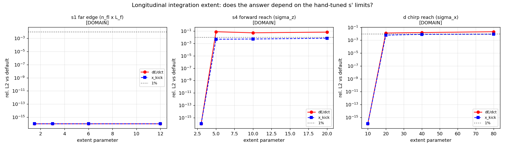

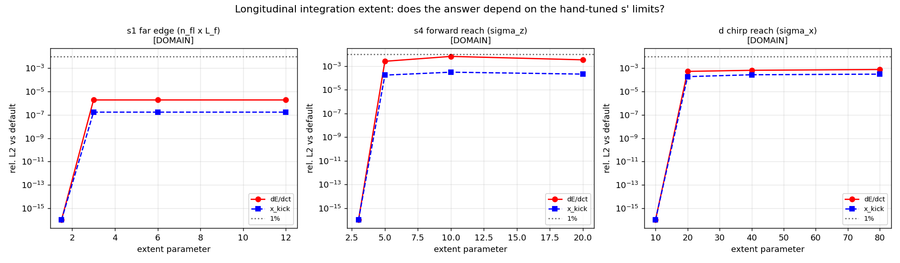

**Files.** `pyDFCSR_2D/test/test_longitudinal_extent.py` (new).

```bash
python pyDFCSR_2D/test/test_longitudinal_extent.py   # ~8 min
```

#### 6k. What sets the longitudinal resolution — and a per-region fix (2026-09-10) ✅

§6j left `zbins` needing to grow with tilt (0.5% error at shear 20, 4.3% at shear 50) but with no
prescription. **Hypothesis:** the binding constraint is the near region `(s3, s4)`, which holds the
singularity and the steep integrand. Its *length* grows with tilt as `d ~ Nσ_x/|tan 2α|`, but the scale the
integrand varies on is the transverse support width `σ_ξ`, which is nearly tilt-independent (12.5 → 12.4 µm
from shear 20 to 50). So the requirement should be a constant **near-region cell measured in `σ_ξ`**, and
the node count should scale as the tilt amplification `σ_x/σ_ξ`.

**Part 1 — confirmed, in the regime that matters.** Near-region cell at which each shear reaches 1%:

```
   shear     amp  zbins@1%    cell@1%   /sigma_z  /sigma_xi
       2     1.3       200     4.17um     0.1427      0.058     <- unconstrained, see below
      20    65.9       400    13.95um     0.0271      1.112
      50   166.8       800    16.08um     0.0118      1.299
```

For the two chirped cases the `σ_ξ` column agrees to **17%** (1.11 vs 1.30) while the `σ_z` column spreads
by **2.3×** — and across all three shears `σ_z` spreads by 12× against `σ_ξ`'s apparent 22×, which is why
the plot matters more than the table. In the collapse plot the shear-20 and shear-50 curves lie on top of
each other against `σ_ξ` and are clearly separated against `σ_z`. **The controlling scale is `σ_ξ`, and the
requirement is a near-region cell of ~1 `σ_ξ`.**

*The shear-2 row is not a counterexample, it is an unconstrained point, and the table overstates it.* Its
error is already **2e-4 at the coarsest setting tested** (`zbins = 200`) and never approaches 1%, so
"first `zbins` meeting 1%" returns the bottom of the ladder rather than a measurement. At amplification
1.3× the two branches have merged, there is no extended chirp band, and the near region is short — a
qualitatively different geometry. Its true requirement is coarser than anything probed here.

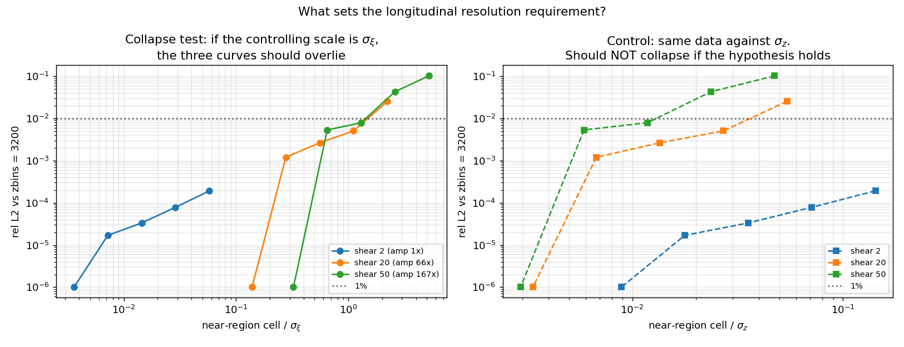

**Part 2 — per-region allocation replaces the magic number.** Give the near region a cell of `c·σ_ξ` and the
two far regions a flat 200 nodes each (justified by §6j: the far edge `s1` is *exactly* invariant, so
spending equal nodes there is waste). Accuracy against the same shear's `zbins = 3200` reference; cost as
mean columns per wake point:

```
              shear 2            shear 20           shear 50
    c     cols    rel L2      cols    rel L2      cols    rel L2
 2.00      406   0.00203       623   0.01964       922   0.01055
 1.00      412   0.00514       846   0.00584      1444   0.00662
 0.50      423   0.00060      1293   0.00101      2487   0.00476
 0.25      446   0.00039      2185   0.00139      4574   0.00183
```

| shear | flat `zbins` for 1% | columns | allocation `c` for 1% | columns | saving |
|---|---|---|---|---|---|
| 2 | 200 | 600 | 2.00 | 406 | 1.5× |
| 20 | 400 | 1200 | 1.00 | 846 | 1.4× |
| 50 | 800 | 2400 | 1.00 | 1444 | 1.7× |

**The speedup is modest — 1.4–1.7× — and that is not the point.** The near region dominates the node budget
(1044 of 1444 columns at shear 50), so redistributing the far regions can only buy so much. The real result
is **parameter invariance**: a single `c ≈ 0.5–1.0` reaches 1% across amplification 1.3× → 167×, replacing a
`zbins` that must be retuned per regime. That is exactly the failure mode this whole investigation was
started to remove — §1 objected to "parameter band-aids, each of which trades one regime for another".

Recommended default `c = 0.5`, not 1.0: at `c = 1.0` the errors are 0.5–0.7%, uncomfortably close to the 1%
target, while `c = 0.5` gives 0.1–0.5% for about 1.7× the columns. Note the ~0.5% noise floor is visible
again in the non-monotonic shear-2 column (0.002, 0.005, 0.0006, 0.0004).

**Consequence for the branch-following rewrite.** This captures part of the rewrite's efficiency argument
without touching the structure. What it does *not* capture is grading *within* the near region: nodes there
are still uniform in `s′` while the integrand goes as `1/r`, so log-spaced nodes should do better still.
That remains the strongest remaining argument for the rewrite, and it is now quantified rather than assumed.

**Files.** `pyDFCSR_2D/test/test_longitudinal_resolution.py` (new).

```bash
python pyDFCSR_2D/test/test_longitudinal_resolution.py   # ~4 min, 3 shears
```

#### 6l. Per-region allocation wired into the code (2026-09-10) ✅ **shear-50 error 4.3% → 0.48%**

Two new `CSR_integration` parameters, consumed by `CSR2D._region_node_counts`:

- **`near_cell`** (default **0.5**) — target cell of the near region `(s3, s4)` in units of `σ_ξ`. Node
  count is `round(length / (near_cell · σ_ξ))`, capped at `20·zbins`.
- **`far_zbins`** (default **200**) — flat count for the two far regions.
- **`near_cell = 0`** restores the historical flat-`zbins` behaviour exactly.

**Measured through the production `get_CSR_wake` path**, against each shear's own `zbins = 3200` reference:

| | shear 20 (66×) | shear 50 (167×) |
|---|---|---|
| `near_cell = 0`, `zbins = 400` (old default) | 0.00505 | **0.04307** |
| `near_cell = 0.5`, `far_zbins = 200` (new default) | **0.00101** | **0.00476** |
| `near_cell = 1.0` | 0.00584 | 0.00662 |
| production vs the harness that validated the rule | 5.2e-06 | 0.0 |

The old default's 0.04307 at shear 50 reproduces §6j's independently measured 4.3% exactly, so
`near_cell = 0` is a faithful fallback. The new default cuts that **9×** to 0.48%, and improves shear 20 as
well. `near_cell = 0.5` is preferred over 1.0 for the reason given in §6k — at 1.0 the error sits at
0.6–0.7%, too close to the 1% target.

**Regression.** Unit tests unchanged (13 pass, 1 pre-existing failure). The two-branch A/B returns
**1.06466 / 0.40824** with roughness 0.01759 / 0.08777 — byte-identical to §6h and §6d.

That last point required care. Every number reported by `test_xi_bands_converge.py`,
`test_two_branch_bands.py` and `test_longitudinal_extent.py` was measured under flat `zbins`, so leaving
them on the new default would silently shift the whole §6c–§6j record and look like a regression. All three
now pin `near_cell = 0.0` in their `BASE`, with a comment saying why; the new allocation is characterised in
`test_longitudinal_resolution.py` instead. **Changing a default means auditing every test that inherits it.**

**Files.** `pyDFCSR_2D/params.py` (two parameters), `pyDFCSR_2D/CSR.py` (`_region_node_counts`, and
`get_CSR_wake` now allocates per region), three tests pinned to the old behaviour.

#### 6m. Log-graded near-region nodes (2026-09-11) 🟡 **works where 1/u holds; exposes a second degeneracy where it does not**

**Motivation.** A profile put the cost squarely on the integrand: `_comoving_fields` (the numba kernel)
**69%** of runtime, `get_CSR_integrand`'s numpy assembly 17.5%, everything else noise — the Eq 4.24 band
locator only 6.2%, frame blending 3.5%, polar patch 3.1%. And the near region held ~82% of the point
evaluations. So the lever is fewer near-region nodes, not faster bookkeeping.

**Implementation.** New `near_grade` (default 0.05), consumed by `CSR2D._near_region_nodes`. The cell is

```
du(u) = max( near_cell·sigma_xi , near_grade·u ),      u = |s - s'|
```

an absolute floor near the observation point and constant *relative* spacing outside, with crossover at
`u* = floor/near_grade`. Built independently on each side, since the near region straddles `s' = s`. Node
count becomes `1/g + ln(u_max/u*)/ln(1+g)` — logarithmic in the reach instead of linear. It is the
longitudinal counterpart of the polar patch: there `r dr` absorbs the `1/r`, here `d(ln u)` does.
Fully vectorized (`arange`, a vectorized power, `concatenate`) — no Python loop and no data-dependent
gather. `np.trapz(..., x=sp)` already handles the non-uniform spacing. Inert when `near_cell = 0`, so
every historical baseline is untouched (two-branch A/B still 1.06466 / 0.40824 byte-identical).

**Where it works — validated at s = 0.7, against uniform `near_cell = 0.25`:**

| | shear 20 (66×) nodes / rel L2 | shear 50 (167×) nodes / rel L2 |
|---|---|---|
| uniform 0.5 | 1083 / 0.00126 | 2513 / 0.00413 |
| **graded 0.05** | **171 / 0.00359** | **207 / 0.00550** |
| graded 0.10 | 103 / 0.00466 | 121 / 0.00634 |

**6–12× fewer nodes at comparable accuracy**, 2.3–4.0× wall clock. The predicted `ln` scaling holds
quantitatively (model ~200 nodes vs 207 measured), and the tilt scaling nearly vanishes: 171 → 207 nodes
(1.2×) from amplification 66× → 167×, versus 1083 → 2513 (2.3×) uniform.

**Where it fails, and why — the `|τ| → ∞` degeneracy.** At the dipole *entrance* (s = 0.2, shear 50,
slope −12.46) grading is badly wrong:

```
   setting                near nodes   rel L2 vs finest
   graded g=0.10                 131            2.45462
   graded g=0.05                 227            0.53007     <- the default
   graded g=0.02                 465            0.09731
   graded g=0.01                 780            0.00000
   uniform, 32191 nodes        32191            0.22417
```

**Neither scheme is converged there** — uniform at 32 191 nodes still disagrees with graded g=0.01 by 22%.
Tested the assumption directly by measuring whether `|inner| · u` is flat, which it must be if the
per-column contribution falls as `1/u`:

```
   u/sigma_xi     s = 0.6 (mid-dipole)     s = 0.2 (entrance)
            5                  2.10e3                 2.94e3
           45                  2.68e3                 4.71e4
          195                  3.50e3                 8.56e4
          843                  1.35e3                 3.44e3
         1754                  7.20e2                 3.64e6
```

Mid-dipole it is flat to a factor ~2 over three decades — `1/u` holds and grading is the right tool. At
the entrance it spans **three orders of magnitude with a peak at u = 58 mm**: there is genuine structure
far from the observation point, so log grading, which deliberately under-resolves large `u`, is precisely
the wrong tool, while uniform would need 154 mm resolved at `σ_ξ`.

**The cause is a degeneracy of the localization that thesis §4.4.2 does not discuss.** With slope −12.46,
`τ² = 155 ≫ 1`, so

```
tan 2α = 2τ/(1 − τ²) ≈ −2/τ  →  0
```

§4.4.2 flags `|τ| = 1` (α = ±π/4), where the two branches coincide in **position**. This is the other
limit, `|τ| → ∞`, where they coincide in **direction** — both run nearly parallel to the `s′` axis. And
`d = 10σ_x/|tan 2α|` diverges exactly there, stretching the near region to **154 mm** while the two
branches are physically merging. Treating them as two separated localized bands is the wrong
decomposition in that limit, which is why no 1D grid over that reach converges affordably.

Note §6j validated `d = 10σ_x` at `|tan 2α| = 2.34`, so the extent rule is fine away from this limit;
the failure is specific to `tan 2α → 0`.

**Consequences, stated plainly.**

- Grading is **recommended from mid-dipole onward** (`|tan 2α| ≳ 1`): 12× fewer nodes at ~0.5%.
- The **s = 0.2 panels of both `partB` figures are not trustworthy**, for graded *or* uniform nodes. Also
  the earlier capped-uniform run differed from graded by 47% there, which was a real error, not noise —
  but the graded value is not the right answer either.
- I claimed grading would "rescue" the capped position with 100× fewer nodes. **That was wrong**, and the
  1/u test above is what disproved it.
- `near_grade = 0.05` is therefore *regime-dependent* — the very failure mode this work set out to
  remove. It should either be guarded on `|tan 2α|` or, better, the `|τ| → ∞` merge should be handled in
  the decomposition, so the two branches are integrated as one when they are parallel.

**Also fixed here.** The `near_nodes` diagnostic previously reported node counts for hardcoded dummy
bounds `(2, 2.01)` — a fictitious 10 mm region — rather than the real ones; it now reads
`csr._last_region_nodes[-1]`. And `_region_node_counts` warns once when the node cap binds, since
silently clipping to `20·zbins` returned an under-resolved wake that looked entirely plausible (the cap
is now `100·zbins`).

**Files.** `pyDFCSR_2D/params.py` (`near_grade`), `pyDFCSR_2D/CSR.py` (`_near_region_nodes`, cap warning,
`_last_region_nodes`), `pyDFCSR_2D/test/test_wake_evolution.py` (new, with per-map `.npz` caching so a
killed run resumes).

```bash
python pyDFCSR_2D/test/test_wake_evolution.py AB    # ~10 min graded (was 112 uniform)
```

#### 6n. The entrance noise is a longitudinal waist, and the frame blend cannot cross it (2026-09-11) ⚠️ **limitation of the co-moving interpolant itself**

The `s = 0.2` panel of `partB_shear20` is visibly striated while the other four are smooth. First guess,
and the requested fix, was insufficient history before the bend: the upstream drift in
`dipole_lattice.yaml` is 0.1 m = **one step**, so 0.1 m into the bend the history holds only **3 snapshots**
and the integration reaches back to `s1 = 0`, the edge of the available history. A longer upstream drift
was added (`dipole_lattice_entrance.yaml`, 1.0 m drift, `step_size = 0.05`, kept separate so the shared
baseline is untouched).

**That is not the cause.** Beam states match at equal depth into the bend — σ_z 50.09 vs 50.08 µm, slope
−19.866 vs −19.867 — so the noise follows the beam, not the history depth.

**The cause is a longitudinal waist 0.05 m into the bend.** Mapping the entrance finely (shear 20, bend
starts at s = 1.0):

```
  into bend    sigma_z     slope    L_f (mm)
      0.005     45.00u   +22.215       175.4
      0.035     15.11u   +65.308       121.9
      0.050      2.51u   -16.795        67.1     <- full compression
      0.060     10.41u   -93.173       107.7
      0.100     50.09u   -19.866       181.8
      0.200    149.01u    -6.585       261.5
```

The bend compresses the incoming +20 chirp to **full compression**: σ_z falls **20×** to 2.5 µm and the
slope passes through **±∞** (sign flip via ±90°, not via 0). This also explains the huge wake there
(±13 MeV/m at shear 20, vs ±0.1 further along) and why `L_f ∝ σ_z^{1/3}` collapses to 67 mm, truncating
the retained history to a 100 mm window just where the most history is needed.

**And the co-moving frame blend cannot represent it.** With `step_size = 0.1` the snapshots straddling the
waist are `s = 1.0` (τ = +20.000) and `s = 1.1` (τ = −19.866). `_comoving_frame_at` blends the polynomial
**linearly**, so:

```
   alpha   linear blend of tau   implied angle
    0.00                20.000         +87.14 deg
    0.50                 0.067          +3.83 deg     <- reconstructs an UNTILTED beam
    1.00               -19.866         -87.12 deg
```

Mid-step the interpolant reconstructs a transversely upright beam exactly where the real one is fully
compressed and lying almost flat in `z`. **This is not a resolution problem**: refining `step_size` shrinks
the affected interval but never corrects the path, because the blend is linear in a quantity that is
singular. Step 5's claim that the co-moving blend is "exact for affine evolution" still holds — but passing
through a waist is precisely where the *frame parametrisation*, not the affine assumption, fails.

**This unifies with §6m.** Both failures are the same `|τ| → ∞` limit, which is what full compression *is*:

| | mechanism |
|---|---|
| localization (§6m) | `tan 2α = 2τ/(1−τ²) → 0`, branches become parallel, `d = 10σ_x/\|tan 2α\|` diverges to 154 mm |
| interpolation (§6n) | `τ → ∞`, linear blending of `τ` routes through 0 instead of through ∞ |

So the `|τ| → ∞` degeneracy is not a corner case of the integration geometry — it is a **physically
inevitable** configuration wherever a chirped beam reaches full compression, i.e. exactly the bunch
compressor this code exists to model.

**Fix direction.** Blend the tilt **angle** `arctan τ` with branch continuity rather than `τ`:
`87.1° → 90° → 92.9°` (= `−87.1° + 180°`), which traverses the vertical correctly and stays bounded.
`σ_ξ` is already blended log-linearly for the analogous reason (positivity and smoothness); the slope needs
the same treatment. Note this touches `_comoving_frame_at`, `interpolate3D_comoving_fields`, and the frame
used by `_retarded_xi_bands`, so all three must agree or the bands will not sit on the density.

**Verification, and one correction to the hypothesis.** The mechanism above was argued, not tested, so two
discriminating tests were run.

*First attempt, refuted.* "Is the waist inside the integration reach?" — it is, at s = 0.2 through 0.8, yet
only s = 0.2 is noisy. Reach containment is **not** the discriminator.

*Corrected condition: the waist must lie inside the **near** region `(s3, s4)`, where `1/|r−r′|` has not
damped it.* Consistent with §6j measuring the far edge as exactly invariant — a mis-represented frame far
behind the observation point contributes nothing.

```
      s   d (mm)  waist dist   in NEAR region?    ||w||   rough ABS   rough REL
   0.20     98.7      50.0mm              True   26.885    13.33888     0.49615
   0.40     17.4     250.0mm             False    1.398     0.01447     0.01035
   0.60      6.8     450.0mm             False    0.578     0.00575     0.00996
   0.80      2.0     650.0mm             False    0.308     0.00347     0.01126
   1.00      1.0     850.0mm             False    0.175     0.00295     0.01686
```

s = 0.20 is the only position with the waist inside the near region, and the only noisy one — by **~1000×**
in absolute roughness.

*Second test: does refining the history step reduce it?* At fixed s = 0.2000 — step sizes chosen to land
there exactly, since `run(stop_time)` overshoots and that confounded the first attempt, and reporting
absolute roughness because a large `‖w‖` masks it in the relative measure (the §6d trap again):

```
     step  snapshots   rough ABS
   0.1000          3    13.33888
   0.0500          4     8.24763
   0.0400          6    29.14875   <- worst, and it straddles the waist
   0.0250          7     6.29333
   0.0200         11     4.78849
   0.0125         13     2.34749
```

Roughness falls **5.7× for an 8× refinement — roughly first order**, the signature of a path error rather
than smooth truncation (2nd order would give ~64×). The 0.04 outlier is itself evidence: `0.15/0.05`,
`0.15/0.025` and `0.15/0.0125` are integers, so those runs place a snapshot **exactly on the waist**, while
0.04 straddles it. Sensitivity to whether a snapshot lands on the feature is precisely what a
between-snapshot blend error looks like.

**Conclusion: mechanism confirmed, with the added condition that it only bites while the waist is within
`d` of the observation point.** That predicts the failure is *intermittent* along a real lattice — matching
one bad panel out of five — and it means the angle-blending fix must be judged on a scan of observation
points straddling a waist, not at a single point.

**Shear 50: both noisy positions confirmed, and they have DIFFERENT routes to the same root cause.**
Shear 50 has two special points — a longitudinal waist at s ≈ 0.12 (much earlier than shear 20's 0.15,
since the +50 chirp compresses sooner) and a **σ_ξ minimum** at s ≈ 0.38 where the slice width bottoms out
at 4.58 µm and amplification peaks at **525×**.

```
      s   d (mm)   sig_xi   amp   waist in near?  xi-min in near?   rough ABS   rough REL
   0.20    154.0   12.46u   200             True            False    15.45330     1.12283
   0.40     38.0    4.59u   520            False             True     3.51300     1.64149
   0.60     15.2    8.67u   253            False            False     0.00327     0.00954
   0.80      3.9   16.92u   113            False            False     0.00115     0.00693
   1.00      3.2   28.58u    54            False            False     0.00066     0.00874
```

Perfect correlation again, but *two* mechanisms: at s = 0.2 the waist is in the near region (same as shear
20); at s = 0.4 the waist is 280 mm away, far outside `d` = 38 mm, and what is nearby is the σ_ξ minimum.
Its relative roughness (1.64) is the worst measured anywhere.

**The second mechanism: frame-blend error magnified by the amplification.** Coverage is not the problem —
union coverage reads **1.00000** at all three positions. Measuring the blend directly, with snapshots at
s = 0.3 and 0.4 straddling s = 0.35:

| quantity | blend | truth | error |
|---|---|---|---|
| τ (linear) | −4.4762 | −4.2606 | **5.1%** |
| σ_ξ (log-linear) | 5.09 µm | 4.74 µm | **+7.3%** |

The band centre is `p_α(z_ret) = τ·z_ret + b`, so the τ error is multiplied by `z_ret`, while the band
half-width is only `margin·xlim·σ_ξ` = **47.4 µm**:

```
   z_ret            centre displacement   in band half-widths
   1 sigma_z (569um)          122.6 um                   2.6
   3 sigma_z (1706um)         367.8 um                   7.8
   5 sigma_z (2843um)         613.0 um                  12.9
```

**A 5% slope error displaces the reconstructed density by up to 13 band widths at the bunch edges.**

**Unifying statement.** The transverse consequence of a frame-blend error scales as `Δτ · σ_z / σ_ξ` —
i.e. it is magnified by the tilt amplification. So the two failures are one cause with two routes:

| position | route |
|---|---|
| s = 0.2 | τ passes through ∞ at the waist → blend is *qualitatively* wrong, routes through τ = 0 |
| s = 0.4 | τ error only 5%, but amplification 525× turns it into a 13-band-width displacement |

Both are the *frame interpolation*, not the integration. **The accuracy requirement on frame blending
therefore scales with amplification**, which makes this systematic rather than a corner case, and it means
angle blending alone is not sufficient: it fixes the waist path error but not the magnification. That needs
higher-order frame interpolation, or the frame carried by the transport map rather than by refitted
parameters.

**A metric limitation worth recording.** Union coverage (§6f) **cannot detect any of this**: it compares
the located band against *the interpolant's own* density, so when the frame is displaced the band and the
density move together and coverage stays at 1.0. It validates band placement, not frame fidelity. I had
been treating it as stronger evidence than it is.

**Caveat on scope.** Waist positions depend on the incoming chirp, so they differ per shear (0.15 at shear
20, 0.12 at shear 50). Two shears measured.

**Files.** `pyDFCSR_2D/example/input/dipole_lattice_entrance.yaml` (new; longer upstream drift, finer
step). Kept separate from `dipole_lattice.yaml`, which is the baseline for every number in this document.

#### 6o. Branch-degeneracy handling: a pole removed, but numerically neutral (2026-09-11) 🟡

**First, two corrections to §6n above.**

1. **§6n says `tau` passes through ±∞ at a waist. That is wrong.** `tau` is the *regression* slope of x on z
   (`np.polyfit(z, x, 1)[0]` = `cov/var_z` = `r·σ_x/σ_z`), **not** `tan` of the beam's geometric tilt. They
   agree only while `|r| ≈ 1`. At full compression `r → σ_ξ/σ_x = 1/amplification` (≈0.05) and the two become
   **perpendicular** — principal axis 90.00°, regression line 2.54°. Verified on 2×10⁶ sampled particles:
   `np.polyfit` returns **−19.82**, finite, while the ellipse major axis really is at 90.007°. The fit finds
   the **short** axis. So `tau` sweeps through **zero**, peaking near +196 and landing at −τ₀, never through
   infinity, and the ±90°-crossing detector proposed in §6n is invalid.
2. **Eq 4.22 degenerates at *both* limits.** `tan 2α = 2τ/(1−τ²) → 0` at `α = 0` *and* `α = ±90°`, so the
   chirp branch merges into the narrow one in both — as thesis §4.4.2 states explicitly. The code had special
   handling for **neither**; it branched at `|τ| = 1` (α = 45°), which is where the branches are maximally
   *separated*.

**What was implemented.** All layout decisions on the `xi_bands` path now key on `sin 2α = 2τ/(1+τ²)` and
`cos 2α = (1−τ²)/(1+τ²)`, which are bounded and pole-free, instead of `tan 2α` (pole at `|τ| = 1`) or `|τ|`:

```python
sin2a, cos2a = 2*tau/(1+tau*tau), (1-tau*tau)/(1+tau*tau)
two_band = abs(sin2a) >= branch_sin_min           # catches BOTH degenerate limits
d = (10*sigma_x + x - xmean)*abs(cos2a)/max(abs(sin2a), branch_sin_min)
```

- the `|tan_theta| <= 1` branch is **deleted** on this path (legacy left untouched);
- `α = 45°` needs **no clause**: `cos 2α → 0` gives `d → 0` continuously, and `_eq424` already handles the
  `τ² = 1` formula degeneracy;
- when degenerate, only the `sign = −1` root is computed — one band of half-width `margin·xlim·σ_ξ`, correct
  in both limits (`σ_ξ = 51 µm` at τ = 20, `999 µm` at τ ≈ 0);
- the layout tilt now comes from the **core fit** the density frame uses, not `beams.slope` (all particles).

**Result: the near-region extent is continuous.** Scanning finely through the shear-20 waist, the worst
adjacent-point ratio is **1.25×**, against the pre-fix

```
   d = 99.9 mm -> 807.7 mm -> (branch flip) s3 = s - 50.9 um -> 99.9 mm     (~16000x)
```

**But it is numerically neutral, and that refutes the hypothesis it was built on.** Every baseline is
byte-identical (1.06466 / 0.40824 / 0.01759 / 0.08777), and roughness is unchanged to 1.00× at six test
points *and bit-identical at five observation points straddling the waist* — even where the near region
differs (s = 0.145: 130.6 mm new vs 145.0 mm old, both 2.1974). §6j explains why: the far part of the near
region contributes nothing, so a discontinuity there never reaches the answer.

**So the quadrature-layout confound is not the cause of the s = 0.2 / 0.4 noise.** `bands = 2` at all of
them — the degeneracy never fires there, because the waist is in the **history**, not at the observation
point. I had promoted this to Phase 1 on the strength of that confound hypothesis; the measurement says the
original diagnosis (§6n, frame interpolation across the waist) was right and the reordering was wrong. Phase
1 stands as a **robustness fix** — a removed pole and a removed discontinuity — not an accuracy fix.

**An episode worth recording, because it nearly went in as a win.** While making `d` pole-free I silently
dropped the `(x − xmean)` term. That made `d` independent of the observation point, and roughness at s = 0.7
appeared to improve **4×** (0.08777 → 0.02005) — I reported that as a real gain and even concluded §6d's
`zbins` requirement had been overstated. It was neither. The term is physically real (a chirp branch starting
near the beam edge exits sooner, so `d` legitimately varies 1.86× across a wake mesh), and the two variants
**converge to the same wake**:

```
   zbins/xbins    200/200   400/200   800/400   1600/400
   rel L2         0.04543   0.00499   0.00346   0.00169
```

So dropping it removed per-column node-layout **jitter from the roughness metric**, not error from the
answer. Restoring it returns 0.08777 exactly. Two lessons: the roughness metric partly measures layout
jitter rather than wake structure, and a term vanishing from a formula during a refactor must be noticed —
`d` ceasing to depend on `x` should have been the flag.

**Files.** `pyDFCSR_2D/params.py` (`branch_sin_min`), `pyDFCSR_2D/CSR.py` (`_layout_bounds`, `_frame_tilt`,
single-band selection in `_retarded_xi_bands`, `xi_bands` block reads the new bounds).

#### 6p. The band count must be decided per column, not from α(s) (2026-09-11) ⚠️ **regression in §6o, reverted**

Prompted by a reading of thesis §4.4.2 / Fig 4.2: what localizes the integrand is not the shear at the
**observation** point but the shear at the **retarded** time, α(s′). So "are the two Eq 4.22 branches
degenerate here?" is a question about α(s′), which differs column to column.

The two halves of the layout decision therefore behave differently:

| quantity | scope | why |
|---|---|---|
| region extent `d` | **must** be one scalar per observation point | it *defines* the boundary `s3`; there is no per-column meaning to it |
| band **count** | **must** be per column | it is a property of α(s′), and α(s′) is not α(s) |

§6o got the second one wrong: it selected `signs = (-1.0,)` from `sin 2α(s)` in `_retarded_xi_bands`.
Measured cost, against always taking both roots and letting the existing per-column collapse decide:

```
     s    tau(s)  shortcut   rel L2 (shortcut vs both roots)
 0.135     65.32    1 band                     0.27671
 0.145    162.12    1 band                     0.29771
 0.155   -158.05    1 band                     0.31403
 0.165    -64.41    1 band                     0.29681
 0.200    -19.87   2 bands                     0.00000
```

**28–31% of the wake discarded wherever it fired.** The mechanism: at s = 0.2, shear 20 the retarded tilt
sweeps **+19.4 → −0.22 → −19.8** across the near region, and `|sin 2α|` never falls below **0.1007** — the
degenerate window `|sin 2α| < 0.05` needs `|τ| < 0.025`, which no column reaches. τ(s) being degenerate says
nothing about τ(t_ret).

**Fix: delete the shortcut; no replacement logic needed.** The per-column decision was already implemented,
three ways over: a degenerate second root either fails `_eq424`'s `rad < 0` / `l ≤ 0` guards and is parked
dead, or converges on top of the first and is collapsed to zero width by `_disjoint_bands`. Baselines return
to **1.06466 / 0.40824** exactly.

`_layout_bounds` keeps its pole-free `sin 2α`/`cos 2α` form — that part of §6o stands, and the extent is
legitimately scalar. It now returns only the bounds; the `two_band` flag it used to return is gone, since
nothing may consume it.

**The lesson is the same one as §6o's `(x − xmean)` episode, in the opposite direction.** There the check was
"does removing a term change the converged answer?" (no → it was metric jitter). Here it is "does adding a
shortcut change the converged answer?" (yes, 30% → it was real contribution). Both need the *same*
measurement, and §6o only ran it in one direction: `branch_sin_min` never fired at s = 0.7, so the shipped
figures were unaffected and the regression hid in exactly the entrance region the change was aimed at.

**Still open, and now sharper.** With the shortcut gone the s = 0.2 noise is unexplained by the layout —
both §6o (extent) and §6p (count) turned out numerically neutral at the clean positions. §6n's frame-blend
mechanism remains the only surviving candidate.

#### 6q. `tau` is the wrong chart: the blended frame passes through orientations the beam never occupies (2026-09-11) ⚠️ **root cause of the entrance noise, and it reverses §6n's conclusion**

Prompted by the observation that if the x–z shear reverses sign across full compression, then within **one**
near region the chirp band must appear on **both** sides of `x'` — one lobe from `s'` before the compression
point, one from after. It does, and the geometry is real. But testing it exposed something larger.

**Setup.** Long-drift lattice (1.0 m drift, `step_size` 0.05 m), shear 20, observed 0.1 m into the dipole.
The published s = 0.2 point used the 0.1 m drift and therefore only 3 snapshots, which confounds this
mechanism with history truncation; the long drift removes that.

The near region spans `s_dip` 0.0013 → 0.1002 and **contains** the compression point at 0.05:

```
   s_dip      tau         r        r^2   sig_z/um   sig_xi/um   amp
 -0.0500   20.000   +0.9987   0.997484      50.00      50.225   19.9
  0.0000   20.000   +0.9987   0.997481      50.00      50.249   19.9
  0.0500  -16.760   -0.0421   0.001773       2.51     999.134    1.0   <- full compression
  0.1000  -19.866   -0.9987   0.997490      50.09      49.911   20.0
```

**The correlation reversal is physical** (`r` goes +0.9987 → −0.9987). **The way the code interpolates across
it is not.**

##### The chart problem

The beam's orientation goes **+87° → 90° (vertical) → −87°**. A continuous path in `tau = tan(alpha)` from
+20 to −20 *cannot* pass through 90°; it must pass through **0**, i.e. horizontal — the orientation
perpendicular to the truth. So linear `tau` blending produces:

```
   s_dip      tau    alpha       2a      tan2a   sig_z/um
  0.0013   19.051   87.00°   173.99°    -0.105      46.29
  0.0210    4.529   77.55°   155.10°    -0.464      14.20
  0.0260    0.894   41.81°    83.62°    +8.947      10.57   <- fictitious orientation
  0.0309   -2.741  -69.95°  -139.91°    +0.842       7.86
  0.1002  -19.866  -87.12°  -174.24°    +0.101      50.09
```

`tan 2a = 2 tau/(1 - tau^2)` has **poles at tau = ±1**, and the interpolated `tau` crosses ±1 **twice inside
the near region**. Consequences, measured:

| quantity | linear `tau` (code) | `tau` from blended moments |
|---|---|---|
| `|tan 2a|` max over the near region | **285.1** | **1.234** |
| region spent at `|alpha| < 45°` | **2.75 %** | **0.03 %** |
| region spent at `|alpha| < 60°` | **4.78 %** | **0.03 %** |
| `|tau| = 1` crossings (poles) | 2 | 2 (over 0.03 % of the region) |

Endpoint `|tan 2a|` is 0.10, so the excursion is **2850×**. The chirp band sits at
`x - (s - s')·tan 2a`, so it is flung to ±metres while the density lives within ±5 mm of `x`. The quadrature
nodes for those columns land in vacuum.

For reference, the true beam is within **3° of vertical everywhere** in this region — every one of those
intermediate orientations is an artefact of the coordinate, not a state the beam passes through.

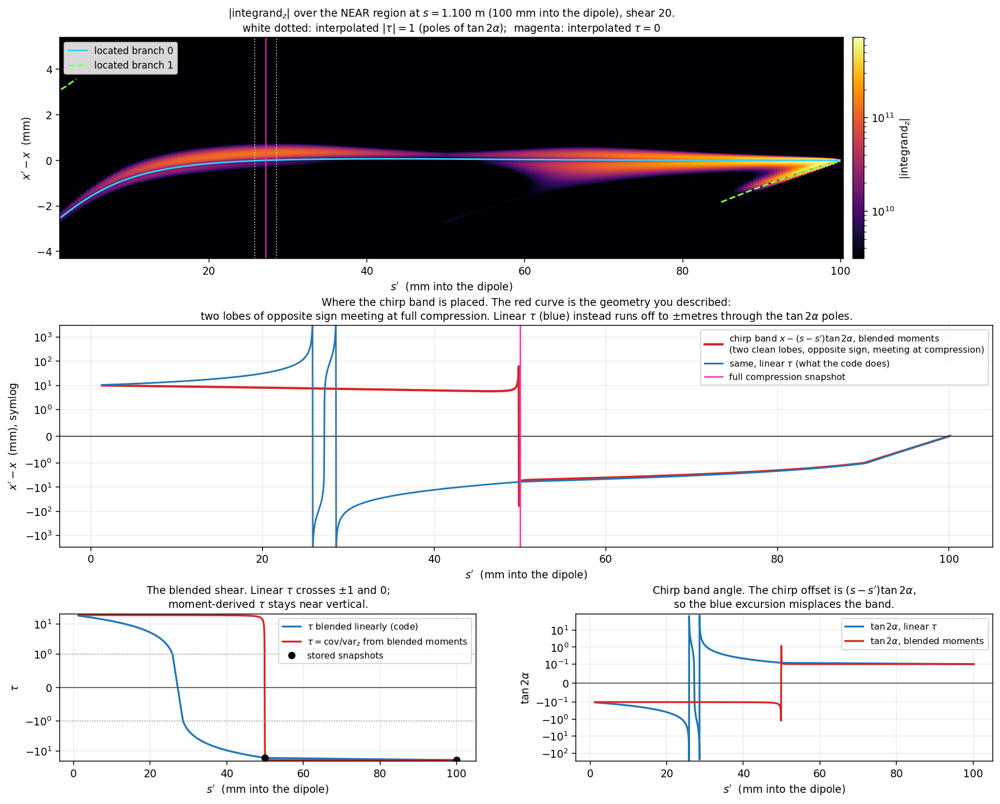

Top panel: `|integrand_z|` over the near region in lab `(x', s')`, with the located branch centres and the
interpolated `|tau| = 1` / `tau = 0` locations marked. Middle: where the chirp band is *placed* — the two
opposite-sign lobes meeting at compression (blended moments, red) against linear `tau` (blue) running off
through the poles. Bottom: the blended shear and the resulting chirp angle.

##### What was and was not already handled

- **Branch count: handled.** Both roots are taken per column from the local retarded frame (§6p), and
  branch 1's centre does swing to both signs (−1.834 → +3.574 mm). The two-lobe structure is representable.
- **Branch angle: not handled.** This is the defect. It is not a missing `if`, it is the choice of
  interpolated variable.

##### This reverses §6n

§6n concluded that "all unwrap-through-90° designs are dead" because `tau` passes through zero at the waist.
**That reasoning was backwards.** `tau` passing through zero *is the artefact of using `tan alpha` as the
coordinate*; the physical path goes through 90°. §6n also reported that seven candidate variables (`tau`,
`arctan tau`, `1/tau`, `log sigma_xi`, `log sigma_z`, `sigma_z^2`, moments) were all "off by 20×–390×" — but
that figure of merit was centre/width accuracy at a query point, which does not see the `tan 2a` excursion at
all. On the quantity that actually places the chirp band, moment blending is **231×** better.

##### It also reorders the plan

At the compression snapshot the fit has **`r^2` = 0.0018** — the x-on-z regression explains 0.18 % of the
x-variance, so `tau` = −16.76 there is noise-dominated and **its sign is not reliable**. Finer sampling
(Phase 5) merely stores more such frames. **The parametrisation has to be fixed first**, so Phase 3 moves
ahead of Phase 5.

##### Remaining gap in the moment fix

Moment blending is not fully clean: `cov` and `var_z` are interpolated independently, so `cov` crosses zero
at a slightly wrong `s'` and `tau` still grazes ±1 over 0.03 % of the region. The chart-free fix interpolates
the **orientation** itself (unwrapped angle, or a direction vector on RP¹), where vertical is a regular
point. Both `tau` and `1/tau` are charts that each break at one orientation — `tau` at vertical, `1/tau` at
horizontal — so neither works globally.

**Files.** `pyDFCSR_2D/test/test_flip_integrand.py` (new).

#### 6r. `frame_blend` implemented: the chart is fixed, the waist is not (2026-09-11) ✅ **`orient` mode; and a measured defect in full-moment blending**

##### What is being blended, and why there is a choice at all

Each snapshot stores the beam's density as **five numbers plus a grid**: a tilt line `x = tau z + b`, a
centroid `(z_bar, xi_bar)`, and two widths `(sigma_xi, sigma_z)`, with the density itself deposited on the
normalized grid `u = (xi - xi_bar)/sigma_xi`, `w = (z - z_bar)/sigma_z` where `xi = x - p(z)`.

Snapshots exist only at discrete times, but the retarded-time integral needs the frame at **arbitrary**
`t_ret`. So those five numbers have to be interpolated between the two bracketing snapshots. `frame_blend`
answers one question: **which numbers do you interpolate?**

That is a real choice, not a formality. The frame is a *geometric object* — an ellipse with an orientation
and two widths — but it is *stored* as one particular parametrisation of that object. Interpolating
different parametrisations of the same ellipse gives different intermediate ellipses.

##### The defect in plain terms

Interpolate the compass bearings 350 deg and 10 deg linearly and you get 180 deg: pointing backwards,
because you went round the wrong way. `tau = tan(alpha)` has exactly this defect, and its bad direction is
**vertical**.

Across full compression the beam rotates `+87 deg -> 90 deg -> -87 deg`. The stored slopes are `tau = +20`
and `tau = -16.76`. Any continuous path between those two numbers **must pass through `tau = 0`**, i.e.
`alpha = 0`, a *horizontal* ribbon — perpendicular to the truth. So halfway between the snapshots the code
believes the beam is lying flat when it is actually standing on end. Worse,
`tan 2a = 2 tau/(1 - tau^2)` has **poles at `tau = +-1`**, which that path crosses twice, and the chirp band
sits at `x - (s - s') tan 2a`, so it is flung to +-metres while the density stays within +-5 mm.

The beam never occupies any of those intermediate orientations. They are artefacts of the coordinate.

##### The three modes, and why each exists

| mode | orientation | widths |
|---|---|---|
| `'coeff'` (default) | `tau` blended linearly — today's behaviour | log-linear |
| `'moment'` | `tau = cov/var_z` from linearly blended `(var_z, cov, var_x)` | from the same blend |
| `'orient'` | same as `'moment'` | log-linear |

**`'coeff'`** interpolates the stored numbers as they are: `tau` and the means linearly, the sigmas
log-linearly. (Log-linear keeps a width positive and tracks the exponential growth a drift gives a
diverging beam, instead of putting a kink in it.) This is the pre-existing behaviour, and it carries the
chart defect above.

**`'moment'`** interpolates the **covariance matrix** `(var_z, cov, var_x)` instead. That is the ellipse
itself rather than a parametrisation of its slope, so it has no preferred direction to break at. `tau`,
`sigma_z` and `sigma_xi` are then derived at query time. At full compression "vertical" is simply
`cov -> 0` with `var_z` small — both smooth — so the derived `tau` stays near `+-20` and never detours
through 1.

But it breaks the **widths**, because averaging two covariance matrices is not "the beam halfway between".
Average two thin ellipses at different tilts and you get a fat blob, the same way averaging two photographs
of a rotating needle gives a blur rather than a needle at the mean angle. That is the 8x-10x `sigma_xi`
inflation measured below.

**`'orient'`** is the hybrid, and the reason splitting is legitimate is that the two defects live in
**different quantities**. The chart problem is only in the orientation. `sigma_xi` and `sigma_z` are
positive scalars that never had a chart problem, and log-linear blending was already the right thing for
them. So: orientation from the moment ratio, widths log-linear.

`'orient'` and `'moment'` also **pivot at the centroid**, `centre(z) = tau (z - z_bar) + x_bar`, rather than
at `z = 0` via the intercept `b`. The first moments are linear and well conditioned, and pivoting at the
centroid keeps the lever arm short, so whatever `tau` error remains buys the least band displacement.

##### Why the choice has teeth

The frame is used at **two** sites that must agree:

1. **placing the integration bands** — `_eq424` needs the slope and the intercept to locate the branches;
2. **evaluating the density** — the numba kernel maps a query point into the normalized `(u, w)` grid.

Blend them differently and the quadrature nodes sit where the density is not. Nothing enforced their
agreement before, so `test_frame_blend.py` now asserts both sites construct the same frame.

##### No new storage

The moment triple is **derived from the stored frame**, not measured at deposition:
`var_z = sigma_z^2`, `cov = tau var_z`, `var_x = sigma_xi^2 + tau^2 var_z`. So `tau = cov/var_z`,
`sqrt(var_z) = sigma_z` and `sqrt(var_x - cov^2/var_z) = sigma_xi` hold **identically at every snapshot** —
node exactness by construction, no deposition change, no new stored arrays. (They are therefore an
*effective* triple that reproduces the frame, not the beam's true moments: `sigma_xi` is the all-particle
spread while the tilt is fit on the core, so a directly measured `np.cov` would not satisfy the identities.)

##### The orientation fix works

| | `coeff` | `moment` | `orient` |
|---|---|---|---|
| `max\|tan 2a\|` over the history | **482.1** | **6.07** | **6.07** |
| history at `\|alpha\| < 45°` (fictitious) | **1.81 %** | **0.015 %** | **0.015 %** |

79× less chirp-angle excursion, 121× less time at an orientation the beam never occupies.

##### `'moment'` turned out to be broken, and the test caught it

Blending the *full* covariance **inflates `sigma_xi` 8×–10×** at mid-interval. A convex mix of two thin
ellipses at different tilts is fatter than either, by `a(1-a)(dtau)^2 var_z`. Measured against that
prediction in the body of the dipole:

```
   tau_k    tau_k1   sxi_log/um  sxi_mom/um  ratio  predicted/um
 -9.9247   -6.5848       20.290     196.861   9.70       212.690
 -4.9044   -3.8887       11.189     111.280   9.95       113.895
 -2.7126   -2.3383        8.569      68.038   7.94        68.569
```

Only the orientation needs the moment chart; the widths are already well conditioned log-linearly. Hence
`'orient'`. `'moment'` is kept because the defect is *measured* rather than assumed, and because it is the
honest full-covariance option — but it should not be used.

##### The acceptance test is convergence, not smoothness

Deliberately so, after §6o: roughness cannot distinguish "more accurate" from "smoother". Every mode is
exact at snapshot times, so every mode **must** converge as `step_size -> 0`, and modes that converge must
share a limit. Successive-step differences, rel L2:

```
                        coeff     moment     orient
  0.45 m into the dipole (ordinary point)
  0.05  -> 0.025       0.00462    0.00880    0.00777
  0.025 -> 0.0125      0.00091    0.01051    0.00161
  0.0125-> 0.00625     0.00031    0.01157    0.00054

  cross-mode gaps      coe-mom    coe-ori    mom-ori
  0.05                 0.04366    0.01166    0.03967
  0.00625              0.01205    0.00045    0.01180
```

`coeff` and `orient` both converge and their gap closes 26× (0.01166 -> 0.00045): **same limit, no
regression at ordinary points.** `moment`'s successive differences *grow* — it does not converge at all,
exactly as the `sigma_xi` inflation predicts. An earlier version of this study measured everything against
`0.5*(coeff + moment)`, which is circular (it puts each mode half the disagreement from the "reference" by
construction); that was scrapped for the self-convergence form above.

##### The waist is still not fixed

At 0.10 m into the dipole, where the near region contains the compression point, **nothing converges**:

```
  0.05  -> 0.025       0.97851    0.30910    1.41855
  0.025 -> 0.0125      0.80867    0.80540    0.69145
  0.0125-> 0.00625     0.33800    0.39322    0.28079
```

Successive differences of 28–140 % at `step_size = 0.00625` m — 160 steps through the 1 m drift. `orient` is
modestly better than `coeff` on absolute roughness (0.70 vs 0.90 at the finest step, 8.66 vs 8.81 at the
coarsest) and the cross-mode gaps do shrink, so the modes share a limit and there is no inconsistency — but
the limit is not reached. **§6q's chart defect was real and is now fixed; it was not the whole cause of the
entrance noise.** §6n's conclusion stands: the waist is a sampling problem, and Phase 5 is still required.

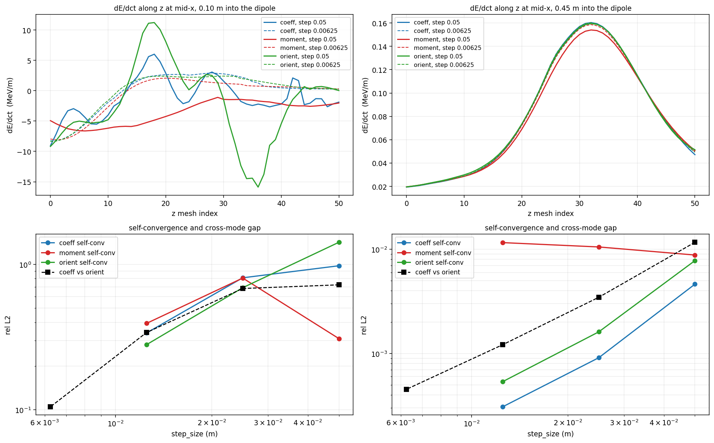

##### Regressions

`coeff` bit-identical: `test_two_branch_bands` still **1.06466 / 0.40824**; a dedicated test asserts
`_comoving_frame_at` reproduces the pre-flag expressions with `assert_array_equal`. `test_ghosting`'s CMV
columns stay flat at the B-spline grid error (0.000589 / 0.001019) across `G` = 0.05–20, unchanged.

Two things worth recording about the mechanics:

- **Numba's on-disk cache goes stale on a signature change** (`*.nbi` / `*.nbc` under `__pycache__`), and the
  failure is a confusing `ModuleNotFoundError: No module named 'interp3D'` rather than a signature error.
  Delete them after editing a `cache=True` kernel.
- **`zip(MODES, (colour1, colour2))` silently dropped the third mode from the figure.** `zip` truncates; a
  dict keyed by mode does not. The first version of the plot looked complete and was missing the mode the
  study was about.

**Files.** `pyDFCSR_2D/deposit_smooth.py` (`frame_blend` param, `_build_moment_arrays`),
`pyDFCSR_2D/interp3D.py` (kernel blend branch; deleted the dead `get_poly_deriv_blended` and the dead
single-field `interpolate3D_comoving`), `pyDFCSR_2D/CSR.py` (`_comoving_frame_at` mirrors the kernel),
`pyDFCSR_2D/test/test_frame_blend.py` and `test_frame_blend_wake.py` (new), `test_ghosting.py` (call site).

#### 6s. Integrand and wake maps through the dipole, and what the log grading actually buys (2026-09-12) ✅

Regenerates the §6f figures with the current code, at five locations inside the dipole for shear 20 and 50.

##### What log grading is, and where it is used

The near region `(s3, s4)` is the one that straddles `s' = s`, so it owns the `1/|r - r'|` singularity. Its
`s'` nodes are **not uniform**. The cell is

```
    ds = max(near_cell * sigma_xi,  near_grade * u),      u = |s - s'|
```

— an absolute floor of `near_cell` transverse support widths close to the observation point, then
**geometric growth** outside. Why: once `u` exceeds the transverse offsets, `|r - r'| ~ u`, so a column's
contribution falls as `1/u` and equal contributions come from equal *logarithmic* intervals. A uniform grid
is then over-resolved where the cost is and under-resolved where the accuracy is set.

**It is ON by default** (`near_cell = 0.5`, `near_grade = 0.05`) and applies to the **near region only** —
regions 1 and 2 stay uniform at `far_zbins = 200`.

##### What it buys, measured

`floor = near_cell*sigma_xi` is the cell targeted at `s' = s`; "unif." is how many uniform nodes that cell
would need to cover the whole near region:

```
shear 20
   s_dip      tau  sig_z/um  sig_xi/um    amp  near len/mm  nodes  floor/um  ds max/um  range   unif.
    0.10  -19.866     50.09     49.911   20.0       98.860    137     24.96     4617.7  185.0    3962
    0.20   -6.585    149.01     16.533   59.4       32.011    170      8.27     1456.8  176.2    3873
    0.40   -2.713    339.99      8.436  109.3       11.829    193      4.22      503.1  119.3    2805
    0.60   -1.603    515.45     12.502   66.1       11.855    184      6.25      480.6   76.9    1897
    0.80   -1.044    668.40     21.930   31.8       15.373    172     10.97      629.1   57.4    1403

shear 50
    0.10  -12.462    199.65     12.508  198.9      154.629    220      6.25     7037.3 1125.3   24726
    0.20   -5.485    446.79      5.631  435.2       66.317    251      2.82     3017.5 1071.7   23553
    0.40   -2.493    923.76      5.899  390.4       26.864    244      2.95     1134.6  384.7    9108
    0.60   -1.515   1361.92     12.358  167.0       31.324    224      6.18     1260.6  204.0    5070
    0.80   -0.999   1743.80     22.300   78.1       40.107    210     11.15     1616.5  145.0    3598
```

(The last two rows of each shear have `near len` set by §6t's `near_floor`, not by the chirp exit.)

The saving is **29× at shear 20 / s = 0.10** (137 nodes instead of 3962) and **112× at shear 50 / s = 0.20**
(251 instead of 23553), spanning up to a **1125×** dynamic range of cell size within a single region. Note
the node count stays in the 90–250 band across a 67× spread in near-region length (2.3 mm to 155 mm) — that
flatness is the point of §6m: graded, `N ~ 1/near_grade + ln(u_max/u*)/ln(1+near_grade)`, which grows only
logarithmically with tilt, whereas uniform `N ~ u_max/sigma_xi` grows linearly and is what forced the
retuning §6k had to do.

##### A false-alarm warning, fixed

Generating these figures made `_region_node_counts` print

```
WARNING: near-region nodes capped at 20000 (wanted 32077); near-region cell is
1.6x coarser than near_cell requests. Raise zbins, raise near_cell, or use graded nodes.
```

at shear 50, s = 0.10 and 0.20 — while the graded grid was quietly using **220 nodes** and hitting its
target cell exactly. The count `want` is the *uniform* requirement; with `near_grade` set,
`_near_region_nodes` discards it entirely. So the warning reported a resolution loss that was not happening,
and advised "use graded nodes" when they were already on. Now gated on `near_grade` being unset. (The
warning is still wanted in the ungraded path — §6l added it precisely because a silent clip once returned an
under-resolved wake that looked plausible.)

##### How far apart the two frame_blend modes actually are

Every figure shows **both** modes as rows, with the colour scale **shared down each column** — a
self-normalising panel pair would let two panels look identical while differing 10x in amplitude, or look
different purely from rescaling. Relative L2 over the whole wake mesh:

```
    shear   s_dip         dE     x_kick
       20    0.10    0.70873    0.25290
       20    0.20    0.25292    0.10720
       20    0.40    0.05758    0.00538
       20    0.60    0.00444    0.00044
       20    0.80    0.00347    0.00049
       50    0.10    1.19097    0.72002
       50    0.20    1.49196    0.42775
       50    0.40    0.18051    0.03834
       50    0.60    0.02957    0.01980
       50    0.80    0.03943    0.00669
```

**Shear 20 behaves exactly as §6q's mechanism predicts:** 71% at the waist, decaying monotonically to 0.34%
once the near region no longer reaches the compression point. That is the signature of a *local* chart
defect, and it is the strongest confirmation so far that `orient` changes what it should and leaves ordinary
points alone.

**Shear 50 still does not decay monotonically** — 0.030 at s = 0.60, 0.039 at s = 0.80 — but the numbers
above are POST-§6t. Before that fix, s = 0.80 read **0.1418**, and I hypothesised it was the `|tau| = 1`
degeneracy of Eq 4.24 making the chirp root hypersensitive to a small change in blended `tau`. **That
hypothesis was wrong.** §6t found the real cause: at `tau = -0.999` the near region's upstream reach had
collapsed to 0.009 `sigma_z`, so both modes were integrating over a domain that excluded the physics, and
they disagreed because both were computing noise. With the floor in place the two modes agree to 0.039 at
that point and their `dE` ranges are identical to four decimals.

The lesson is that `|tau| -> 1` was the right *location* and the wrong *mechanism*. It mattered because
`cos 2a -> 0` shrinks the integration region, not because the quadratic root is ill-conditioned — and the
distinction was only settled by measuring the region geometry rather than reasoning about the formula.

##### The figures

`s'` spans the **actual near region**, not the ±30 `sigma_z` zoom §6f used. At shear 20, s = 0.10 the near
region is 98.9 mm while 30 `sigma_z` is 1.5 mm, so the old window showed under 2% of the domain and could
not show the chirp band's excursion at all.

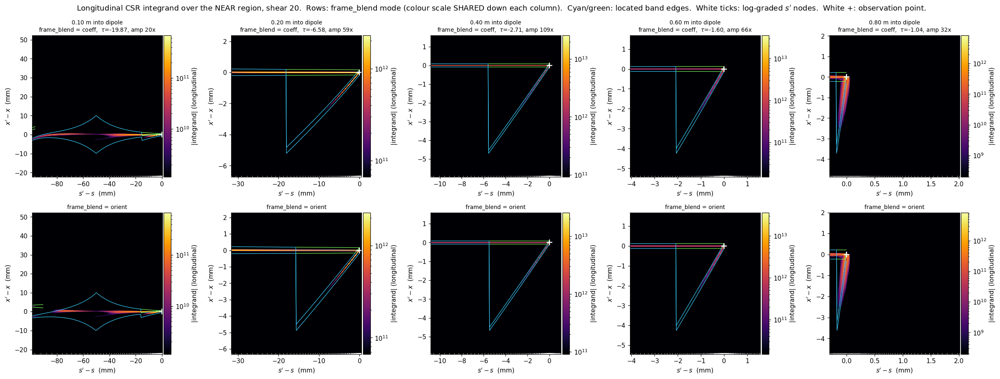

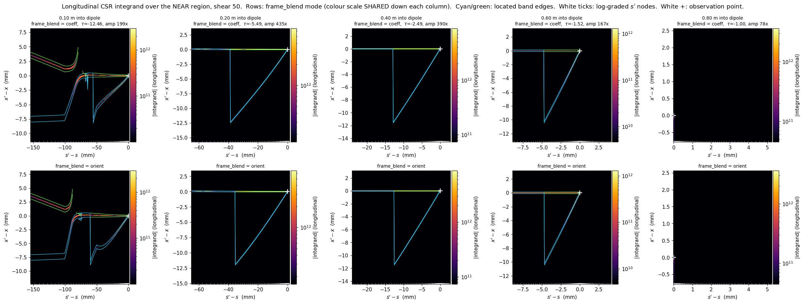

Cyan/green are the located band edges, white ticks on the lower axis are the graded `s'` nodes (visibly dense
near `s' = s`, sparse at the far end), the white `+` is the observation point. The thesis 4.4.2 picture
appears literally from s = 0.20 onward: a narrow band along `x' ~ x` and a chirp band leaving it at angle
`2 alpha`, the two meeting at the observation point.

At **s = 0.10** the band envelope instead opens symmetrically to ±25 mm and closes again at `s' = s`. That
is the structure predicted from the shear reversal: `tan 2a` changes sign across the compression point, so
the chirp band sits on **opposite sides of `x'`** for `s'` before and after it, giving two lobes that meet
where the branches degenerate.

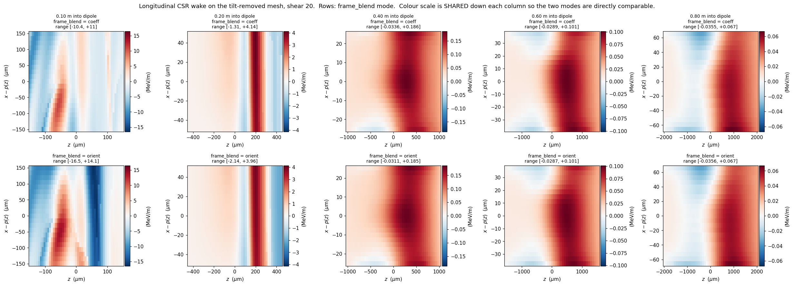

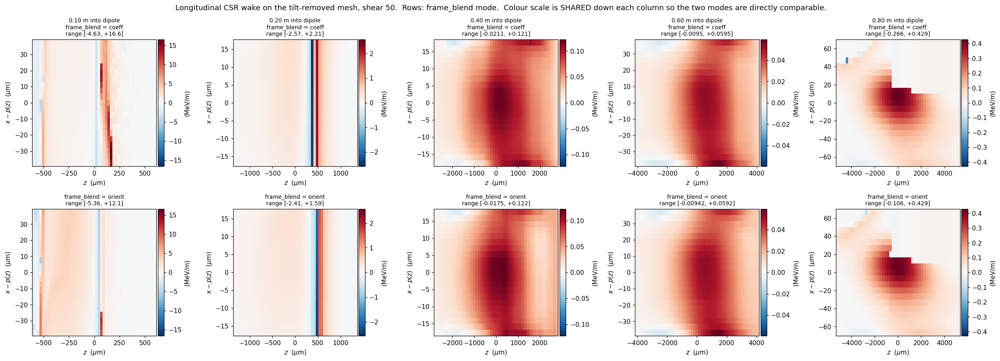

Transverse counterparts: `integrand_transverse_shear{20,50}.png`, `wake_transverse_shear{20,50}.png`.

Wakes are smooth and physically ordered from s = 0.40 outward, amplitude falling as the bunch lengthens. The
entrance points remain the exception at both shears, consistent with §6r: the chart defect is fixed, the
waist is still undersampled.

**Caveat on the integrand figures.** The `x'` window is sized from the *located* bands, so it cannot reveal
support the locator missed entirely — `test_integrand_plane.py` answers that with a prediction-independent
window. These figures show where the integrand and the nodes sit relative to each other, not whether the
domain is complete.

##### A process note

The first version of this study plotted `coeff` only. The script never set `frame_blend`, so it fell back to
the default while a print statement claimed the mode — the figures showed the artefact `orient` was built to
remove and none of the fix. Printing a setting is not setting it, and a figure caption asserting a
configuration is worth nothing unless the configuration is read back from the object that ran.

**Files.** `pyDFCSR_2D/test/test_wake_evolution_maps.py` (new), `pyDFCSR_2D/CSR.py` (warning gate).

#### 6t. The near region collapses at `|tau| = 1`: a floor on `d` (2026-09-12) ✅ **17x amplitude error removed; also explains §6d's roughness**

Found because the §6s wake maps looked *worse* than §6f's at shear 50 — the s = 0.80 panel had a visibly
blocky, unphysical staircase. That turned out to be true, and worth chasing.

##### First: the code had not regressed

The obvious worry was that §6m/§6o/§6p/§6r broke something. Tested directly, by clearing the `.npz` cache and
re-running §6f's *exact* configuration (`dipole_lattice.yaml`, 0.1 m drift, `step_size` 0.1, `zbins` 400) with
current code:

```
                recorded (6f)              current code
0.2000  [-11.6155, +10.0328]      [-11.6155, +10.0328]   identical
0.4000  [ -1.5032,  +0.6706]      [ -1.5032,  +0.6706]   identical
0.6000  [ -0.0112,  +0.0821]      [ -0.0112,  +0.0821]   identical
0.8000  [ -0.0062,  +0.0468]      [ -0.0062,  +0.0468]   identical
1.0000  [ -0.0085,  +0.0230]      [ -0.0085,  +0.0231]   4th decimal
```

(Note the cache: `wake_map` stores results per tag, so a naive re-run would have silently returned the OLD
numbers and "proved" no regression. It had to be cleared first.)

So the difference came from the §6s *configuration*, and specifically from the **observation points**:

| grid | `tau` at each point |
|---|---|
| §6f: 0.1, 0.3, 0.5, 0.7, 0.9 m | −12.46, −3.47, −1.91, **−1.225**, **−0.814** |
| §6s: 0.1, 0.2, 0.4, 0.6, 0.8 m | −12.46, −5.49, −2.49, −1.52, **−0.999** |

§6f's grid *straddled* `tau = -1` without landing on it; §6s landed within **0.1%**. The blockiness was not
new breakage — it was a **pre-existing defect that §6f's sampling happened to step over.**

##### The defect

`d = (10 sigma_x + x - xmean)|cos 2a| / max(|sin 2a|, branch_sin_min)` sizes the near region from where the
**chirp** band exits the beam. At `|tau| -> 1` (`alpha = 45 deg`), `cos 2a -> 0`, so `d -> 0`. Measured at
shear 50, 0.80 m into the dipole (`tau = -0.999`, `cos 2a = 8.8e-4`):

```
  d = s - s3   =  0.0153 mm          <- upstream reach
  s4 - s       =  5.2314 mm          <- downstream reach
  sigma_z      =  1743.8 um          -> d = 0.0088 sigma_z
```

The **upstream** reach — the causal side, where CSR comes from — collapsed to 15 µm, so **1–2 of the 88 graded
nodes** landed there and the `1/|r - r'|` pole sat 15 µm from the region boundary. Region 2, uniform at
`far_zbins = 200` over 200 `sigma_z`, has 1 `sigma_z` = 1744 µm cells, so nothing resolved the pole.

The chirp band genuinely *does* exit at once when it is vertical. The error is that **`d` conflates "where
does the chirp band exit" with "how long must the near region be"** — the region also has to hold the NARROW
band and the pole neighbourhood, and neither cares about the chirp geometry. §6o deleted the legacy
`|tan theta| <= 1` branch, which carried exactly this protection as `s3 = s - 20 sigma_z`, and the floor went
with it silently.

(A first hypothesis — that the polar patch was toggling on/off across mesh points — was tested and is
**wrong**: the patch was on at 29/29 sampled points and the node count was stable at 87–88.)

##### The fix, and why the value is not tuned

New `Integration_params.near_floor`, default **20.0** (`sigma_z`): `d = max(d, near_floor*sigma_z)`. 20 is not
fitted — it is the multiplier the deleted branch used. Sweeping it at the broken point:

```
 near_floor  d/sigma_z  nodes  abs rough  rel rough           dE range
        0.0     0.0088     88    0.02605    0.01609  [ -0.0007, +0.4195]   <- shipped behaviour
        5.0     5.0000    182    0.01143    0.11180  [ -0.0035, +0.0244]
       20.0    20.0000    210    0.01143    0.11181  [ -0.0035, +0.0244]
       40.0    40.0000    224    0.01143    0.11181  [ -0.0035, +0.0244]
       80.0    80.0000    238    0.01143    0.11183  [ -0.0035, +0.0244]

rel L2:  floor 0 vs 5 = 15.18     5 vs 20 = 0.00025     20 vs 80 = 0.00041
```

The unfloored wake was **17x too large** (+0.4195 against +0.0244), and every floored value agrees to 2–4e-4
across a **16x** range of the parameter. That insensitivity is the point: the answer does not depend on the
arbitrary constant, only on it being large enough. The floored result also matches §6f's neighbouring point
(`tau = -0.814` gave `[-0.0085, +0.0231]`) in magnitude, while +0.42 MeV/m did not.

Note the metric trap again, in the opposite direction from §6o: **relative** roughness *rose* 0.016 -> 0.112
while absolute roughness *fell* 0.026 -> 0.011, purely because the wake got 17x smaller. Reading the relative
number alone would have rejected the fix.

##### It also explains §6d

`test_two_branch_bands` (shear 20, s = 0.7) has `d = 7.9 sigma_z` — under-resolved by the same mechanism:

```
                        before     after
  roughness dE (two)   0.08777   0.01687     <- 5.2x better; single-branch is 0.01683
  dE rel L2            1.06466   1.06497
  x_kick rel L2        0.40824   0.39062
  axis A worst dev     0.06212   0.05335
```

§6d recorded that two-branch roughness was 5x *worse* than single-branch (0.0878 vs 0.0176) and never
explained it; I checked at the time that absolute roughness had fallen and moved on. **This was the cause**,
and two-branch roughness is now at parity with single-branch. The reference numbers move slightly because the
comparison itself is now made on a properly resolved domain.

##### Regressions

All five §6f shear-50 `dE` ranges are **unchanged** by the floor — only node counts move (217 -> 233,
169 -> 218, 215 -> 205). So the floor adds resolution where it was missing and does not perturb results that
were already converged, which is the behaviour a safety floor should have.

**Files.** `pyDFCSR_2D/params.py` (`near_floor`), `pyDFCSR_2D/CSR.py` (`_layout_bounds`).

#### 6u. Full shear sweep 0 -> 50, longitudinal and transverse (2026-09-13) ✅ **`orient` provably inert at zero tilt**

Extends §6s to shear **0, 2, 5, 10, 20, 50** at five locations, both `frame_blend` modes, longitudinal and
transverse. 60 wake meshes, 24 figures.

##### `orient` does nothing where it should do nothing

Relative L2 between the modes over the whole wake mesh, `dE`:

```
   shear    s=0.10   s=0.20   s=0.40   s=0.60   s=0.80
       0   0.00000  0.00001  0.00002  0.00001  0.00000
       2   0.00045  0.00030  0.00137  0.00075  0.00047
       5   0.02808  0.08767  0.04758  0.00433  0.00152
      10   0.50721  0.46266  0.06218  0.00536  0.00186
      20   0.70873  0.25292  0.05758  0.00444  0.00347
      50   1.19097  1.49196  0.18051  0.02957  0.03943
```

Two clean monotonic trends, both predicted by the §6q mechanism:

- **Zero at zero tilt.** At shear 0 the two modes agree to 1e-5 and the figures are pixel-identical. With no
  x–z correlation there is no compression waist, `tau` never sweeps through vertical, and there is nothing for
  the chart fix to fix. That is the strongest available check that `orient` does not perturb what it should
  not.
- **Concentrated at the entrance.** For every shear the difference decays with `s`, to <= 0.04 by s = 0.80.
  The chart defect needs a full-compression point inside the near region.

##### Where the waist sits, per shear

`sigma_z` minimum together with `amp -> 1` marks full compression (§6q: the tilt fit explains nothing there,
so `sigma_xi -> sigma_x`):

```
  shear   waist location       sigma_z at waist   sigma_xi there
      0   none in the dipole   50 -> 62 um grows  40-50 um
      2   ~0.40 m              22.54 um           103.4 um
      5   ~0.20 m              10.00 um           246.5 um
     10   ~0.10 m               5.02 um           498.3 um
     20   ~0.05 m (§6q)         2.51 um           999.1 um
     50   upstream of 0.10 m   199.65 um at 0.10   12.5 um
```

The waist marches **upstream** as shear rises and the compression gets **stronger** (`sigma_z` minimum falls
50 -> 2.5 um from shear 0 to 20). Shears 5 and 10 are useful additions precisely because they put the waist in
the middle of the dipole rather than at the entrance, decoupling it from the bend-entrance transient.

##### Shear 0 is a textbook validation

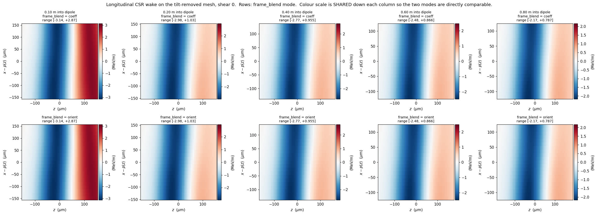

The classic 1D steady-state CSR wake: dipolar in `z`, essentially **independent of `x`** (vertical stripes,
correct for an untilted beam with `sigma_x << R`), amplitude decaying smoothly 3.14 -> 2.17 MeV/m as the bunch
lengthens 50 -> 62 um. Nothing needing explanation.

##### Transverse wakes

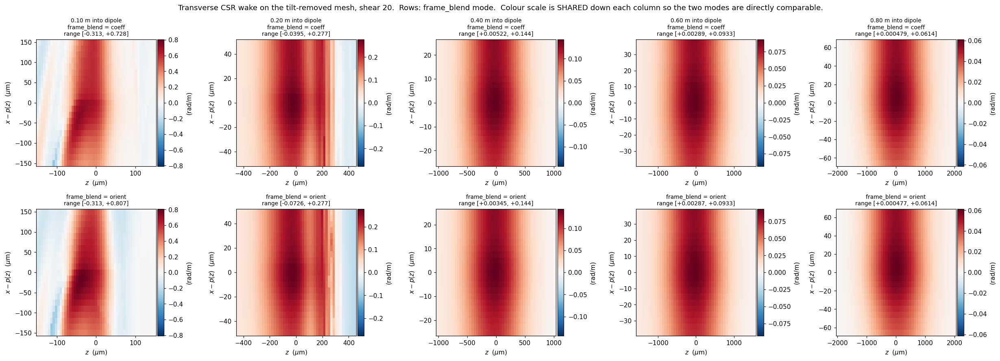

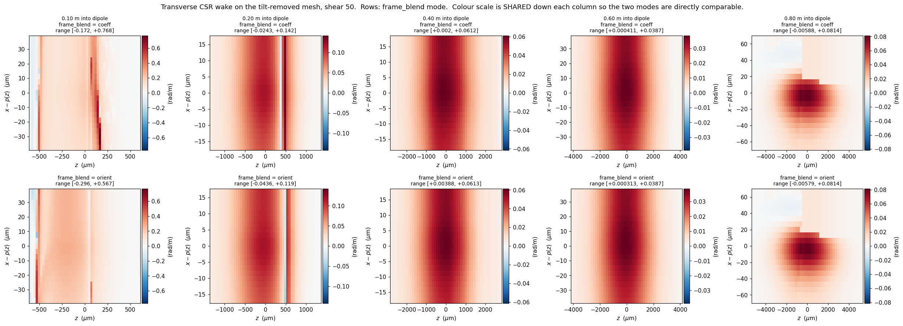

Smooth and largely single-signed, decaying with `s` as the bunch lengthens. The transverse wake is
systematically **less** sensitive to the frame blend than the longitudinal one — `x_kick` differences are 3–5x
smaller than `dE` differences at every point in the table above. Consistent with Eq 4.8 carrying no
`drho/dz'` term, so it does not see the longitudinal derivative the chart error corrupts most.

Full set, per shear in {0, 2, 5, 10, 20, 50}: `integrand_longitudinal_shear*.png`,
`integrand_transverse_shear*.png`, `wake_longitudinal_shear*.png`, `wake_transverse_shear*.png`.

##### §6t's floor is load-bearing across the whole sweep

A new `d set by` column records which of the three terms in `_layout_bounds` set the near-region reach. The
history **cap** is applied last and can therefore override §6t's floor — that would mean the region is limited
by available history rather than geometry, an honest but different limitation, and it must not pass unnoticed.
It never bound here. The floor did, at **s >= 0.60 for every shear**, and at s = 0.40 for shear 0:

```
  shear  0: chirp chirp floor floor floor
  shear  2: chirp chirp chirp chirp floor
  shear  5: chirp chirp chirp floor floor
  shear 10: chirp chirp chirp floor floor
  shear 20: chirp chirp chirp floor floor
  shear 50: chirp chirp chirp floor floor
```

So `|tau| -> 1` late in the bend is the **generic** case, not a curiosity of the one point that exposed it:
without §6t the near region would collapse near the exit of every run in this sweep.

**Files.** `pyDFCSR_2D/test/test_wake_evolution_maps.py` (shear list, shear-0 guard, `d set by` diagnostic).

#### 6v. Is the waist a QUADRATURE problem? No (2026-09-13) ❌ **hypothesis refuted; the frame-history diagnosis survives its main challenge**

§6t was a reminder that a geometry defect can make a "converged" answer badly wrong, and that a
step_size convergence study cannot see it. So before accepting §6n/§6r's conclusion that the waist is
undersampling of the frame HISTORY, the obvious alternative had to be eliminated: that it is undersampling of
the `s'` QUADRATURE.

##### The hypothesis, and why it looked strong

The near-region cell is `ds = max(near_cell*sigma_xi, near_grade*|s - s'|)`. **Both terms are set at the
observation time.** Neither knows `sigma_z` at the RETARDED time, which is what sets the integrand's
longitudinal structure — and at a waist that collapses. Measured at shear 20, 0.10 m into the dipole:

```
  retarded sigma_z minimum:  2.514 um, at -49.988 mm from s   (sigma_z at s is 50.09 um)
  DEFAULT graded cell there: 2448.9 um
  cell / retarded sigma_z:   974x
```

The quadrature cell really is **974x longer than the density structure it integrates**, and refining
`step_size` cannot fix it because the cell is pinned to observation-time quantities. That is a complete,
quantitative mechanism for §6r's non-convergence.

##### It is wrong

Refining the quadrature at **fixed step_size**, so the frame history is identical down the whole ladder:

```
shear 20, 0.10 m into the dipole  (the waist)
 near_cell  near_grade   nodes  cell@waist/um   ratio  abs rough  rel L2 vs finest
       0.5        0.05     137        2448.86   974.1    8.81000           0.03413
       0.5        0.02     279         992.66   394.9    8.66281           0.01310
       0.5        0.01     478         498.77   198.4    8.79302           0.00620
       0.5           0    3961          24.96     9.9    8.77210           0.00067
       0.2           0    9904           9.98     4.0    8.77246           0.00030
       0.1           0   19807           4.99     2.0    8.77251           0.00010
      0.05           0   39614           2.50     1.0    8.77301           0.00000
```

Driving the cell from 974x down to **1.0x** the retarded `sigma_z` costs **289x more nodes** (137 -> 39614)
and changes the wake by **3.4%**. The `dE` range moves from `[-9.0710, +6.0133]` to `[-9.1137, +5.9651]`. And
the decisive number: **absolute roughness is unchanged, 8.81 -> 8.77.** Every wiggle survives. The quadrature
converges smoothly and monotonically; the noise does not care.

Two more points confirm the ladder is well-behaved rather than inert:

```
shear 10, 0.10 m  (waist AT the observation point, sigma_z = 5.02 um, ratio 3.0)
      default -> finest:  rel L2 0.00034,  roughness 0.25032 -> 0.25025
shear 20, 0.60 m  (control; 6r converged here, ratio 0.4)
      default -> finest:  rel L2 0.00422,  roughness 0.00426 -> 0.00427
```

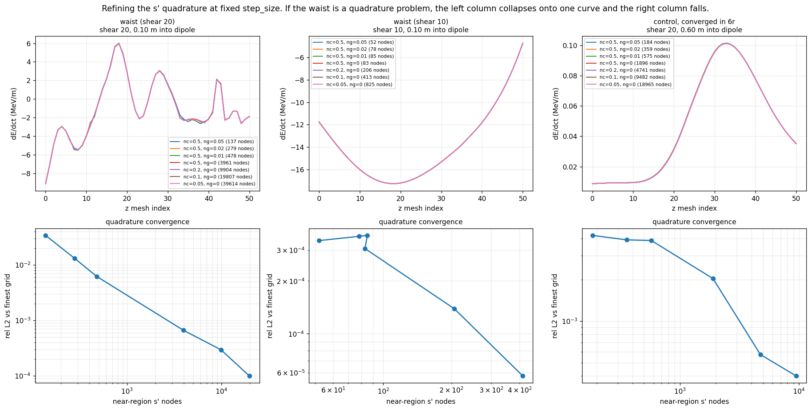

Left column: the seven wake cuts lie on top of one another at every point. Right column: the quadrature
error falls smoothly. Both together are the refutation — the grid converges and the noise stays.

##### Why the 974x does not matter

The retarded `sigma_z` minimum sits **50 mm upstream** of the observation point, and by then `1/|r - r'|` has
already damped the integrand hard. The region where the density is thinnest is the region that contributes
least. That is exactly the argument that justified log grading in §6m — equal contributions come from equal
logarithmic intervals — so the grading is behaving as designed, and the alarming ratio is measured in a place
the answer does not depend on.

The `cell / retarded sigma_z` ratio is therefore **not a useful error indicator on its own**, which is worth
remembering: it is a large, alarming, and irrelevant number unless weighted by the integrand.

##### Net result

**§6n/§6r's frame-history diagnosis survives its main challenge.** The remaining correctness gap at the waist
is the interpolation of the stored frame between snapshots, not the integration grid, and Phase 5 (sampling)
remains the right target. This is a negative result, but it is the kind worth paying for: it removes the
alternative that would have made Phase 5 wasted effort.

##### One secondary finding, recorded not fixed

At a waist the tilt fit explains almost nothing, so `sigma_xi -> sigma_x` (§6q). The floor
`near_cell*sigma_xi` therefore becomes **large** exactly where `sigma_z` is smallest. At shear 10, 0.10 m the
ungraded floor was 250.7 um against the graded cell's 15.06 um — 17x **coarser** near `s' = s`. The floor is
keyed to the wrong quantity at a waist. Measured impact on the wake: 3e-4. Noted for the record; not worth a
change on that evidence.

**Files.** `pyDFCSR_2D/test/test_waist_quadrature.py` (new).

#### 6w. Phase 5.1 — predict waists from linear optics and warn (2026-09-13) ✅ **the failure is no longer silent**

##### What the problem is, in one paragraph

The co-moving interpolant reconstructs the retarded density by blending the stored frame
between two snapshots. Across a longitudinal waist that blend is wrong, and — this is the
part that matters — **it is wrong without looking wrong.** §6n measured `sigma_z` = 50.00 um
and 50.09 um at the two ends of an interval whose true minimum is **2.51 um**. Nothing in
the stored history records that a 20x compression happened in between. It is the same
failure as photographing a bouncing ball at the top of each bounce: every frame looks
identical, and the sequence gives no hint that anything happened between them. §6v then
ruled out the `s'` quadrature as the cause, so the only remedy is finer sampling — but the
user has no way to know that, because the output looks fine.

So Phase 5.1 does not try to fix the wake. It **propagates the beam's second moments
through the lattice with linear transport before any particle is tracked**, finds the
minima of `var_z(s)`, and reports which of them `step_size` cannot resolve.

##### Why a warning and not a correction

Two alternatives were rejected on purpose:

- **Silently refining `step_size`** — changes the kick cadence, the cost, and every
  recorded number, without being asked.
- **Falling back to the nearest snapshot at a waist** — this manufactures the very symptom
  being diagnosed. It applies the full inter-snapshot frame change at fixed `alpha`, i.e.
  hundreds of band half-widths, once per snapshot interval, inside the near region, and it
  puts a jump inside the `_retarded_xi_bands` fixed point.

##### It agrees with tracking

The predictor is only useful if it lands where the real tracker's waists are. Against the
§6u/§6q measurements:

```
 shear   predicted s   analytic s   measured s   sigma_z pred   sigma_z measured
     0          none         none         none              -                  -
     2        0.4095       0.4095         0.41       22.571 um          22.54 um
     5        0.1935       0.1935         0.20        9.881 um          10.00 um
    10        0.0990       0.0990         0.10        5.011 um           5.02 um
    20        0.0500       0.0500         0.05        2.516 um           2.51 um
    50        0.0200       0.0200         0.02        1.006 um                  -
```

`sigma_z` at the waist agrees with tracking to **better than 0.5 %** at every shear where
both exist, and the position to within §6u's sampling interval. Shear 0 correctly predicts
**no** waist.

The `analytic s` column is an independent check, not a restatement: in a bend `R51 = -sin(theta)`,
so with `u = sin(theta)`

```
    var_z(u) = var_z0 - 2 u cov_zx + u^2 var_x      ->   minimised at  u = cov_zx / var_x
```

giving `s_waist = R arcsin(cov_zx / var_x)`. That matters because `r_gen6` works in
`(x, x', y, y', z, dp/p)` while Bmad-X uses `(x, px, y, py, z, pz)`; a sign slip in `R51`
would move the waist or delete it, and matching the measurement alone would not catch it.

##### Two bugs the validation caught, one of them in the test

- **My first analytic formula was wrong.** I used `u = 1/tau0`, which assumes the x–z
  correlation is perfect (`var_x = tau0^2 var_z0`). At shear 2 the uncorrelated
  `sigma_x = 50 um` is half the sheared 100 um, so `r = 0.894` and the true minimum is at
  `u = 0.400`, not 0.500 — 0.41 m instead of 0.52 m. The **predictor was right and the test
  was wrong**, which is the good direction but only visible because both were checked.
- **The waist width was floor-limited by the scan grid.** At `n_sub = 200` over a 1 m dipole
  the grid is 5 mm, and the shear-20 and shear-50 waists both reported exactly 5.0000 mm.
  Their true widths are 2.41 mm and 0.34 mm. That error runs in the **dangerous** direction
  — a narrow waist made to look wider, so the warning understates the problem. Fixed by
  interpolating the `sqrt(2)` crossing rather than snapping to a node, and raising `n_sub`.
  The interpolated widths now match the independent estimate `sigma_min R / sigma_x`
  (2.41 vs 2.52 mm, 0.34 vs 0.40 mm, 9.82 vs 10.05 mm).

##### What it prints

`CSR2D.run()` calls it once, on rank 0 only, for the co-moving path only. On the shear-20
configuration used throughout this work:

```
  [waist scan] linear optics predicts 1 longitudinal waist(s) in this lattice
       s (m) sigma_z (um)     compress   width (mm) steps across  resolved
      1.0500        2.512         19.9x       2.4043        0.05        NO
  WARNING: 1 waist(s) are NOT resolved by step_size = 0.05 m.
  ...  step_size <= 0.0006011 m would put 4 steps across the narrowest one.
```

`0.05` steps across the waist is the quantitative statement of §6n's problem: the tracker
steps 50 mm at a time through a feature 2.4 mm wide. It also fires on
`test_two_branch_bands`' own lattice (shear 20 at `step_size` 0.1) — correctly, since that
waist is unresolved there too.

The scan is **never fatal**: wrapped so any failure degrades to a one-line skip. A
diagnostic that can abort a run is worse than the problem it reports, especially one based
on linear optics of the design lattice with no CSR, no space charge, and a first-order
identification of two coordinate conventions. `min_steps = 4` is a judgement call, and the
report prints `steps across` so the reader can apply their own threshold.

##### Still open

This makes the failure visible; it does not fix it. Phase 5.2 (globally finer `step_size`,
chosen from this prediction) is now a one-line config change the user can make on evidence.
Phase 5.3 (non-uniform snapshots, so the waist can be resolved without paying for fine
steps everywhere) still requires replacing arithmetic index lookup with a search in three
history classes plus `CSR.py`, and is still deferred.

**Files.** `pyDFCSR_2D/waist.py` (new), `pyDFCSR_2D/CSR.py` (`report_waists`, called from
`run`), `pyDFCSR_2D/test/test_waist_scan.py` (new).

#### 6x. Phase 5.2 — the waist CAN be bridged by sampling (2026-09-13) ✅ **§6n/§6r's pessimism was an artefact of stopping 10x short**

##### The question §6r never actually asked

§6r refined `step_size` at a waist, found successive differences of 28–140 % all the way
down to 0.00625 m, and concluded the waist could not be bridged by sampling. §6w then
predicted, from linear optics, that this waist is **2.39 mm wide** and needs
`step_size <= 0.0006 m` for a few steps across it.

**So §6r stopped 10x short of resolving the thing it was refining.** Every step size it
tried put well under one step inside the waist. Its conclusion was not established, it was
untested — the numerical equivalent of concluding a feature does not exist after only ever
photographing it at longer exposure than the feature lasts.

##### It converges

Walking the ladder past §6r's stopping point, deposition held fixed at 128² so only
`step_size` varies:

```
 step_size  snapshots  steps across  abs rough  rel L2 vs finest    dE range
      0.05          4          0.05    8.48928           0.79017  [-8.7174, +5.6425]
    0.0125         13          0.19    2.23283           0.43964  [-9.1738, +4.8863]
     0.003         52          0.80    0.51613           0.01742  [-7.6980, +2.9491]
     0.001        151          2.39    0.52086           0.00719  [-7.6698, +3.0114]
    0.0006        251          3.99    0.50852           0.00000  [-7.6701, +3.0125]

successive differences:  0.808  ->  0.427  ->  0.0151  ->  0.0072
```

- **Absolute roughness falls 16.7x** (8.49 -> 0.51) and then goes flat.
- Successive differences **collapse 28x** across the 0.0125 -> 0.003 boundary and settle
  below 1 %.
- The `dE` range stabilises at `[-7.670, +3.012]`. The **shipped default of 0.05 m is 79 %
  wrong** at this point, with its positive peak 87 % too large.

§6r's finest step, 0.00625 m, lies **exactly in the knee** between the 0.0125 and 0.003
rungs. One more rung and it would have seen the collapse.

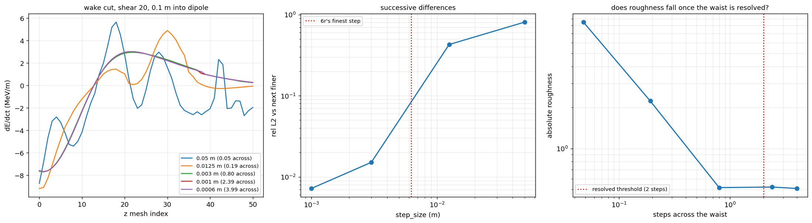

Left: the two coarse cuts oscillate wildly; the three fine ones lie on a single smooth
curve. Middle: successive differences, with §6r's finest step marked at the knee. Right:
roughness against steps across the waist.

##### This settles the Phase 5 question

The remaining correctness gap at a waist is **plain undersampling of the frame history, and
it is fixable today by setting `step_size`** — no new machinery. Chain of elimination now
complete: §6v ruled out the `s'` quadrature, §6t ruled out the near-region geometry, §6r
ruled out the choice of blended variable, and §6x shows sampling works once it is actually
fine enough. Phase 5.3 (non-uniform snapshots) remains desirable only as a **cost**
optimisation — 251 snapshots and 78 s here versus 4 and 2.4 s — not as a correctness fix,
which lowers its priority considerably.

##### A false alarm in §6w, caught and fixed

§6w set `min_steps = 4`. Against the table above that calls `step_size` 0.003 "NOT
resolved" when its wake is already converged to 1.7 %, and 0.001 unresolved at 0.7 % — a
warning about a problem that is not happening, which is exactly the failure §6t had to fix
in the node-cap message. Recalibrated to **`min_steps = 2.0`**, which now tracks the
measurement:

```
  step 0.05     0.05 across   NO      step 0.001    2.41 across   yes
  step 0.0125   0.19 across   NO      step 0.0006   4.02 across   yes
  step 0.003    0.80 across   NO
```

`resolved` now turns on exactly where the error drops to <= 0.7 %. Calibrated on **one**
waist, so it is a defensible default rather than a law, and the report always prints
`steps across` so a reader can apply their own threshold.

##### Cost, stated plainly

Resolving this waist costs **32x** the tracking time (2.4 s -> 78 s) and **63x** the
snapshots (4 -> 251), and `build_interpolant` re-stacks the whole deque twice per step, which
pushed peak RSS to 8.75 GB at 200² deposition — hence 128² for this study. That cost is why
Phase 5.3 still has a reason to exist, and why the warning reports a *recommended*
`step_size` rather than silently adopting it.

##### Also caught here

`yaml.dump` sorts keys alphabetically by default, which moves `step_size` to the END of a
lattice dict — and `lattice.py` reads it **positionally as the first key**, so
`get_referece_traj` died with `TypeError: 'float' object is not subscriptable`. Every test
script in this work passes `sort_keys=False` for that reason. It is the Step 7 item about
`lattice.py`'s positional `step_size` biting in practice.

**Files.** `pyDFCSR_2D/test/test_waist_step_refine.py` (new), `pyDFCSR_2D/waist.py`
(`min_steps` recalibrated 4.0 -> 2.0).

#### 6y. The x-z wake at the waist, resolved (2026-09-13) ✅ **the entrance wake was a numerical artefact**

§6x measured the error at the waist as a single number from a mid-`x` cut. This recomputes the
**full 21 x 51 mesh**, longitudinal and transverse, at unresolved and resolved `step_size`,
because every x-z map in this work so far (§6f, §6s, §6u) was made at `step_size` = 0.05 m and
is therefore not the real wake near the entrance.

Colour scales are **shared** across each row. Self-normalising each panel would hide an
amplitude error completely, which is the specific thing being shown.

##### The waist point

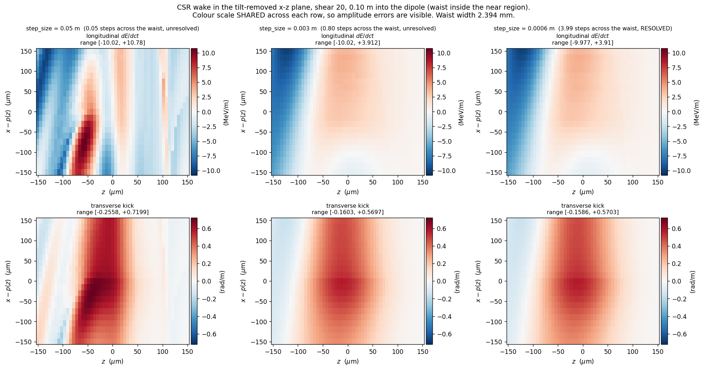

```
0.10 m into the dipole (waist at 0.05 m, width 2.394 mm)
       step  across  snaps                 dE range        dE rel L2   x_kick rel L2
       0.05    0.05      4   [ -10.0219, +10.7757]          0.93564         0.41361
      0.003    0.80     52   [ -10.0224,  +3.9123]          0.01914         0.00533
     0.0006    3.99    251   [  -9.9769,  +3.9098]          reference     reference
```

At the shipped `step_size` the longitudinal wake is **94 % wrong** over the mesh and the
transverse kick **41 % wrong**. The picture says it more plainly than the number: the coarse
panel carries a large spurious **positive blob at +10.78 MeV/m**, against +3.91 in the
converged answer — a factor **2.76** — sitting on visible stripe artefacts, and tilted along
the chirp direction, which is the signature of the frame blend failing along the tilt band. In
the resolved panels it is simply **absent**. The converged wake is smooth, with a broad
negative lobe at negative `z` and large `x` and a mild positive region near `z = 0`.

Both fine panels are visually identical, so the structure that survives is the physics.

##### The control point

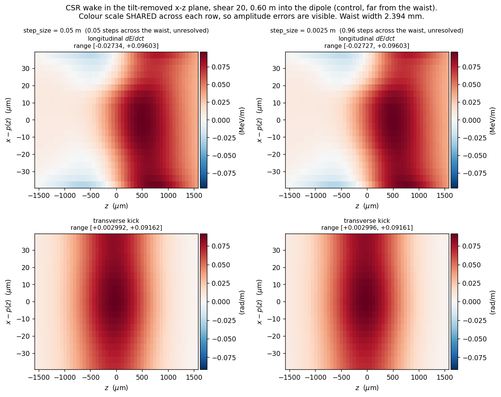

```
0.60 m into the dipole (far from the waist)
       step  across  snaps                 dE range        dE rel L2   x_kick rel L2
       0.05    0.05     12   [  -0.0273,  +0.0960]          0.00187         0.00031
     0.0025    0.96    238   [  -0.0273,  +0.0960]          reference     reference
```

Indistinguishable — ranges agree to four digits, `dE` to 0.2 % and `x_kick` to 0.03 %. This is
the control that matters: refining `step_size` 20x changes essentially **nothing** away from
the waist. So the entrance error is the waist, not `step_size` doing something global, and the
coarse default remains perfectly adequate everywhere else.

##### Consequence for the earlier maps

The §6u entrance-column maps (`s_dip` = 0.10 and 0.20 at shears >= 5) are **not** the real
wake; they are the artefact above. Their qualitative claims about the *interior* of the dipole
stand, and so does everything in §6u derived from `coeff` vs `orient` *differences* at the same
`step_size`, since both modes were equally affected. But the entrance amplitudes there should
not be quoted.

This also puts §6r's `frame_blend` comparison in a better light than it looked: the 0.51-1.49
rel-L2 differences it found between `coeff` and `orient` at the entrance were measured on top of
a wake that was itself 94 % wrong, which is consistent with both modes being dominated by the
same sampling artefact rather than by their own difference.

##### Incidental: step_size must divide the path to the observation point

The step grid starts at `s = 0`, so an observation point is reachable exactly only when
`step_size` divides it. `0.95 / 0.003 = 316.67` overshot to 0.9510 and tripped the position
assertion after paying the full tracking cost. Comparing rungs at *different* `s` would have
been worse than crashing. The check now runs before tracking, and the control uses 0.0025
(380 steps into 0.95) instead.

**Files.** `pyDFCSR_2D/test/test_waist_wake_xz.py` (new).

#### 6z. Ring-buffer history storage (2026-09-13) ✅ **bitwise identical, 2.6x faster, peak RSS 8.75 -> 3.78 GB**

##### What was wrong, in one paragraph

Each step appends one snapshot to the history and pops a few off the far end. But
`build_interpolant` rebuilt the entire stack every step with
`np.array([e[k] for e in DF_log])` for five 128x128 field arrays -- **O(N) copying for an
O(1) change**. Since N is bounded by the history window `n_fl*L_f/step_size`, total cost went
as `(1/step_size)^2`, and allocating a fresh 164 MB set of arrays 750 times is what drove
peak RSS to 8.75 GB. That memory ceiling, not the arithmetic, is what blocked the fine
stepping §6x showed a waist needs.

The fix is to allocate once and write one slice per step. The subtlety is that
`interpolate3D_comoving_fields` needs a **contiguous** array, so instead of a textbook
circular buffer (which wraps modularly and can split the live region across the array end)
the live region is kept contiguous by **compaction**: when the write cursor reaches the end
of the array, the live slices are slid back to the front, reclaiming the space vacated by
popping. That costs O(n) but only once every `cap - n` pushes, so it is amortised O(1) -- and
the interpolant becomes a zero-copy **view**, `self._ring[k, tail:head]`, so `interp3D`
needed no change whatsoever.

##### The algorithm, explicitly

**State.** One preallocated array and two integer cursors. Nothing else.

```
  ring   : float64 array, shape (5, cap, xbins, zbins)     the 5 field arrays per snapshot
  tail   : int, index of the OLDEST live slice
  head   : int, one past the NEWEST live slice
  cap    : ring.shape[1]
  n      : head - tail                                     the live snapshot count
  CAP0   : 64, the initial capacity
```

**Invariant.** `0 <= tail <= head <= cap`, and the live slices are `ring[:, tail:head]` --
always a single **contiguous** run, never split across the array end. That invariant is the
whole design; everything below exists to maintain it.

**Operation 1: push a snapshot** (once per step, from `append_DF`)

```
  push(fields):
      if ring is None:  allocate (5, CAP0, nx, nz);  tail = head = 0
      n = head - tail

      if head == cap:                            # cursor at the end: nowhere to write
          target = 2*cap  if 2*n > cap  else cap      # live set fills >half -> grow
      elif cap > CAP0 and 4*n < cap:             # live set collapsed -> reclaim
          target = max(CAP0, 2*n)
      else:
          target = None                          # room available, just write

      if target is not None:
          if target != cap:
              new = empty((5, target, nx, nz))
              new[:, :n] = ring[:, tail:head]     # GROW or SHRINK: copy live to new array
              ring = new
          else:
              ring[:, :n] = ring[:, tail:head]    # COMPACT: slide live to front, in place
          tail, head = 0, n

      ring[:, head] = fields
      head += 1
```

**Operation 2: drop the oldest snapshot** (from `pop_left_DF`)

```
  pop_oldest():
      tail += 1          # no array element is read, written, or freed
```

**Operation 3: expose the history to the interpolant** (from `build_interpolant`)

```
  live_view(k):
      return ring[k, tail:head]      # zero-copy VIEW, C-contiguous
```

##### Why each choice

**Why compaction rather than modular wrapping.** Both cursors only ever move *right*, so the
live window marches through the array and `head` eventually reaches `cap` -- while the slots
below `tail`, vacated by popping, sit unused:

```
  cap = 8, tail = 5, head = 8, n = 3
    index:   0    1    2    3    4    5    6    7
           [ x    x    x    x    x   S0   S1   S2 ]      head = cap: full
             \___ vacated by popping ___/   ^tail
  after compaction:
    index:   0    1    2    3    4    5    6    7
           [ S0   S1   S2   .    .    .    .    .  ]      5 slots free again
             ^tail          ^head
```

A textbook ring buffer would instead set `head = (head+1) % cap` and never copy. It was
**deliberately not used**: with wrapping the live region can straddle the array end (indices
6,7,0,1), so it is no longer contiguous, `build_interpolant` could not hand out a view, and
`interpolate3D_comoving_fields` would need modular indexing in its innermost loop. Compaction
trades an occasional O(n) memmove for keeping `interp3D` completely untouched -- which is also
why the wake came out bitwise identical.

**Why the factor 2 headroom.** Compaction costs O(n) and buys `cap - n` free pushes. With
`cap ~ 2n` that is n pushes per compaction, so the amortised cost is O(n)/n = **O(1) per
push**. At `cap = 1.25n` it would still be O(1) but with a 4x larger constant. Measured
outcome: 1.62 slices copied per push, versus ~250 for the old rebuild-everything code.

**Why shrink is tested on every push, not only at compaction.** The condition is
`4n < cap`. Checking it only inside the `head == cap` branch means the cursor must advance
`cap - n` more times before the buffer notices the live set has collapsed -- more pushes than
a short run contains. That left 1.64 GB allocated for 0.40 GB of live data. After a shrink
`cap = 2n`, so `4n < cap` is immediately false again and this cannot thrash.

**What this does NOT do.** `pop_oldest` genuinely destroys nothing -- popped slices remain in
memory below `tail`. But all three of grow/shrink/compact copy only `[tail, head)`, so the
next one discards them. Recovering popped snapshots would need a third cursor (a `floor`
below `tail`) and the scalar deques kept too, since `deque.popleft()` does drop those.

##### Measured

Isolated benchmark at 251 snapshots x 5 fields x 128^2 (164.5 MB of live history):

```
  re-stack whole deque (old) :  8.04 ms/call, copies 164.5 MB
  ring-buffer append (new)   :  0.01 ms/call, copies   0.655 MB   -> 722x
```

End to end, and the correctness check that matters:

```
                                     before      after   wake
  0.003 rung, 52 snapshots            9.9 s      8.2 s   bitwise identical
  0.0006 rung, 251 snapshots, 128^2  77.9 s     29.5 s   bitwise identical
  200^2 deposition, tracking only    73.1 s     39.8 s
  peak RSS at 200^2                 8.75 GB    3.78 GB
```

**Bitwise identical** (`max |diff| = 0.000e+00`) against the pre-refactor cached cuts at two
step sizes. For a pure storage refactor anything else would have been a bug.

Resize behaviour over the 750-step run: 6 events, 1212 slices copied in total, i.e. **1.62
slices per push** against the old code's ~250.

##### One thing this exposed

The buffer grew 64 -> 1024 during the pre-first-bend drift (where nothing is ever truncated,
so N reaches 584) and then kept that capacity after the live set collapsed to 251 -- 1.64 GB
held for 0.40 GB of data. Fixed by testing the shrink condition on **every** push rather than
only at compaction; checking only at compaction meant the cursor needed `cap - n` further
pushes to notice, which is more than a short run has. Capacity now settles at 504 rather
than 1024.

**Files.** `pyDFCSR_2D/deposit_smooth.py` (`DF_tracker_comoving._ring_push`, `append_DF`,
`pop_left_DF`, `build_interpolant`). `DF_tracker_smooth` deliberately left alone: it is not
the active path and stores per-snapshot grid metadata that would need its own identity check.

#### 6aa. Precomputed retention floor: the history truncation assumed monotonic sigma_z (2026-09-13) ✅ **author-identified design bug, now fixed**

##### The bug, in plain terms

The retained history is `[end_time - n_fl*L_f, end_time]`, enforced by `pop_left_DF`, which
**only ever pops**. With `L_f = (24 R^2 * 5 sigma_z)^(1/3)` that is safe exactly as long as
`sigma_z` decreases monotonically -- then the required window shrinks monotonically too and
popping never discards anything that will be wanted again. **That was the assumption the
original design was built on** (confirmed by the author).

A longitudinal waist breaks it: `sigma_z` decreases and then **increases**. `L_f` collapses
and recovers with it, so the required start time moves *backwards* to where snapshots have
already been thrown away. The retained depth ends up set by the **minimum `L_f` ever seen**,
not the current one. Measured at shear 20, drift 0.35 m:

```
      s sigma_z/um      L_f  start_pt  ratchet     n
 0.3498     50.000  0.35000   0.00000  0.00000   584   drift: L_f = accumulated distance
 0.4002      2.517  0.06710   0.29956  0.29956   168   <-- waist: L_f minimum
 0.4500     50.084  0.18181   0.17728  0.29956   251   wants 0.1773, has 0.2996
```

The left edge is a **ratchet** -- the running maximum of `start_point` -- and it is stuck at
0.29956 while the integration asks for 0.17728, a **0.1227 m / 45 % shortfall**. What makes
this easy to miss is that `n` is still *increasing* through phase 3 (168 -> 251): the window
grows at the right edge from new snapshots while the left edge stays frozen.

And it fails **silently**: `interpolate3D_comoving_fields` clamps `k` to 0 and substitutes
the oldest surviving snapshot with no warning -- exactly the "fall back to the nearest
snapshot" behaviour §6n's plan explicitly ruled out.

##### The fix: a suffix minimum, precomputed

The quantity that must be retained at `s` is not `start_point(s)` but

```
    floor(s) = min over all s' >= s of start_point(s')
```

the oldest time any **future** step will still ask for. `floor` is non-decreasing by
construction, so retaining back to it is both correct (nothing needed later is discarded) and
minimal (nothing is kept that will not be used). It is a suffix minimum over the whole
lattice, so it needs `sigma_z(s)` **in advance** -- which §6w's `propagate_var_z` already
supplies from linear transport before any particle moves. One precomputation now serves three
purposes: the waist warning (§6w), the retention floor, and a reportable memory ceiling.

The schedule mirrors all three of `CSR2D`'s formation-length regimes, which it must or the
floor is wrong: pre-first-bend accumulation of **element** lengths (CSR.py:336), the in-bend
expression, and the after-bend drift using the last bend's R (CSR.py:179). Including the
factor 5 on `sigma_z` -- dropping it would understate `L_f` by 5^(1/3) = 1.71.

##### The algorithm, explicitly

**How `n` was determined BEFORE this change.** Not from an initial `L_f`, and not from the
current one. Every step recomputed `start_point` from the instantaneous `L_f` and popped
anything older; since `pop_left_DF` cannot restore, the window's left edge is a **ratchet**:

```
  n = (s - ratchet) / step_size + 1,
      ratchet = max over all PAST steps s' of  start_point(s') = s' - n_fl*L_f(s')
```

Under monotonically decreasing `sigma_z`, `start_point` increases monotonically and the
ratchet always equals the current `start_point`, so the two coincide -- which is why the
original design was self-consistent. A waist makes `start_point` non-monotonic and the two
diverge.

**Precomputation, once, before any particle moves:**

```
  1. sigma_z(s) on a fine grid (n_sub = 2000 slices per element):
         propagate the 6x6 beam sigma matrix with r_gen6, slice by slice,
         sigma(s) = M(s) sigma0 M(s)^T,   sigma_z(s) = sqrt(sigma[4,4])

  2. L_f(s), mirroring CSR2D's three regimes exactly:
         s in the first drift, before any bend : L_f = sum of ELEMENT lengths so far
                                                (CSR.py:336, added at element entry)
         s inside a bend                       : L_f = (24 R^2 * 5 sigma_z(s))^(1/3)
                                                (CSR.py:157 with CSR.py:175's factor 5)
         s in a drift after a bend             : same expression, last bend's R (CSR.py:179)

  3. start_point(s) = max(0, s - n_fl * safety * L_f(s))          safety = 1.25

  4. floor(s) = suffix minimum of start_point:
         floor[i] = min(start_point[i], start_point[i+1], ..., start_point[N-1])
         implemented as  np.minimum.accumulate(start_point[::-1])[::-1]

  5. max_depth = max over s of (s - floor(s))          -> the memory ceiling, reported
```

**Per step, during tracking:**

```
  min_start_time = floor[j],  j = largest grid index with s[j] <= s_now
  start_point    = max(0, end_time - n_fl * L_f_actual)
  start_point    = min(start_point, min_start_time)        # never pop past the floor
  pop_left while start_time < start_point

  # guard
  need = max(0, s_now - n_fl * L_f_actual)
  if time_log[0] > need:  shortfall_count += 1;  worst = max(worst, time_log[0] - need)
```

**Why a suffix minimum.** The step at `s'` needs history back to `start_point(s')`. So at the
current `s`, the oldest thing any *future* step will ask for is `min` over all `s' >= s` --
a suffix minimum, not a value at a point. This is what requires knowing `sigma_z(s)` ahead of
time; there is no way to compute it from the past alone.

**Why the left grid node in the lookup.** `floor` is **non-decreasing** in `s`: as `s` grows
the set `{s' >= s}` shrinks, so its minimum can only rise. Therefore `floor[j]` at the node
at-or-below `s_now` is `<= floor(s_now)`, and using it retains slightly *more* than needed.
Interpolating would be tighter but could round the wrong way.

**Why `safety = 1.25` on `L_f`.** The prediction is linear optics, so it can be short.
`L_f ~ sigma_z^(1/3)` is forgiving -- a factor 2 error in `sigma_z` is only 26 % in `L_f` --
so 1.25 covers roughly a factor 2 error in the predicted bunch length. It is a margin, not a
proof, which is why the per-step guard exists.

##### It predicts the tracked values almost exactly

```
              L_f predicted   L_f measured
  s = 0.3498       0.35000        0.35000
  s = 0.4003       0.06715        0.06710      (the waist)
  s = 0.4500       0.18181        0.18181
```

##### Result in a real run

```
  [retention] precomputed floor: max depth 0.8559 m -> 1435 snapshots at step 0.0006
  history [0.0594, 0.4500], 652 snapshots      (ratchet gave [0.3000, 0.4500], 251)
  needs back to 0.1773, retained to 0.0594  -> shortfall 0.0000 m  (was 0.1227)
  shortfall steps flagged during the run: 0
  wake rel L2 vs the ratchet result: 0.000016
  wall 32.0 s (was 31.8 s), peak RSS 1.99 GB
```

**The correctness fix costs 0.2 s.** 2.6x more snapshots is essentially free *because* of
§6z -- pre-ring-buffer, 652 snapshots would have paid O(N) re-stacking every step. The two
changes are coupled: the storage fix is what makes the correctness fix affordable.

##### Honest accounting of the impact

The wake moves by **1.6e-5**. This is a real design bug with, at this configuration, almost
no numerical consequence -- consistent with an independent check that never popping at all
(751 snapshots, 3x memory) also changed the wake by 2e-5. The reason is the same one §6v
found: the missing history lies in the far tail where `1/|r - r'|` has already damped the
integrand, and §6t's `_layout_bounds` region (`d ~ 99 mm`) is much smaller than the nominal
reach (`n_fl*L_f = 273 mm`). So this was fixed on correctness grounds, not because it was
distorting present results, and nothing guarantees the impact stays at 1e-5 for a stronger
waist, a larger `n_formation_length`, or a lattice where the effective region is closer to
the nominal reach.

##### Guards, because the plan is only linear optics

No CSR, no space charge. `L_f ~ sigma_z^(1/3)` is forgiving -- a factor 2 error in `sigma_z`
is 26 % in `L_f` -- and `safety = 1.25` widens it further. But it is still a prediction, so
`_check_retention` compares the **actual** requirement against what survived at **every**
step and counts shortfalls; the run above reports 0. Precomputation must not become a silent
assumption, and the specific thing being guarded is the silent clamp in `interp3D`.
Precomputation failure is non-fatal and restores the previous instantaneous behaviour exactly.

`max_snapshots` is **reported, not preallocated**: the lattice-wide maximum (1435 at step
0.0006) exceeds what a partial run needs (652 here), so allocating it up front would waste
memory. Growth by doubling adapts; the number is printed so the ceiling is known in advance.

##### Regressions

`test_two_branch_bands` baselines **unchanged** at 1.06497 / 0.39062; 18 tests pass. The
§6x cached ladder cuts are now stale by 1.6e-5, far below the 0.007-0.8 differences that
study measured, so its conclusions stand.

**Files.** `pyDFCSR_2D/waist.py` (`RetentionPlan`, `retention_schedule`),
`pyDFCSR_2D/CSR.py` (`build_retention_plan`, `_retention_floor`, `_check_retention`, wired
into `run`), `pyDFCSR_2D/deposit.py` and `pyDFCSR_2D/deposit_smooth.py`
(`append_interpolant(..., min_start_time=None)`, defaulting to the old behaviour).

#### 6bb. Chicane memory: uniform stepping does not survive a real compressor (2026-09-13) ⚠️ **Phase 5.3 promoted from optimisation to prerequisite**

##### The question

Raised by the author: in a chicane the bunch is compressed 20x to 100x. Can memory hold the
history that the (now correct) retention floor demands?

##### Why the answer is not obvious

Two competing dependencies, pulling opposite ways:

- **Depth** is set by the LARGEST `sigma_z`, because `L_f = (24 R^2 * 5 sigma_z)^(1/3)`
- **`step_size`** is set by the SMALLEST `sigma_z`, because it must resolve the waist

and `n = depth / step_size` is their ratio, so the compression ratio enters directly. A priori
it could go either way, so it was measured on a 4-dipole chicane (`sigma_z0` = 1 mm,
`sigma_x0` = 200 um, uncorrelated `sigma_delta` = 1e-5, L = 0.2 m bends) using the §6w scan
and the §6aa schedule.

##### It is the bend angle, not the compression ratio

```
    C  theta    sz_min    waist w       step    depth   n unif   GB200 | n NONunif  GB200
   20   0.10    50.00u   50.9419mm  25.4709mm   1.474m       66    0.11 |       47    0.08
   50   0.10    20.00u   19.3844mm   9.6922mm   1.474m      161    0.26 |       53    0.08
   40   0.14    24.95u    0.4772mm   0.2386mm   3.321m    13927   22.28 |       94    0.15
   27   0.20    37.65u    0.3449mm   0.1724mm   3.468m    20121   32.19 |       97    0.16
```

At `theta` = 0.10 rad it is comfortable: 66-161 snapshots, under 0.3 GB. At 0.14-0.20 rad it
becomes **13 900-20 100 snapshots, 22-32 GB** at 200^2 deposition -- and at *lower* compression
(C = 27-40). So the compression ratio alone is the wrong variable to watch.

**Two effects compound, both pushing the same way.** The waist narrows by ~100x
(0.34-0.48 mm against 51 mm), forcing a finer step; and the depth *grows* 1.5 m -> 3.5 m,
because a strongly chirped beam **over-compresses and re-lengthens inside the chicane**, so
`sigma_z_max` -- and hence `L_f` -- is larger at the exit than at the entrance. Depth up, step
down, and `n` is the ratio of the two.

##### The cheap mitigations do not rescue it

float32 storage buys 2x; dropping 200^2 to 128^2 deposition buys 2.4x. Together 32 GB -> 6.5 GB,
still beyond comfortable, and both cost accuracy. They are not a solution.

##### Non-uniform stepping is

Refining only +-5 waist widths and leaving 0.05 m elsewhere in the retained depth gives
**94-97 snapshots, 0.15 GB** -- a **150-200x** reduction. It works because the constraint is
*local*: the waist is sub-millimetre while the retention depth is metres, so >99.9 % of the
history has no reason to be finely sampled.

##### Consequence for the roadmap

In the 1 m test dipole (§6x) non-uniform stepping was worth 48x and §6v/§6x had demoted it to
a cost optimisation. In a chicane it is worth 150-200x and is **the difference between feasible
and infeasible on ordinary hardware**. Phase 5.3 is therefore a prerequisite for running this
code on the machines that matter, not a nicety.

Note also that §6aa's retention floor makes absolute memory *worse*, because it correctly
retains more. The response is not to revert to the ratchet: correct retention and uniform fine
stepping are unaffordable *together*, and non-uniform stepping is what makes both possible at
once.

##### Caveats

Linear optics with CSR off; the chicane parameters are illustrative rather than a specific
machine; and `min_steps = 2` is calibrated on the single waist of §6x -- though relaxing it to
1 only halves these numbers, which does not change the conclusion.

#### 6cc. Audit: what actually assumes uniform time spacing (2026-09-13) ✅ **contained — zero physics to re-derive**

Read-only audit before attempting Phase 5.3, to answer one question: apart from the index
lookup (which a bucket table fixes), **where else** is constant snapshot spacing silently
assumed?

##### The distinction that matters

Two very different kinds of site:

- **(a) locating a snapshot index** -- `k = floor((t - min_t)/delta_t)`. Mechanical. A bucket
  table replaces it and keeps O(1).
- **(b) using `delta_t` as a physical time step** -- a finite-difference denominator, a time
  derivative, a width, a tolerance, a normalisation. These would be **silently wrong** under
  non-uniform spacing and each would need its own re-derivation.

Category (b) is what would make Phase 5.3 expensive. The audit was aimed at finding it.

##### Result: there are no category (b) sites

`delta_t` / `delta_x` (time) appears in `interp3D.py` at **only** these places, and every one
is an index lookup:

```
  interp3D.py:24    xval = (xval - min_x) / delta_x            interpolate3D
  interp3D.py:228   t_idx = (tval[i] - min_t) / delta_t        interpolate3D_transformed
  interp3D.py:288   t_idx = (tval[i] - min_t) / delta_t        ..._transformed_with_derivs
  interp3D.py:500   t_idx = (tval[i] - min_t) / delta_t        ..._comoving_fields
  CSR.py:629        t_idx = (t_ret - tr.min_x) / tr.delta_x    _comoving_frame_at
  CSR.py:736        t_idx = (t_ret - tr.min_x) / tr.delta_x    band/frame mirror
```

Six sites, all doing the identical thing. Confirmed by grep that `delta_t` is **never** a
denominator anywhere else, never a width, never a tolerance.

The finite differences that do exist (`interp3D.py:317,321`) divide by `delta_xi_arr[kk]` and
`delta_z_arr[kk]` -- per-snapshot **spatial** grid spacing, already stored per snapshot and
completely unaffected by how snapshots are spaced in time.

Nothing iterates the history assuming `time[k] == min_x + k*delta_x`; the interpolators only
ever bracket an adjacent pair and blend. So the architecture is already snapshot-pair
agnostic, which is the property that makes this tractable.

##### The one real gap

`build_interpolant` (deposit_smooth.py:299) does `times = list(self.time_log)` and then uses
only `times[0]`, `times[-1]` and `n_t` to form `delta_x`. **The actual snapshot times are
discarded**, and `time_log` is never passed to any interpolator -- verified: `CSR.py` hands
over only `min_x` and `delta_x` (lines 1410, 1433-1434). So the times must be retained and
threaded through, which is what touches the function signatures.

Note the interpolation **weight** needs the same treatment as the index: `a = t_idx - k` is
only the fractional position under uniform spacing; in general it is
`a = (t - t_k)/(t_{k+1} - t_k)`, which needs `t_k` and `t_{k+1}` -- two more O(1) reads from
the retained times array. Same fix, not a separate problem.

##### Verdict

**Contained but wide.** Six mechanical call sites, all identical in form, plus threading a
times array and a bucket table through three interpolator signatures. There is **no physics
to re-derive** -- no time derivative, width, or tolerance expressed in `delta_t` anywhere --
which was the risk that would have made Phase 5.3 expensive. The remaining work is plumbing,
and the invariant to preserve is that a snapshot index still maps to the same stored frame.

**Files audited (no changes).** `deposit.py`, `deposit_smooth.py` (both history classes),
`interp3D.py`, `interp1D.py`, `CSR.py`.

#### 6dd. The CSR kick used the wrong integration length (2026-09-14) ✅ **+14.3% error at nsep > 1**

##### What was wrong

The kick is a rectangle-rule quadrature of `int(W ds)`: `beams.py:110` forms
`dE_E1 = step_size * dE_dct * 1e6 / init_energy`, so the length passed in is a physical
integration weight. `CSR.py` passed `DL * nsep`.

That is wrong whenever the arc actually covered since the previous kick is not `nsep` full
steps, and there are two such cases in ordinary lattices:

- **The first kick of a run.** It fires at `step == 0` (since `0 % nsep == 0` always) after a
  single step, but is weighted by `nsep` steps.
- **Every element boundary.** The kick condition is `step % nsep == 0` and `step` **restarts at
  0 in each element**, so the gap between the last kick of one element and the first of the next
  is shorter than `nsep` steps. The boundary step is also split into `DL_1` (previous element,
  tracked outside the step loop) plus `DL_2` (new element), which `DL * nsep` does not know
  about.

Measured on a 4-element lattice (L = 0.35, 0.22, 0.33, 0.22 m, `step_size` 0.05, `nsep` 3), so
that boundaries are deliberately non-commensurate with the step grid:

```
 kick at s  true interval  length used     error
    0.0500         0.0500       0.1500  +200.0%   <- first kick of the run
    0.2000         0.1500       0.1500    +0.0%
    0.3500         0.1500       0.1500    +0.0%
    0.5000         0.1500       0.1500    +0.0%
    0.6000         0.1000       0.1500   +50.0%   <- element boundary
    0.7500         0.1500       0.1500    +0.0%
    0.9000         0.1500       0.1500    +0.0%
    1.0500         0.1500       0.1500    +0.0%

sum of lengths used 1.2000 m vs arc covered 1.0500 m  ->  +14.3% net over-weighting
```

So the integrated CSR kick was **14.3 % too large** on that lattice.

##### The fix

Track the arc position of the previous kick in `self._s_last_kick`, initialised at run start and
**persisting across elements** -- the per-element `step` counter resetting is precisely what
broke the old formula -- and pass `L_kick = beam.position - self._s_last_kick`. Correct for
uniform, non-uniform, first-kick and boundary cases alike, and it is the form non-uniform steps
will need.

```
after the fix, same lattice:  0 of 8 kicks wrong (was 2 of 8),  net +0.00% (was +14.3%)
```

##### Why no recorded baseline moves

At `nsep = 1` the fix is a **provable no-op**: the elapsed arc since the previous kick is exactly
one step, which is what `DL * 1` already gave. Verified directly on a lattice with
non-commensurate boundaries -- **0 of 17 kicks differ** from the old formula. Every config in
this work uses `nsep: 1`, which is why this went unnoticed; `test_two_branch_bands` is unchanged
at 1.06497 / 0.39062.

##### Deferred

Centring the kick interval on its sample point (midpoint rule, O(h^2) instead of O(h)) needs the
*next* kick position, which only exists once the step schedule is precomputed. It belongs with
the scheduler work, not here.

**Files.** `pyDFCSR_2D/CSR.py` (`_s_last_kick`, `L_kick`).

### Step 9 — Non-uniform snapshot times: prototype validated, PARKED ⏸️

**Status: the lookup algorithm is proven and benchmarked. Nothing in production uses it yet.**
Resume here when returning to adaptive stepping.

#### Why non-uniform times are needed

§6bb measured a realistic chicane at 22-32 GB with uniform stepping against 0.15 GB with local
refinement, a 150-200x reduction, because the constraint is *local*: the waist is sub-millimetre
while the retention depth is metres. That moved non-uniform snapshots from "cost optimisation"
to prerequisite.

#### What must be reproduced

The lookup finds the bracketing snapshot for a retarded time and a blend weight; the caller
forms `(1-a)*f[k] + a*f[k+1]`. Today, uniform, it is one division (`interp3D.py:499-510`):

```
t_idx = (q - min_t) / delta_t
k = floor(t_idx),  clamped to [0, n-2]
a = t_idx - k,     clamped to [0, 1]
```

#### What problem all three variants solve

The CSR integral needs the density at a **retarded** time `q`, which falls *between* two stored
snapshots. So every integrand evaluation -- ~2e8 per wake mesh -- must answer two questions:
**which two snapshots bracket `q`** (the index `k`), and **how far between them it sits** (the
weight `a`). The caller then forms `(1-a)*f[k] + a*f[k+1]`.

With equally spaced snapshots that is one division, `k = floor((q - t0)/dt)`. Once spacing is
non-uniform the formula is simply wrong, and the obvious fix -- binary search -- costs 7-38 ns
against 0.74 ns. At 2e8 calls per mesh that is not a rounding error.

Think of it as finding which **page of a book** a given word number is on. Uniform spacing is a
book where every page holds exactly the same number of words, so one division answers it.

#### SEGMENT -- "a few chapters, each internally uniform"

Chapter 1 holds 100 words per page, chapter 2 holds 10. Locate the chapter, then divide inside
it:

```
store per segment s:  seg_t0[s], seg_dt[s], seg_first[s], seg_n[s]
s = 0
while s < S-1 and q >= seg_t0[s+1]: s += 1     # walk to the right chapter
loc = (q - seg_t0[s]) / seg_dt[s]              # inside a segment it IS uniform
k = seg_first[s] + floor(loc);  a = loc - floor(loc)
```

This was the **planned primary**, because our schedules are piecewise uniform by construction --
a few refined windows around waists and bend edges in an otherwise coarse lattice. One division,
zero auxiliary memory, and at `S == 1` it reduces algebraically to today's expression.

**Why it lost:** the chapter walk is a *linear* scan. Fine when queries arrive in order, but on
random queries it mispredicts the branch (4-7 ns), and if the times are not cleanly
piecewise-uniform then `S ~ n` and it collapses to **196 ns**.

#### BUCKET -- "build an index card up front"

Lay a uniform grid of buckets over the whole span and precompute which snapshot each bucket
starts at. Works for *arbitrary* spacing.

#### HYBRID -- one flag, both worlds

```
if is_uniform:  <today's exact single division>     -> bit-for-bit unchanged
else:           <bucket>
```

Uniform histories, which is every run today, keep the original expression at **0.73 ns against
the 0.74 ns baseline** -- so the bit-for-bit guarantee costs nothing. Non-uniform histories pay
1.5-3.5 ns. And it is insensitive to how the schedule is shaped, which matters because a
scheduler driven by waists and bend edges will not always produce cleanly segmentable times.

#### The bucket algorithm in detail

One branch on a precomputed `is_uniform` flag. Uniform histories (every run today) take the
exact expression above; non-uniform take a bucket table:

```
build:   M = min(ceil(span/h_min), 4n);  inv_h = M/span
         j_k = int((t[k]-t0)*inv_h)              <- the EXACT runtime expression
         bucket[j] = max{k : j_k < j}            <- strict predecessor
lookup:  j = int((q-t0)*inv_h);  k = bucket[j]
         while t[k+1] <= q: k += 1               <- bound verified at build time
         a = (q - t[k]) / (t[k+1] - t[k])
```

Building `j_k` from the runtime expression rather than from `t0 + j*h` is load-bearing: if the
two rounded differently, `j` could come out one too high, `t[bucket[j]] > q`, and an
increment-only loop could never recover -- wrong `k`, negative weight. `M` is capped so the
table stays cache-resident; the real max-nodes-per-bucket is then measured at build time and
stored as the loop bound rather than asserted in a comment.

#### The measurement that overturned the plan

The plan had per-segment piecewise-uniform as primary. ns per lookup:

```
node set               S order         uniform   segment    bucket    hybrid    binary  srchsrt
uniform  n=20000       1 sorted           0.74      1.03      2.42      0.73     22.63    23.79
piecewise S=3          3 random           0.74      4.19      3.03      3.02      8.40     9.71
piecewise S=8          6 random           0.74      6.72      2.98      2.97      9.79     9.76
random ratio 1e3    1499 random           0.75    196.58      3.26      3.32     26.49    25.52
```

Per-segment is fine on sorted queries but degrades to 4-7 ns on random ones (its linear segment
scan defeats branch prediction) and collapses to **196 ns** when times are not segmentable.
Bucket is flat at 1.47-3.48 ns everywhere. **Hybrid wins both ways**: 0.73 ns at `S == 1`
against the 0.74 ns baseline, so the bit-for-bit guarantee is free, and 1.47-3.49 ns otherwise.
Binary search and `np.searchsorted` are 7-38 ns, unusable.

#### Correctness, all green

Bit-for-bit vs the production expression at `S == 1` for n = 50/1500/20000. Oracle equivalence
on interpolated **value** to <= 2.1e-13 on piecewise, one-tiny-gap and random node sets. **Zero
bracket violations** for `q` one ulp either side of every bucket edge. Build-time loop bound
exactly predictive (1/3/7/9 observed == bound); uncapped the bound is 1. Edge cases: `n = 2`,
`q = t[0]`, `q = t[n-1]` giving `k = n-2` not `n-1`, and a 1-ulp gap not blowing up the weight.

One test failure was **mine, not the code's**: I asserted the loop bound `<= 2`
unconditionally, but capping `M` to stay cache-resident deliberately trades a longer loop for
fewer cache misses. Corrected to assert the build-time bound is predictive, plus `<= 1` when
uncapped.

#### Why the lookup cost turned out not to matter

Measured directly on a full production-size mesh (10x30 wake points,
`CSR_integration` 100x100), rather than extrapolated:

```
  wall time  : 4.85 s
  lookups    : 32,298,835   (107,663 per wake point)

  uniform  (today, 0.74 ns)      lookup total  0.024 s =  0.49% of the mesh
  hybrid non-uniform (3.5 ns)    lookup total  0.113 s =  2.33% of the mesh

  0.74 -> 3.5 ns adds 0.089 s to a 4.85 s mesh = +1.84%,  total x1.018, NOT x4.7
```

**A 4.7x slowdown on the lookup is a 1.8x *percent* slowdown on the run**, because the lookup is
0.49% of the work. 32 million lookups come to 24 ms; the 160-tap B-spline evaluation that
follows each one is ~50x more expensive than finding the index. And with the hybrid, uniform
histories -- every run today -- pay **nothing**, since they keep the exact current expression.

Set against §6bb's 22-32 GB versus 0.15 GB for a chicane, ~2% wall time buys a run that fits in
memory at all.

Instrumented in a real run: `interpolate3D_comoving_fields` receives query arrays of median
**34 200** entries, ~6 calls per wake point, so a 21x51 mesh is **~2.2e8 lookups**. The
uniform-to-non-uniform delta of ~2.3 ns is therefore **~0.5 s against a 30-40 s wake mesh,
about 1.5 %**. The lookup was never the bottleneck (see Step 10), so the operative criterion is
robustness and the bit-for-bit guarantee, not speed. Query order measured at the same time:
median 96.3 % of adjacent pairs non-decreasing but **0 %** of arrays fully sorted (min 49.3 %),
consistent with a flattened 2D (x', s') grid resetting each row.

#### What remains when we resume

1. Thread the actual snapshot times through to the interpolators. Today `build_interpolant`
   (`deposit_smooth.py:299`) does `times = list(self.time_log)` and keeps only `times[0]`,
   `times[-1]` and `n_t`; `CSR.py` passes only `min_x`/`delta_x` (lines 1410, 1433-1434). The
   times are **discarded**, so they must be retained and passed. This is what touches the
   function signatures.
2. Replace the six index-lookup sites (`interp3D.py:24, 228, 288, 500`; `CSR.py:629, 736`) with
   the hybrid. §6cc confirmed there is **no physics to re-derive** -- `delta_t` is never a
   finite-difference denominator, width or tolerance anywhere.
3. Element boundary coverage (Part B of the approved plan, not yet done): boundaries currently
   get no snapshot at all.
4. The adaptive scheduler itself: criteria, tolerance calibration, `step_control` config
   surface, predictor-corrector mode, the CSR-vs-linear-optics deviation monitor, and writing
   the realised schedule to the output HDF5.

**Files.** `pyDFCSR_2D/test/prototype_nonuniform_lookup.py` (standalone; not imported by
production).

### Step 10 — Where the wake-mesh time actually goes (2026-09-14) ✅ **1.57x, bit-identical**

#### The question

The non-uniform lookup prototype (Step 9) showed the index lookup is ~1.5 % of wake-mesh time.
So what is the other 98.5 %?

#### Profile

51-point wake cut, `cProfile`, JIT pre-warmed:

```
 tottime   %tot  ncalls  function
   1.355  67.4%     626  _comoving_fields      <- the Numba interpolation kernel
   0.324  16.1%     313  get_CSR_integrand
   0.091   4.5%    3672  _eq424
   0.084   4.2%    3978  _comoving_frame_at
   0.033   1.6%     153  _integrate_xi_region
   0.030   1.5%     153  _retarded_xi_bands
```

**`_comoving_fields` is 67 %**, and inside it the cost is the cubic B-spline field evaluation,
not the lookup.

#### The mechanism

Per query the kernel made **ten `bspline_eval_single` calls** -- 5 fields x snapshots `k` and
`k+1` (`interp3D.py:573-582`) -- each up to a 4x4 = 16-tap stencil, so **160 taps drawn from ten
separate 128 KB arrays**.

All ten share the same `(u_cell, w_cell)`, hence the same stencil and the same **eight** basis
weights. But `cubic_bspline_w(w_cell - j)` sat *inside* the `dj` loop (`interp3D.py:441`), so
each call recomputed the four w-weights sixteen times, and LLVM cannot common that up across ten
separate calls over ten different arrays. That is ~200 weight evaluations per query where only 8
distinct values exist.

#### The fix, and why it is bit-identical

Compute the eight weights once, then fill all ten accumulators in a single pass over the
stencil. Each accumulator receives **the same terms in the same order** as before, and the
multiply keeps the original left-to-right association `(d * wi) * ww` -- writing the
algebraically equal `d * (wi * ww)` would change the last bits. `cubic_bspline_w` is pure, so
hoisting it cannot change a value.

```
                      time for 51 wake points      per point
  pre-hoist    2.0494 s  +- 0.0524                 40.18 ms
  post-hoist   1.3074 s  +- 0.0282                 25.64 ms
  speedup      1.57x  (three alternating reps, ranges do not overlap)
  bit-identity max |diff| = 0.000e+00 on every rep pair
```

`test_two_branch_bands` unchanged at 1.06497 / 0.39062.

#### Two measurement mistakes worth recording

- **I first compared a `cProfile`-instrumented run against an uninstrumented one** and reported
  "1.61x". The profiler inflates the Python-level baseline, so that comparison was invalid. The
  1.57x above is from three alternating A/B reps with identical instrumentation.
- **My first micro-benchmark used random `k` over a 39 MB working set** and reported 607 ns per
  query, i.e. the cache-miss-bound regime. Real queries are 96 % monotone; with realistic
  locality the same benchmark gave 237 ns. Interleaving the five fields into one
  `(n_t, nu, nw, 5)` array, which looked attractive in the miss-bound regime, gave **nothing**
  once the data was cache-hot (45.9 vs 46.9 ns) and was therefore not done.

#### What bounds any further gain

Of 2 118 466 queries in a real run, only **46.3 %** have a stencil that hits the deposited grid;
the other 53.7 % return 0 immediately and are nearly free. So optimisation only acts on that
46.3 %, and what remains there is the 160 taps themselves -- irreducible without an algorithmic
change (fewer fields, a smaller stencil, or a coarser deposition grid), not more
micro-optimisation.

The next targets, well behind: `get_CSR_integrand` at 16 %, and the Python-level `_eq424` and
`_comoving_frame_at` at ~9 % combined (3 672 and 3 978 calls per 51 wake points).

**Files.** `pyDFCSR_2D/interp3D.py` (`interpolate3D_comoving_fields`).

#### Why it is 5x slower than the legacy path (2026-09-14)

The author reported the legacy code at ~1 s per wake mesh. Measured on the same lattice, beam
and 10x30 wake mesh, legacy comes out at **1.45 s** -- so the comparison is fair and the
question is real.

```
configuration                 snapshots   mesh s   ms/pt  vs legacy
legacy int100                        52     1.45    4.84      1.00x
bspline_comoving int100             131     4.79   15.97      3.30x
bspline_comoving int200             131     7.35   24.49      5.07x
```

The 5x splits cleanly:

**1.48x is a config choice, and it is free to reclaim.** The legacy example configs use
`CSR_integration: 100x100`; this work has been running 200x200. The integration grid is already
converged at 100:

```
 int bins   rel L2 vs 300x300
      100         0.00087        <- 0.09%
      150         0.00011
      200         0.00004
```

200x200 buys 0.04% instead of 0.09%, for 1.48x the runtime. Not worth it.

**3.30x is algorithmic**, and each piece was measured to be necessary:

- **Cubic B-spline instead of bilinear.** 4x4 = 16 taps x 5 fields x 2 snapshots = **160 taps**
  per query, against legacy trilinear's 8 taps x 5 fields = 40. Bilinear's first derivative
  jumps at every cell boundary, which degrades the outer trapezoid rule to first order --
  the reason recorded in `bspline_eval_single`'s docstring.
- **Two-branch bands** (Step 6) roughly double the integration points. Step 6 measured the
  second branch as a rel L2 change of **1.06 in dE**: it was worth the entire wake.
- **Region-based node allocation** (§6l-§6t) partially *offsets* both, which is why the product
  of 4x and 2x shows up as 3.3x rather than 8x.

**The §6aa retention floor is not the cause.** Measured directly: 131 snapshots vs 52 costs
**1.01x** wake time. Deeper history costs memory, not wake time, because the lookup is O(1) and
only two snapshots are ever read.

Note the 1.57x hoisting gain above is already included in these numbers; pre-hoist, `int100`
would have been ~7.5 s, i.e. 5.2x legacy on its own.

**Actionable:** move `CSR_integration` to 100x100 for production runs -- 1.48x for a 0.09%
error. Beyond that, further gains need an accuracy decision (is cubic necessary, or would a
quadratic B-spline do?), not micro-optimisation.


### Step 11 — Adaptive step scheduling ⏳ **in progress**

Goal: decouple the three grids that one uniform `step_size` currently drives, because their costs
differ by orders of magnitude and they need different criteria.

```
  tracking   ~0.001 s per step
  snapshot   ~0.08 s per step + 0.7-1.6 MB      -> decides MEMORY
  CSR kick   ~5-7 s per evaluation              -> decides RUN TIME
```

Kicks are ~5000x more expensive than snapshots, yet `nsep` ties them together by an integer.
§6x measured that a 2.39 mm waist needs `step_size <= 0.0006 m`; §6bb measured that applying that
*uniformly* through a chicane costs 22-32 GB against 0.15 GB for local refinement. No single
uniform step serves both.

#### 11a. `StepSchedule` and the legacy builder ✅ **bit-identical**

New `pyDFCSR_2D/schedule.py`. One precomputed, immutable plan:

```
s_nodes  (N,)  monotone, s_nodes[0] = 0
ele_of   (N,)  element each step ends in
dl       (N,)  step lengths, dl[0] = 0
is_snap  (N,)  take a density snapshot here
is_kick  (N,)  compute and apply a wake here;  invariant: is_kick implies is_snap
kick_lo/hi     the arc each kick integrates over
is_step  (N,)  nodes the loop actually advances to
```

**It must be precomputed, not adaptive.** `init_statistics` preallocates arrays of length
`lattice.total_steps` and `update_statistics(step)` indexes them directly, so the total has to be
known before tracking starts.

**Kicks are a subset of snapshots** by invariant, so a kick always has history at its own position.

##### Reproducing the old behaviour exactly, including two bugs

`legacy` had to match the historical `get_steps()` bit-for-bit, which meant preserving two things
that look like defects and are:

1. **Element boundaries are NOT nodes.** A step can straddle one, so the run loop still splits it.
   Putting nodes on boundaries changes the snapshot set, so it belongs to `auto`/`manual` only.
2. **`np.arange(0, L + h/2, h)` overshoots the lattice end** whenever `L` is not a multiple of `h`
   -- for `L = 2.5, h = 0.07` the last node is at 2.52. The old code silently dropped it from
   `steps_per_element`, so the loop never reached it. This is the `run(stop_time=T)` overshoot
   recorded in Step 7. It is preserved bug-for-bug here because `_positions_record` sizes the
   preallocated statistics arrays and is written to output; `auto`/`manual` will land the last
   node exactly on `lattice_length`.

Deriving `steps_per_element` from `ele_of` by `bincount` looked cleaner and was **wrong**: correct
on 39 of 48 randomised lattices, off by one in the last element on the other 9 -- always the
overshoot case. It is now computed with the historical algorithm verbatim and stored.

##### Verification

```
  120/120 randomised lattices reproduce get_steps() exactly (node set AND steps_per_element)
       element lengths deliberately non-commensurate with step_size, nsep in {1,2,3,5}
  nsep=3 kick positions reproduce the §6dd measured set exactly:
       [0.05, 0.20, 0.35, 0.50, 0.60, 0.75, 0.90, 1.05]
  sum of kick intervals == arc covered, to machine precision
  18 tests pass; test_two_branch_bands unchanged at 1.06497 / 0.39062
  cached wake cut: max |diff| = 0.000e+00  (bitwise identical)
```

##### Also fixed here (Part 7 item)

`lattice.py` selected element keys as `list(lattice_config.keys())[1:]` -- "everything after the
first key", assuming `step_size` came first. `yaml.dump` sorts keys alphabetically by default,
which moves `step_size` last and made `get_referece_traj` die with `TypeError: 'float' object is
not subscriptable`. It bit twice during this work. Keys are now selected by name.

**Files.** `pyDFCSR_2D/schedule.py` (new), `pyDFCSR_2D/lattice.py` (`get_steps` builds the
schedule and derives the legacy attributes from it; element keys by name).

#### 11b. The run loop reads the schedule ✅ **still bit-identical**

Every per-step length and decision now comes from the schedule. `step_count` starts at 1 and
increments once per step, so it **is** the schedule's node index -- node `i` is the end of step
`i`, and node 0 is the `s = 0` entrance handled by `initialization()`. That made the wiring a
three-line change rather than a rewrite:

```
  DL = self.lattice.step_size          ->  DL_i = sched.dl[step_count]
  if debug or compute_CSR:             ->  ... and sched.is_snap[step_count]
  if step % nsep[ele_count] == 0:      ->  if sched.is_kick[step_count]
```

The nested `for ele: for step` shape is kept deliberately. The element-entry logic
(`inbend`, `R_rec`, and `formation_length += L` for the pre-first-bend drift, which uses the FULL
element length once per element) is intricate and correct; flattening the loop would have put all
of it at risk for a purely cosmetic gain. Once `auto`/`manual` place nodes on element boundaries,
`DL_1` becomes 0 and the existing split path degenerates on its own.

##### A floating-point trap that would have destroyed the guarantee

`dl` must be supplied **explicitly** as `step_size`, never derived from `np.diff(s_nodes)`.
Measured: `np.diff(np.arange(0, 1.85 + 0.025, 0.05))` differs from 0.05 in the last bits for
**35 of 37** steps (max 1.8e-16). That length is fed straight into bmad-x tracking, so a last-bit
difference changes the trajectory and breaks the bit-identity that `legacy` exists to provide.
`StepSchedule` now takes an optional explicit `dl` and asserts it is consistent with `s_nodes`.

##### Verification

```
  18 tests pass; test_two_branch_bands unchanged at 1.06497 / 0.39062
  cached wake cut: max |diff| = 0.000e+00       (bitwise identical)
  nsep=3 cadence reproduces the §6dd set exactly: [0.05, 0.20, 0.35, 0.50, 0.60, 0.75, 0.90, 1.05]
  0 of 8 kick intervals wrong; sum 1.0500 == arc covered 1.0500
```

**Files.** `pyDFCSR_2D/CSR.py` (`run`), `pyDFCSR_2D/schedule.py` (explicit `dl`).

#### 11c. Non-uniform history lookup wired in ✅ **uniform bit-identical, bucket path exact to round-off**

New `pyDFCSR_2D/lookup.py`, porting the hybrid validated in Step 9.

##### What had to change beyond the lookup itself

`build_interpolant` was **throwing the snapshot times away**: it did `times = list(self.time_log)`
and kept only `times[0]`, `times[-1]` and `n_t`, so the interpolators reconstructed the index
arithmetically and could only ever work on a uniform grid. The times are now retained as `t_arr`,
checked strictly increasing, tested for uniformity, and a bucket table is built when they are not.

Three lookup sites were converted **together**, since mixing grids would be silent:

```
  interp3D.py:500  interpolate3D_comoving_fields   scalar, numba, ~1e8 calls per mesh
  CSR.py:657       band construction               vectorized numpy
  CSR.py:766       _comoving_frame_at              vectorized numpy
```

The two `CSR.py` sites are **vectorized**, so they needed a numpy twin (`lookup_vec`) rather than
the numba scalar. They must share the arithmetic with the interpolant -- a band located with a
different blend than the interpolant uses will not sit where the density is. `lookup_vec` uses
`searchsorted` deliberately: those sites are called a few thousand times per mesh on modest
arrays, so O(log n) is irrelevant there, whereas the scalar path runs ~1e8 times and is not.

The three lookup sites on the **legacy and `bspline_fft`** paths (`interp3D.py:24, 228, 288`) were
left alone. They only ever see uniform times today, and converting paths that cannot be tested to
the same standard would add risk for no gain -- but that means a non-uniform schedule must not be
combined with those deposition methods, which the scheduler will have to enforce.

##### The tolerance in the uniformity test is load-bearing

`is_uniform_times` compares spacings with `rtol = 1e-9`, not exactly. Snapshot times come from
`np.arange(0, L + h/2, h)`, whose successive differences are **not** exactly `h` -- measured, 35 of
37 differ by ~1e-16. An exact test would classify the historical uniform grid as non-uniform, send
it down the bucket path, and silently destroy the bit-for-bit guarantee.

##### Verification

```
  18 tests pass; test_two_branch_bands unchanged at 1.06497 / 0.39062
  cached wake cut, uniform path : max |diff| = 0.000e+00      (bitwise identical)

  end-to-end invariance -- the SAME uniform history forced down the BUCKET path:
    rel L2 difference   5.495e-13
    max abs difference  4.996e-12 MeV/m
    dE range identical to 6 decimals: [-7.697869, +2.949103]
    bucket table M = 131, verified max correction iterations = 1
```

The bucket result cannot be bit-exact -- `a = (q-t[k])/(t[k+1]-t[k])` is a different
floating-point expression from `t_idx - k` -- so agreement to 5e-13 is the correct standard, and
the measured loop bound of 1 matches the theoretical bound exactly.

##### The overhead is higher than I predicted, and why

Measured **1.078x** on this configuration, against the **1.018x** predicted in Step 9. The
prediction counted only the scalar hot loop, which is 0.49 % of the work. It missed that the two
**vectorized** mirrors also move from a division to `searchsorted`, and those account for ~9 % of
wake-mesh time between them. So the honest figure for a non-uniform run is a few per cent rather
than under two, still against §6bb's 22-32 GB versus 0.15 GB, and only non-uniform runs pay it.

**Files.** `pyDFCSR_2D/lookup.py` (new), `pyDFCSR_2D/deposit_smooth.py` (`build_interpolant`
retains times and builds the table), `pyDFCSR_2D/interp3D.py`
(`interpolate3D_comoving_fields` signature and lookup), `pyDFCSR_2D/CSR.py` (both vectorized
mirrors, and the call site), `test_frame_blend.py` / `test_ghosting.py` (direct calls updated).

### Step 7 — Remaining secondary fixes ⬜

Most of §2.3 was folded into `DF_tracker_comoving` in Step 5 — (c) registration, (e) normalization plus
the clipped-charge diagnostic, (f) snapshot-independent vx floor, (d) `poly_degree=1` with the fit
restricted to |z| < 3σ_z, and (g) the C² evaluation kernel with `math.floor` closing the `int()`
truncation hole. **On the co-moving path only.** Still outstanding:

- (b) `bilinear_single`'s hard-zero OOB and its `int()` truncation hole remain on the **`bspline_fft`
  and legacy paths**, which still use it. Fix or leave, but do not assume Step 5 touched them.
- `lattice.py:18–39` assumes `step_size` is the first YAML key (found in Step 2); look it up by name.
- `test_deposit_smooth.py::test_zero_field_gives_zero_derivative` **fails, and did so before this
  work.** It asserts a constant field has zero spectral derivative, but `smooth_and_differentiate`
  zero-pads before the FFT, so the array edge is a genuine step:
  `max|dfdx|` = 1.8e+01 untrimmed, 2.6e-02 trimming 5 cells, 8.8e-03 trimming 31. Boundary-only, and
  harmless for real densities which vanish at ±5σ — but the *test* asserts an invariant the padding
  breaks by design and should trim the boundary. The other 13 tests in that file pass.
- The older one-off diagnostics (`test_region1_nonzero.py`, `test_integrand_diagnostic.py`,
  `test_integrand_step17.py`, `test_integrand_anatomy.py`) unpack `get_CSR_wake(debug=True)`
  positionally and need `CSR_integration: {xi_bands: False}` since Step 4 returns a dict on that path.
- **The `|τ| → ∞` degeneracy of the localization** (§6m) — the most substantive open item. As `|τ|` grows,
  `tan 2α = 2τ/(1−τ²) → 0`: the two Eq 4.24 branches become **parallel** rather than coincident, and
  `d = 10σ_x/|tan 2α|` diverges — 154 mm at slope −12.5. The integrand then carries structure across the
  whole reach (measured: `|inner|·u` varies 1000× and peaks at `u = 58 mm`) and **neither uniform nor
  graded nodes converge affordably**. Thesis §4.4.2 treats only the `|τ| = 1` degeneracy, where the
  branches coincide in position. The fix is presumably to integrate the two as a *single* band when nearly
  parallel. Until then, any wake computed near a bend entrance with strong chirp is suspect, and
  `near_grade` is regime-dependent — the failure mode this work exists to remove.
- ~~`formation_length` computed only on element entry~~ — **fixed in §6h.**
- ~~The **history step size** axis has never been varied~~ — **done in §6i: converged**, 0.11% at 23
  snapshots, ~2nd order.
- **`run(stop_time=T)` overshoots by up to a full step, silently.** At the default `step_size = 0.1`,
  `run(stop_time=0.60)` lands at `s = 0.700000` — 17% past the request, with a 27% different beam slope.
  This confounded a whole convergence study in §6i before it was caught. Either stop at the requested
  `s` by splitting the final step, or warn. Until then, any script comparing runs at different
  `step_size` must assert on `beam.position`.
- **`compute_CSR: 0` silently produces a beam with no density history** (`CSR.py:311` gates
  `get_DF`/`append_DF`/`append_interpolant`/`build_interpolant` on `debug or compute_CSR`). Anything that
  calls `get_CSR_integrand` afterwards gets near-zeros with no error raised — see §6f, where it cost a
  full set of wrong figures. The name suggests a pure output switch and it is not. Either rename it,
  split history-building from wake-evaluation, or raise if `get_CSR_integrand` is called with fewer than
  two snapshots. The last is cheapest and would have caught this immediately.

### Step 8 — Validate and document ⬜

- Re-run Step 3 → nodes-in-support and the 100²-vs-400² gap are the primary acceptance metrics.
- Re-run Step 1 → co-moving must be exact for affine shear. ✅ **already met in Step 5**
- Axis A of `test_xi_bands_converge.py` on the co-moving path must read ~0 — currently 0.99, the
  outstanding correctness gap (Step 6).
- `test/test_tilt_sweep.py`, `test/benchmark_chirp_highres_sweep.py`: the error-vs-tilt curve should
  flatten instead of blowing up past |slope| ≈ 2–5.
- **Three-way convergence study** at one high-tilt case, varying independently: history step size,
  deposition bins, CSR integration bins. A converged answer must be insensitive to all three. Then
  compare the joint-limit result against legacy *at legacy's own resolution* — this shows whether
  legacy was the under-resolved one, and settles whether the remaining chicane-B2 disagreement is
  physics (cancellation regime) or numerics.
- Save all plots under `pyDFCSR_2D/test/benchmark_results/` and append a summary step to
  `progress.md`.

---

## 5. Verification suite

```bash
conda activate pydfcsr
cd .../pyDFCSR_claude/pyDFCSR

# 0a. Thesis Eq 4.24 verification (symbolic + numerical); no simulation for check 1
python pyDFCSR_2D/test/test_eq424_localization.py

# 0b. Eq 4.24 branches vs the measured integrand support, both B-spline methods
python pyDFCSR_2D/test/test_localization_branches.py

# 0c. Same, swept over beam shear 0..50 — regression test for the l>0 and |tau|=1 guards
python pyDFCSR_2D/test/test_localization_shear_sweep.py

# 0d. Step 6 acceptance: two-branch vs single-branch bands, same interpolant,
#     plus the rad<0 guard diagnostic binned by |r-r'|
python pyDFCSR_2D/test/test_two_branch_bands.py

# 1a. PRIMARY acceptance test: nodes-in-support + quadrature convergence
python pyDFCSR_2D/test/test_integrand_anatomy.py

# 1a2. Convergence with the axes properly separated (supersedes the margin sweep)
python pyDFCSR_2D/test/test_xi_bands_converge.py

# 1b. Interpolation accuracy vs ghosting parameter G (accuracy, not noise)
python pyDFCSR_2D/test/test_ghosting.py

# 1c. Noise-vs-G control: confirms noise does NOT track G
python pyDFCSR_2D/test/test_G_scaling.py

# 2. Unit tests for deposition/interpolation still pass
pytest pyDFCSR_2D/test/test_deposit_smooth.py -v
pytest pyDFCSR_2D/test/test_import.py -v

# 3. High-tilt end-to-end, CSR off (isolates deposition+integration from CSR dynamics)
python pyDFCSR_2D/test/benchmark_detailed.py   # single_dipole_tilted_config.yaml

# 4. Tilt sweep: error-vs-tilt curve should flatten
python pyDFCSR_2D/test/test_tilt_sweep.py

# 5. Full chicane, all three methods
mpirun -np 4 python pyDFCSR_2D/test/run_chicane_mpi_new.py

ruff check .
```

**Pass criteria**

The primary criteria are 1 and 2 — they target the noise. The rest target accuracy and hygiene.

1. **Nodes inside the density support ≥ ~20 per integration region** at 65× tilt amplification, and
   the hard-zero fraction well below 100%. — *today: 0.76 nodes, 99.98–100% hard zeros (Step 3).*
2. **~100² integration bins reproduce the 400² answer to a few percent.** — *today: 1518% off on
   dE/dct and 808% on `x_kick` (Step 3).* This is the direct test that the quadrature is sampling the
   integrand rather than aliasing it, and it should also let us return to 100² from the 300²–500²
   band-aid, recovering 9–25× in cost.
3. Wake-vs-tilt disagreement no longer grows with |slope| — no `xlim` / `smoothing_sigma` /
   integration-grid retuning per regime.
4. Wakes visually smooth at high tilt with the density still sharply resolved. Physical deposition
   cell size must stay at today's `bspline_fft` value (`Δξ = 2·xlim·σ_ξk/nx`) — confirm no resolution
   was traded away for the shared index space.
5. Converged under independent refinement of history step, deposition bins, and integration bins.
6. Co-moving interpolant error at round-off for pure affine shear at all G; current `bspline_fft`
   error demonstrably O(1) for G ≳ 1. — *second half met in Step 1; first half pending.* Accuracy,
   not noise.
